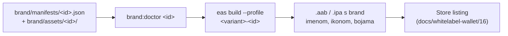
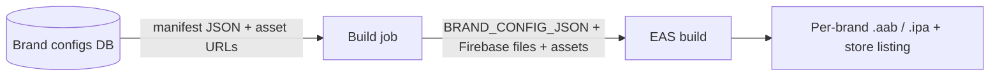

# White-label brand configuration

This directory is the seam between the **brand-agnostic codebase** and a
**per-brand identity**. The app ships no hard-coded brand — identity is
resolved from a _manifest_ at build time.

## How it resolves

`app.config.ts` calls `resolveBrand({ isDev })`, which loads a manifest in this
order:

1. `BRAND_CONFIG_JSON` — inline JSON in the environment (used by the SaaS build
   pipeline; nothing touches disk).
2. `brand/manifests/${BRAND_ID}.json` — local file. `BRAND_ID` defaults to
   `safe`, so a plain checkout builds the stock Safe identity.

The manifest is validated against [`schema.ts`](./schema.ts) (zod). Variant math
(the `.dev` suffix, iOS app-group id, APNs mode) lives in
[`resolveBrand.ts`](./resolveBrand.ts) so the Expo config only consumes final
strings.

## Local build for a brand

```bash
# 1. Drop the brand manifest here (pulled from the dashboard, or hand-written):
#    brand/manifests/acme.json
# 2. Place that brand's Firebase files (gitignored) and point the env vars at them.
# 3. Build the dev variant:
BRAND_ID=acme APP_VARIANT=development GOOGLE_SERVICES_JSON_DEV=./google-services-acme-dev.json \
  yarn expo run:android
```

## What is baked at build time vs. runtime

| Layer                | Fields                                                                                             | Mutable at runtime? |
| -------------------- | -------------------------------------------------------------------------------------------------- | ------------------- |
| **Native identity**  | `name`, `android.package`, `ios.bundleIdentifier`, `scheme`, EAS `owner`/`projectId`, Firebase app | No — per binary     |
| **Visual assets**    | `assets.*` (icon, splash, adaptive icons, favicon)                                                 | No — per binary     |
| **Runtime branding** | `theme` palette overrides, `backend.cgwBaseUrl`, `backend.defaultChainId`                          | No — per binary¹    |

¹ Baked into the binary via `expoConfig.extra.brand` and read once at startup; an OTA/backend-driven rebrand is a possible later step.

## Runtime branding fields

### `theme` — palette overrides

Dot-path keys into the shared palette (`packages/theme/src/palettes/`), one map
per mode:

```json
"theme": {
  "light": { "primary.main": "#0B5FFF", "static.textBrand": "#0B5FFF" },
  "dark": { "primary.main": "#4D8DFF" }
}
```

They are applied in `apps/mobile/src/theme/tokens.ts` via
`generateTamaguiColorTokens(getBrand().theme)`, so every Tamagui token and
theme derives from the overridden palette. Unknown keys are ignored (validate
manifests against the schema). Without `theme` the output is byte-identical to
stock Safe.

### `backend.cgwBaseUrl` / `backend.cgwStagingBaseUrl`

`cgwBaseUrl` overrides the CGW base URL for **production builds only**
(`GATEWAY_URL` in `src/config/constants.ts`). Development builds keep the Safe
staging gateway unless the brand ships its own via `cgwStagingBaseUrl` — this
preserves the dev/staging isolation (push registrations, test safes) that the
stock build gets from `GATEWAY_URL_STAGING`. A custom CGW host must also be
pinned via `backend.pinnedCertificates` (see below), otherwise the config
evaluation warns and the host is served without certificate pinning.

### `backend.pinnedCertificates`

Map of `host → SPKI base64 pins`, merged into the app's SSL pinning config at
config-eval time. Any brand gateway host without an entry triggers a build-time
warning and is served **without** certificate pinning. Pin the CA roots your
gateway's certificates chain to (see the Amazon Trust Services example in
`app.config.ts`), not the leaf.

### `backend.defaultChainId`

Chain preselected in the "Create account" flow (`CreateSafe` feature). Must be
one of the chains served by the brand's gateway; unknown ids fall back to the
active account's chain, then the first gateway chain.

### `assets` — icon/splash/adaptive icons/favicon

Image paths are **relative to `brand/`** (they live in the gitignored
`brand/assets/`, delivered together with the manifest); `backgroundColor*` are
hex colors. Every field is optional and falls back to the stock Safe asset.

```json
"assets": {
  "icon": "assets/acme/icon.png",
  "splash": {
    "image": "assets/acme/splash-dark.png",
    "backgroundColor": "#f4f4f4",
    "imageDark": "assets/acme/splash-light.png",
    "backgroundColorDark": "#121312"
  },
  "androidAdaptiveIcon": {
    "foregroundImage": "assets/acme/adaptive-fg.png",
    "backgroundImage": "assets/acme/adaptive-bg.png",
    "monochromeImage": "assets/acme/adaptive-mono.png"
  },
  "favicon": "assets/acme/favicon.png"
}
```

### Reading the brand in app code

Use the typed accessor from the overlay module — never `expo-constants`
directly:

```ts
import { useBrand, getBrand } from '@/src/custom/brand'

const { name, theme, backend } = useBrand() // or getBrand() outside React
```

## Brand doctor

Validates that a brand package is complete enough to build — manifest passes
the zod schema, referenced assets exist, Firebase files are present and their
application ids match the manifest, OTA certificate resolves, and the
`eas.json` brand profiles are wired:

```bash
yarn workspace @safe-global/mobile brand:doctor            # default: safe
yarn workspace @safe-global/mobile brand:doctor airkuna
node brand/doctor.js airkuna --remote-firebase             # CI: Firebase via EAS file env vars
```

Exit code 0 = buildable (warnings allowed), 1 = something is missing; the
report says exactly what. Firebase file naming convention per brand:
`google-services-<id>[-dev].json` and `GoogleService-Info-<id>[-Dev].plist`
(the `safe` brand keeps the stock unsuffixed names). The `GOOGLE_SERVICES_*`
env vars override those paths, mirroring `app.config.ts`.

## From manifest to store (release pipeline)

One brand = one binary = one store listing. The deterministic path:



1. **Doctor first**: `yarn workspace @safe-global/mobile brand:doctor <id>`.
2. **EAS profiles**: each brand gets two thin profiles in `eas.json` extending
   the stock ones, carrying only `env.BRAND_ID`:

   ```json
   "preview-airkuna": { "extends": "preview", "env": { "BRAND_ID": "airkuna" } },
   "production-airkuna": { "extends": "production", "env": { "BRAND_ID": "airkuna" } }
   ```

   The profile env is applied both when the CLI evaluates `app.config.ts`
   locally (correct owner/projectId) and inside the remote build.

3. **Firebase files on EAS**: gitignored files never reach the build archive,
   so each brand's EAS project carries them as **file-type env vars** named
   exactly like the local overrides (`GOOGLE_SERVICES_JSON`,
   `GOOGLE_SERVICES_PLIST`, plus `_DEV` variants for the development profile),
   created once per environment:

   ```bash
   BRAND_ID=airkuna npx eas-cli env:create --environment preview \
     --name GOOGLE_SERVICES_JSON --type file --value ./google-services-airkuna.json \
     --visibility secret --scope project --non-interactive
   ```

4. **Build** (cloud; local builds need ~10 GB disk):

   ```bash
   cd apps/mobile
   eas build --profile preview-airkuna --platform android --non-interactive --no-wait
   eas build --profile production-airkuna --platform all --non-interactive --no-wait
   ```

   Or via GitHub Actions: `mobile-brand-release.yml` (manual
   `workflow_dispatch`; runs doctor + EAS build, secrets stay in GH/EAS).

5. **SaaS pipeline path**: instead of a manifest file, inject
   `BRAND_CONFIG_JSON` (inline manifest) into the build env — no repo edits at
   all. The dashboard will generate the `eas.json` profile pair per brand the
   same way.

6. **Store submission**: per-brand checklist (listing assets, privacy policy
   URL, Apple/Google accounts, APNs/FCM, GPL-3.0 source offer) lives in
   [docs/whitelabel-wallet/16-release-checklist.md](../../../docs/whitelabel-wallet/16-release-checklist.md).

## Smoke checklist (branded build)

The Maestro e2e harness (`e2e/`) is tied to the stock Safe appId and the e2e
mock environment, so branded smoke is a short manual pass on the installed
build:

- [ ] App installs and launches; launcher shows the brand **name** and **icon**
- [ ] Splash screen uses the brand image/background (light and dark)
- [ ] Onboarding/home surfaces use brand colors (`theme` palette override)
- [ ] "Create account" flow opens and preselects `backend.defaultChainId`
- [ ] Receive QR renders for the active account (and share link works)
- [ ] Brand feature packs mount per `features` flags (e.g. donations tab), and
      are absent on the stock `safe` build
- [ ] Deep link `<scheme>://` opens the app

## SaaS pipeline (target)



The dashboard and the app validate against the **same** zod schema. To share it,
promote `schema.ts` to a `packages/brand-config` workspace so web, mobile, and
the dashboard import one definition.

## Manifests are not committed

Per-brand manifests come from the dashboard/DB and may carry sensitive identity,
so `brand/manifests/*.json` is gitignored except the tracked `safe.json`
(default) and `example.community.json` (template). Firebase files
(`google-services*.json`, `GoogleService-Info*.plist`) are gitignored too.
