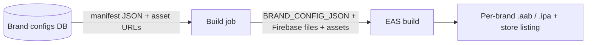

# White-label brand configuration

This directory is the seam between the **brand-agnostic codebase** and a
**per-brand identity**. The app ships no hard-coded brand — identity is
resolved from a _manifest_ at build time.

## How it resolves

`app.config.ts` calls `resolveBrand({ isDev })`, which loads a manifest in this
order:

1. `BRAND_CONFIG_JSON` — inline JSON in the environment (used by the SaaS build
   pipeline; nothing touches disk).
2. `brand/manifests/${BRAND_ID}.json` — local file. `BRAND_ID` defaults to
   `safe`, so a plain checkout builds the stock Safe identity.

The manifest is validated against [`schema.ts`](./schema.ts) (zod). Variant math
(the `.dev` suffix, iOS app-group id, APNs mode) lives in
[`resolveBrand.ts`](./resolveBrand.ts) so the Expo config only consumes final
strings.

## Local build for a brand

```bash
# 1. Drop the brand manifest here (pulled from the dashboard, or hand-written):
#    brand/manifests/acme.json
# 2. Place that brand's Firebase files (gitignored) and point the env vars at them.
# 3. Build the dev variant:
BRAND_ID=acme APP_VARIANT=development GOOGLE_SERVICES_JSON_DEV=./google-services-acme-dev.json \
  yarn expo run:android
```

## What is baked at build time vs. runtime

| Layer                     | Fields                                                                                             | Mutable at runtime? |
| ------------------------- | -------------------------------------------------------------------------------------------------- | ------------------- |
| **Native identity**       | `name`, `android.package`, `ios.bundleIdentifier`, `scheme`, EAS `owner`/`projectId`, Firebase app | No — per binary     |
| **Runtime branding** (P2) | `theme` palette overrides, `backend.cgwBaseUrl`, in-app copy/logos                                 | Yes                 |

## SaaS pipeline (target)



The dashboard and the app validate against the **same** zod schema. To share it,
promote `schema.ts` to a `packages/brand-config` workspace so web, mobile, and
the dashboard import one definition.

## Manifests are not committed

Per-brand manifests come from the dashboard/DB and may carry sensitive identity,
so `brand/manifests/*.json` is gitignored except the tracked `safe.json`
(default) and `example.community.json` (template). Firebase files
(`google-services*.json`, `GoogleService-Info*.plist`) are gitignored too.
