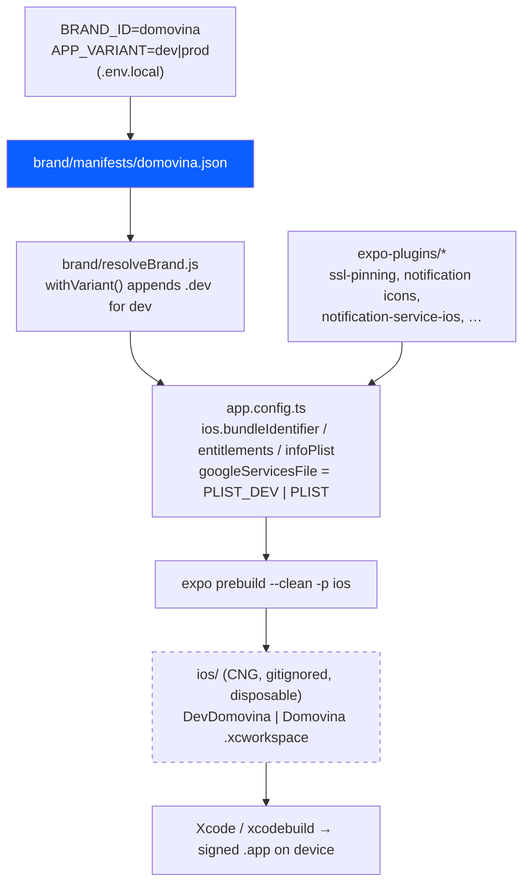
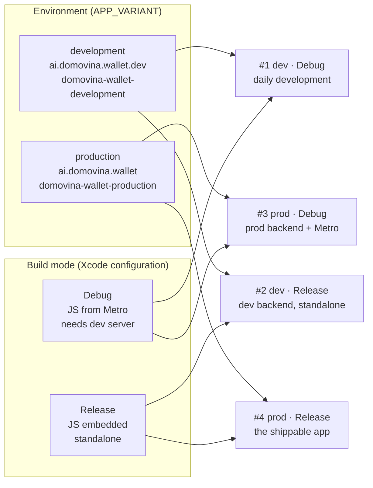
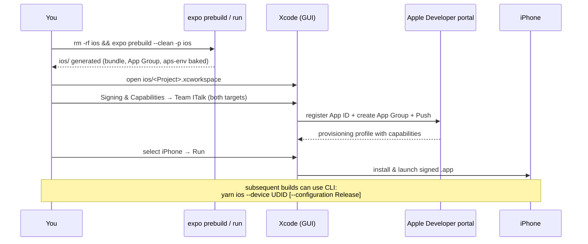
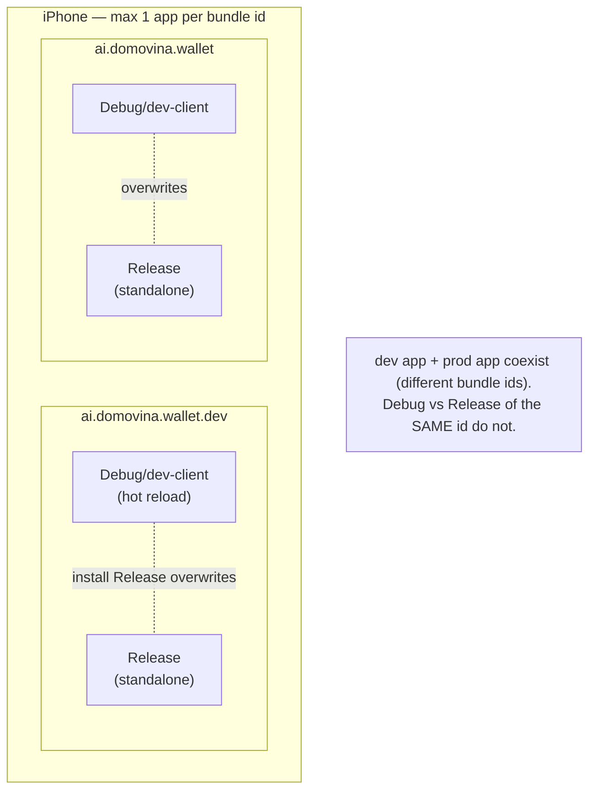
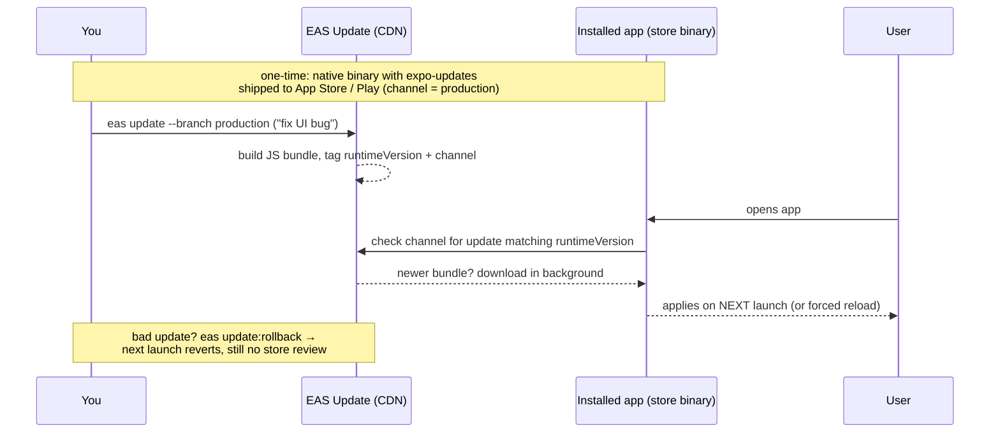

# Domovina — white-label brand, environments & build modes (iOS)

How the **Domovina** white-label build is wired on top of the Safe mobile app: brand
manifest → resolved identity → Expo config → native project → signing → run. Covers the
two independent axes (**environment/flavor** and **build mode**) that together give four
run combinations.

> Companion setup facts also live in the agent memory note `mobile-local-run-setup`. This
> document is the committed source of truth for humans.

---

## TL;DR

- **Brand** is chosen by `BRAND_ID=domovina` → `brand/manifests/domovina.json`.
- **Environment / flavor** is chosen by `APP_VARIANT` (`development` | `production`).
  It selects the bundle id, App Group, Firebase project and APNs mode.
- **Build mode** is chosen by the Xcode configuration (`Debug` | `Release`).
  Debug streams JS from Metro; Release embeds JS and runs standalone.
- `ios/` is **CNG** — generated by `expo prebuild`, gitignored, **disposable**. Never
  hand-edit it; put native customisation in `app.config.ts` or an `expo-plugins/` plugin.
- Only **one flavor lives in `ios/` at a time**. Switching = flip `.env.local` + re-prebuild.

---

## Identity matrix

|                                  | Development                                       | Production                                    |
| -------------------------------- | ------------------------------------------------- | --------------------------------------------- |
| `APP_VARIANT`                    | `development`                                     | `production`                                  |
| iOS bundle **=** Android package | `ai.domovina.wallet.dev`                          | `ai.domovina.wallet`                          |
| App Group                        | `group.ai.domovina.wallet.dev`                    | `group.ai.domovina.wallet`                    |
| APNs (`aps-environment`)         | `development`                                     | `production`                                  |
| Firebase project                 | `domovina-wallet-development`                     | `domovina-wallet-production`                  |
| iOS config file                  | `GoogleService-Info-Dev.plist`                    | `GoogleService-Info.plist`                    |
| Android config file              | `google-services-dev.json`                        | `google-services.json`                        |
| App display name                 | `Dev-Domovina`                                    | `Domovina`                                    |
| Xcode project / workspace        | `DevDomovina`                                     | `Domovina`                                    |
| Notification Service Extension   | `…wallet.dev.NotifeeNotificationServiceExtension` | `…wallet.NotifeeNotificationServiceExtension` |

Apple Developer **Team**: `ITalk d.o.o.` (`6SCK58757K`).
Bundle scheme is **identical cross-platform** (no `.ios` suffix — that suffix in upstream
Safe is a Safe-internal choice, not a requirement). The `.dev` suffix for the development
flavor is appended in code by `brand/resolveBrand.js` (`withVariant`).

> The Firebase admin-SDK service-account JSON and the web `firebaseConfig` snippet are **not**
> used by the mobile build — only the per-platform `GoogleService-Info.plist` /
> `google-services.json` matter.

---

## How the brand resolves (config → native)

Everything native is derived from committed config. The generated `ios/` folder is a build
artefact, so wiping and regenerating it loses nothing.



**Source-of-truth locations for native customisation** (never edit `ios/` directly):

- Info.plist keys → `ios.infoPlist` in `app.config.ts`
- Entitlements → `ios.entitlements` in `app.config.ts`
- Per-flavor differences → branch on `IS_DEV` in `app.config.ts`
- Anything that adds files / edits the pbxproj / capabilities → a config plugin in `expo-plugins/`

---

## Two axes → four run combinations

Environment (what backend/Firebase/bundle) and build mode (how JS is packaged) are
**independent**.



| #   | Environment | Mode    | Needs Metro? | Use for                                     |
| --- | ----------- | ------- | ------------ | ------------------------------------------- |
| 1   | development | Debug   | **yes**      | everyday development, hot reload            |
| 2   | development | Release | no           | dev backend as a "real" standalone build    |
| 3   | production  | Debug   | **yes**      | debugging against the prod backend          |
| 4   | production  | Release | no           | the actual product (TestFlight / App Store) |

> "No development servers found" always means a **Debug** build with no Metro running.
> Either start Metro, or build **Release** for a standalone app.

---

## Build & signing flow (first run of a flavor)

CLI `xcodebuild` auto-signing can register a basic App ID but **cannot create an App Group**.
So the **first** build of each flavor must go through Xcode once to create the App ID +
App Group + Push capability on the Apple Developer portal. Afterwards, CLI builds work.



**Known gotchas**

- Double-clicking the project name in Xcode renames the `.xcodeproj` on disk (once produced
  a stray `e da .xcodeproj`). If the workspace breaks, just regenerate `ios/`.
- Renaming the app between flavors can leave a stray old-named `.xcworkspace`; delete it and
  keep only the one matching the current `.xcodeproj`.
- `prod · Debug/Release` uses `aps-environment: production`. Automatic (development) signing
  may warn that the profile doesn't permit production push — expected. Full production push
  needs a distribution/ad-hoc build (EAS). The app itself still runs.
- Installing to the device over CLI can fail transiently with `APIInternalError` — unlock the
  phone and retry, or install from Xcode.

---

## Switching flavors

Only one flavor exists in `ios/` at a time. To switch:

1. Edit `apps/mobile/.env.local` — flip **both** lines under `ACTIVE FLAVOR SWITCH`:
   - `EXPO_PUBLIC_APP_VARIANT=development|production`
   - `APP_VARIANT=development|production`
2. Regenerate native project:
   ```bash
   cd apps/mobile
   yarn expo prebuild --clean -p ios
   ```
3. First time for that flavor → open `ios/<Project>.xcworkspace`, set signing (Team ITalk)
   on both targets, Run once.

---

## Command cheat sheet

Physical device UDID: `00008130-00184D0111FA001C` (iPhone MS 15 Pro).
Env values come from `.env.local`, so they don't need to be passed inline.

```bash
cd apps/mobile

# Start Metro only (app already installed) — Debug flavors
yarn expo start --dev-client --lan          # open app, connect to http://<mac-lan-ip>:8081

# Debug build → install → launch → Metro (needs dev server)
yarn ios --device 00008130-00184D0111FA001C

# Release build → standalone (no Metro)
yarn expo run:ios --device 00008130-00184D0111FA001C --configuration Release

# Regenerate native project after changing app.config.ts / plugins / flavor
yarn expo prebuild --clean -p ios
```

If `yarn` isn't found in a fresh shell: `corepack enable` once (see agent memory
`yarn-via-corepack`).

---

## Files & where they live

| Path                            | Purpose                                               | Committed?    |
| ------------------------------- | ----------------------------------------------------- | ------------- |
| `brand/manifests/domovina.json` | brand identity (name, slug, bundle base, team)        | ✅ yes        |
| `brand/resolveBrand.js`         | variant math (`.dev` suffix, App Group, APNs mode)    | ✅ yes        |
| `app.config.ts`                 | Expo config; consumes resolved brand                  | ✅ yes        |
| `expo-plugins/`                 | native customisation as config plugins                | ✅ yes        |
| `.env.local`                    | `BRAND_ID`, `APP_VARIANT`, config-file paths, secrets | ❌ gitignored |
| `GoogleService-Info-Dev.plist`  | Firebase iOS config (development)                     | ❌ gitignored |
| `GoogleService-Info.plist`      | Firebase iOS config (production)                      | ❌ gitignored |
| `ios/`                          | generated native project (CNG)                        | ❌ gitignored |

For CI / store builds, prefer **EAS Build** profiles (`eas.json`) that set `APP_VARIANT`
per profile and regenerate the native project in the cloud — no local `ios/` needed, and
both flavors build losslessly from the committed config above.

---

## Debug vs Release of the **same flavor** — the bundle-ID collision

A subtle but important point: within a single flavor, the **Debug (dev-client)** build and
the **Release** build share the **same bundle id** (e.g. dev flavor → `ai.domovina.wallet.dev`
for both modes). iOS allows only **one app per bundle id** installed at a time, so:

- Installing the **Release** build of a flavor **overwrites** that flavor's **Debug/dev-client**
  build on the device (and vice-versa). They cannot coexist.
- The **Expo dev launcher** (the "Development servers / Enter URL manually" screen that connects
  to Metro) exists **only in the Debug/dev-client build**. A Release build is standalone — no
  launcher, no Metro.
- So after you install a Release build of a flavor, that flavor no longer has hot reload. To get
  it back, **reinstall the Debug build** (`yarn ios --device …`, Debug is the default).
- Switching Debug ↔ Release does **not** need a prebuild — both modes build from the same `ios/`
  project; only the `--configuration` differs. It only changes what's **installed** on the device.

**Good news — the two flavors do NOT collide with each other.** `ai.domovina.wallet.dev` and
`ai.domovina.wallet` are different bundle ids, so the dev app and the prod app live side-by-side
on the phone. Recommended workflow that avoids reinstall churn:

- **dev flavor → keep as Debug/dev-client** (daily development, hot reload)
- **prod flavor → build as Release** (test the real, standalone app)

Different bundle ids → both installed at once, no overwriting. You only hit the collision if you
flip a _single_ flavor between Debug and Release.



### Why not add a `.debug` suffix to install all four at once?

You _could_ give the Debug build its own bundle id (e.g. `…wallet.dev.debug` for Debug, no suffix
for Release) via a config plugin that sets `PRODUCT_BUNDLE_IDENTIFIER` per Xcode configuration —
a legitimate native pattern — so all four (dev/prod × Debug/Release) install side-by-side.

**We deliberately don't**, and it is **not** the Expo/RN convention here:

- **Identity should track the flavor, not the build mode.** The Release build you ship must have
  the _same_ identity you developed against; a `.debug` suffix makes the tested app a different
  app than the shipped one.
- **It doubles the signing surface**: 4 bundle ids → 4 App IDs + 4 App Groups + 4 Firebase apps +
  4 APNs setups, plus a custom config plugin fighting CNG. High overhead for marginal gain.
- **The realistic need is already covered**: the `.dev` flavor lives as **Debug/dev-client** for
  daily work and the prod flavor is built as **Release** occasionally — different bundle ids, so
  the two apps you actually use coexist. You rarely need Debug _and_ Release of the _same_ flavor
  installed simultaneously.

Convention: **flavor → bundle id (`.dev`)**, **build mode → Xcode configuration**. Keep them on
separate axes; don't fold build mode into the bundle id.

---

## Over-the-air (OTA) updates — EAS Update

> **Current state in this repo:** OTA is **not wired yet**. `expo-updates` is not installed
> (`EXUpdatesEnabled = false`), and `eas.json` has build profiles but no update channels. The
> section below explains the model and the exact steps to enable it.

### Why it exists (and why it's a killer feature vs Flutter)

A React Native app is two layers:

1. **Native binary** — Swift/ObjC/Kotlin + native modules + the Hermes JS engine. This is what
   you submit to the App Store / Play Store. It changes rarely.
2. **JS bundle + assets** — your app code (screens, logic, styling, images). Loaded at runtime.

`expo-updates` lets the **installed native binary fetch a newer JS bundle from a CDN at runtime**
and boot that instead of the bundle embedded at build time. So you can ship UI/logic/bug-fix
changes **without a new store submission or review**.

Flutter compiles Dart → native ARM; there is **no first-party, store-compliant OTA** (only
third-party patchers like Shorebird). React Native's JS-bundle architecture makes OTA
first-class and store-policy-compliant — for a wallet where you want to hotfix a display bug or
add a chain without waiting days for review, this is a major advantage.

### What can and cannot be updated OTA

| ✅ OTA-updatable (JS/asset layer)       | ❌ Needs a new native build + store submission                                |
| --------------------------------------- | ----------------------------------------------------------------------------- |
| React components, screens, navigation   | Adding/updating a **native module** (new pod / gradle dep)                    |
| Business logic, TX building, formatting | Changing permissions / entitlements / `Info.plist`                            |
| Styling, theme, copy                    | Anything in `app.config.ts` that affects native, or an `expo-plugins/` change |
| Images/fonts bundled through Metro      | Bumping the Expo/RN runtime, Hermes                                           |
| JS-side config, feature flags           | SSL pinning (TrustKit), native key storage, App Groups                        |

Rule of thumb: **if it would change `ios/` (needs a prebuild), it cannot go OTA.** If it's pure
JS/assets compatible with the installed runtime, it can.

### runtimeVersion — the safety interlock

An update is only delivered to a binary whose **`runtimeVersion`** matches the update's. This
prevents pushing JS that expects native code the installed binary doesn't have (which would
crash). Recommended policy: **`fingerprint`** — Expo hashes the native project, so the
runtimeVersion changes automatically whenever the native layer changes, and OTA only ever targets
compatible binaries.

### Channels & branches

- A **branch** is a sequence of updates (like a git branch of JS bundles).
- A **channel** is bound to a build (set per profile in `eas.json`, e.g. `production`). At runtime
  the app checks its channel for the latest update matching its `runtimeVersion` + platform.
- Channels can be **re-pointed** to different branches → staged rollout, promotion
  (staging → production), and instant **rollback** (`eas update:rollback`).

### Delivery flow



Default timing: check **on launch**, download in the background, apply on the **next** launch
(`EXUpdatesCheckOnLaunch=ALWAYS`). Tunable via `checkAutomatically`
(`ON_LOAD` / `ON_ERROR_RECOVERY` / `NEVER`) and `fallbackToCacheTimeout` (how long launch blocks
to fetch before falling back to the embedded/cached bundle).

### Enabling OTA (steps, when we're ready)

```bash
cd apps/mobile
npx expo install expo-updates          # adds the native module (requires a new native build)
eas update:configure                   # sets updates.url + runtimeVersion, wires channels
```

Then in `app.config.ts` add (per-flavor via `IS_DEV` if desired):

```ts
runtimeVersion: { policy: 'fingerprint' },
updates: { url: 'https://u.expo.dev/<eas-project-id>' },
```

and give each `eas.json` build profile a `channel` (e.g. `"channel": "production"`). Publish with
`eas update --branch production`. **The binary that first ships to the stores must already contain
`expo-updates`** — you cannot retro-add OTA to an already-shipped build without a new release.

### Wallet-specific security (do not skip)

OTA ships **arbitrary JS into an app that handles private keys and signs transactions** — treat
the update pipeline as a security-critical supply chain:

- **Enable expo-updates code signing.** The app then only accepts updates signed with _your_
  private key, so a compromised update server/CDN cannot push malicious JS. For a wallet this is
  effectively mandatory.
- Keep security-sensitive logic **native** where practical (SSL pinning via TrustKit, Keychain /
  key storage, RASP) — being native, it's not OTA-mutable, which is a feature.
- Respect store policy: OTA is for fixes/UI/content, **not** for shipping a materially different
  app that bypasses review.
