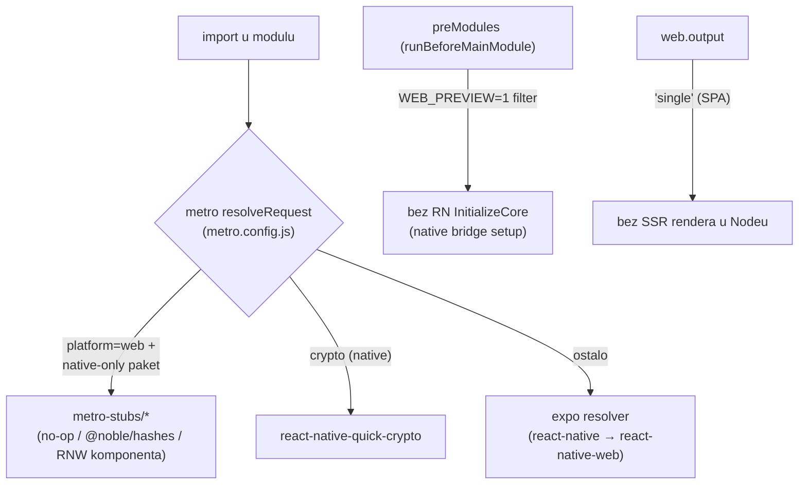
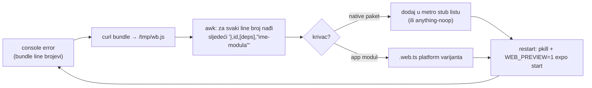

# Web preview — pokretanje mobile appa u browseru

> Datum: 2026-07-17 · Status: radi (dev preview, NIJE release target) · Jezik: HR
> Nastalo tijekom Događaji sesije (v. [docs/whitelabel-wallet/13-lekcije-sesije-dogadjaji.md](../../../docs/whitelabel-wallet/13-lekcije-sesije-dogadjaji.md)).

## Pokretanje

```bash
cd apps/mobile
WEB_PREVIEW=1 npx expo start --web --port 8085
# → http://localhost:8085
```

`BRAND_ID` dolazi iz `.env.local`; feature flagovi (npr. `features.events`) se pale u
`brand/manifests/<brand>.json` (gitignored). Do tabova treba proći onboarding — dovoljan je
read-only import bilo koje Safe adrese (ili koristi screen preview mode dolje).

## Screen preview mode — ekran po ekran bez onboardinga

Za brzu UI inspekciju pojedinačnih ekrana direktno URL-om, bez prolaska onboardinga:

```bash
cd apps/mobile
WEB_PREVIEW=1 EXPO_PUBLIC_SCREEN_PREVIEW=1 npx expo start --web --port 8085
```

Što flag radi (samo `__DEV__` + `EXPO_PUBLIC_SCREEN_PREVIEW=1`; native/prod netaknut):

- **Initial redirect se preskače** — `NavigationGuardHOC` inače na bootu radi
  `router.replace('/onboarding')` ili `(tabs)`, pa URL ruta ne preživi. S flagom ostaje
  URL koju si otvorio (expo-router na webu mapira URL → ekran).
- **State se seeda** (modul `src/custom/preview/screenPreview.ts`): `onboardingVersionSeen`,
  `promptAttempts` (da notifications opt-in ne iskače) i read-only aktivni Safe
  `0x2f3e600a3F38b66aDcbe6530B191F2BE55c2Fbb6` na Sepoliji (isti kao e2e fixtura) —
  staging CGW za njega vraća prave podatke.

Kako otvoriti ekran:

- Popis svih ruta: <http://localhost:8085/_sitemap> (expo-router dev sitemap)
- Direktno URL-om, npr. <http://localhost:8085/doniraj> (tab, grupa `(tabs)` nije u URL-u),
  <http://localhost:8085/address-book>, <http://localhost:8085/app-settings>…
- Root `/` ostaje na splash spinneru (dummy `app/index.tsx`; redirect je namjerno preskočen) —
  uvijek otvaraj konkretnu rutu.

Napomena: state je seedan i persistiran u browser storage; za čist boot bez flaga
obriši site data (localStorage/MMKV web).

## Zašto je ovo trebalo

App nikad nije imao web target: ~10 native-only paketa (TurboModule/Nitro/codegen speci) pucaju
**pri importu** u browseru, expo default gura RN-ov `InitializeCore` u svaki bundle, a static
SSR render u Nodeu dira native bridge. Rješenje je overlay sloj u `metro.config.js` +
`metro-stubs/` + `.web.ts` platform varijante — **sve gated na `platform === 'web'` ili
`WEB_PREVIEW=1`, native buildovi netaknuti**.



## Što je stubbano i zašto

| Paket / modul                                                                                                                                                                                                                                                        | Stub                                     | Razlog (puca pri importu na webu)         |
| -------------------------------------------------------------------------------------------------------------------------------------------------------------------------------------------------------------------------------------------------------------------- | ---------------------------------------- | ----------------------------------------- |
| `react-native-capture-protection`                                                                                                                                                                                                                                    | no-op prevent/allow                      | native modul, nema web                    |
| `expo-datadog` + `@datadog/mobile-react-native`                                                                                                                                                                                                                      | no-op RUM/Logs/Provider                  | TurboModule spec (`NativeDdSdk`)          |
| `react-native-vision-camera`                                                                                                                                                                                                                                         | Camera → null, permission denied         | throwa "does not work on web"             |
| `react-native-quick-crypto`                                                                                                                                                                                                                                          | **@noble/hashes** (md5/sha/hmac/pbkdf2)  | Nitro; `createDecipheriv` namjerno throwa |
| `react-native-pager-view`                                                                                                                                                                                                                                            | React komponenta (aktivna stranica)      | Fabric native komponenta                  |
| `freerasp-react-native`                                                                                                                                                                                                                                              | `useFreeRasp` no-op                      | native RASP                               |
| `@react-native-firebase/*`, `@notifee/*`, `react-native-share`, `react-native-keychain`, `react-native-device-crypto`, `react-native-device-info`, `react-native-ble-plx`, `react-native-permissions`, `react-native-quick-base64`, `@ledgerhq/...-react-native-ble` | `anything-noop.js` univerzalni proxy     | codegen/TurboModule speci                 |
| `src/platform/crypto-shims` → `.web.ts`                                                                                                                                                                                                                              | prazan (ethers defaulti rade u browseru) | quick-crypto install                      |
| `src/platform/security` → `.web.ts`                                                                                                                                                                                                                                  | prazan config/actions                    | čita `expoConfig.android.package`         |
| `services/notifications/backgroundHandlers`                                                                                                                                                                                                                          | empty (side-effect only modul)           | Firebase pri importu iz `index.js`        |
| RN devtools interni (`ReactDevToolsSettingsManager`)                                                                                                                                                                                                                 | empty                                    | ne resolvea se za web                     |

**`anything-noop.js`** je univerzalni proxy: svaki named export postoji, sve je pozivno,
`await`/`.then(cb)` se ponašaju kao `Promise.resolve(undefined)` (then je funkcija koja
async poziva callback s `undefined`), enum usporedbe daju `false` ("nije autorizirano").

Uz stubove: `app.config.ts` `web.output: 'single'` (SPA umjesto static SSR),
`WEB_PREVIEW=1` filter RN `InitializeCore` preModula, i guard
`Appearance.setColorScheme?.()` u `safeTheme.tsx` (RNW nema tu metodu).

## Kako debugirati sljedeći native modul koji pukne

Greške tipa `__fbBatchedBridgeConfig is not set` / `getEnforcing` / "importing from
'react-native' instead of 'react-native-web'" znače da je neki modul dirnuo native bridge pri
importu. Postupak (radio 7× u sesiji):



```bash
curl -s 'http://localhost:8085/apps/mobile/index.bundle?platform=web&dev=true&...' -o /tmp/wb.js
awk -v l=<LINE> 'NR>=l && NR<=l+900' /tmp/wb.js | grep -am1 -oE '\},[0-9]+,\[[0-9, ]*\],"[^"]+"'
```

## Ograničenja (svjesno)

- Kamera/QR skeniranje ne radi (VisionCamera stub) — skener ulaza testiraj na uređaju.
- Push notifikacije, RASP, Ledger BLE, screenshot zaštita: no-op.
- Import legacy podataka (AES decipher) throwa jasnu grešku.
- PagerView renderira jednu stranicu bez swipea.
- Ovo je **preview alat**, ne osnova za web release — za to bi trebao pravi audit RNW podrške.
