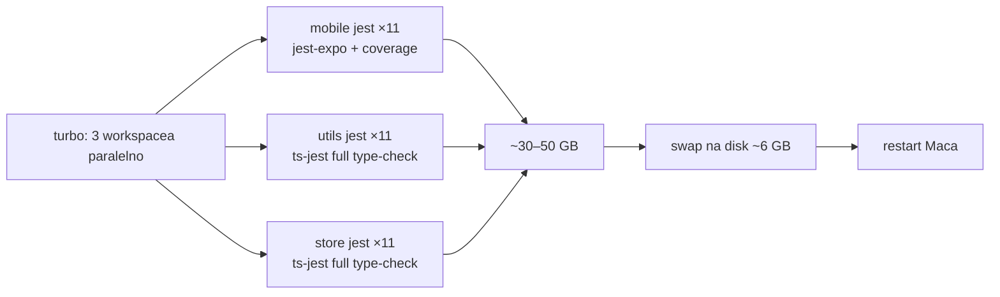

# Lokalni build/test i RAM — zašto ovaj repo ruši Mac

Stanje 2026-09-26. Kontekst: nakon upstream synca (vidi
[14 — sync dnevnik](whitelabel-wallet/14-upstream-sync-dnevnik.md)) sub-agent je pokrenuo
`yarn install` + `yarn turbo run type-check/test --filter=mobile --filter=utils --filter=store`.
Mac (24 GB RAM, 12 jezgri, ~6 GB slobodno na glavnom disku) potrošio je RAM i swap i
**restartao se**, zajedno s drugim aktivnim Claude Code sesijama. Nije prvi put.

Rezultat je pravilo: **sync ne pokreće nikakav build** (vrh doca 14). Ovdje je analiza zašto.

## Uzrok: četiri defaulta koji se množe

Transkript agenta nestao je s restartom (`/tmp`), pa je ovo rekonstrukcija iz konfiguracije,
ne mjerenje. Brojke po workeru su procjene.

| #   | Default                                                           | Gdje                                 | Posljedica                                                                                                                     |
| --- | ----------------------------------------------------------------- | ------------------------------------ | ------------------------------------------------------------------------------------------------------------------------------ |
| 1   | turbo bez `concurrency` / `dependsOn` (default 10 taskova)        | `turbo.json`                         | mobile, utils, store testovi rade **istovremeno**                                                                              |
| 2   | jest bez `maxWorkers` → `ncpu − 1` = 11                           | svi `jest.config.*`                  | 3 × 11 = **do 33 Node procesa**                                                                                                |
| 3   | `preset: 'ts-jest'` bez `isolatedModules` / `diagnostics: false`  | `config/test/presets/jest-preset.js` | **svaki worker diže cijeli TS type-checker** (ethers, protocol-kit, RTK, AUTO_GENERATED) ≈ 1–1,5 GB × 22 workera (utils+store) |
| 4   | `collectCoverage: true`, `jest-expo`, bez `workerIdleMemoryLimit` | `apps/mobile/jest.config.js`         | 461 test fajl s instrumentacijom, workeri samo rastu                                                                           |

Plus native TypeScript 7 type-check (višenitan po defaultu), Brave i druge sesije.
Zbroj ≈ 30–50 GB na stroju od 24 GB; swap na disk s ~6 GB slobodnog puca → restart.

Repo je podešen za CI runnere (jedan posao po stroju, puno RAM-a), ne za laptop s više
paralelnih sesija.

## Mitigacije (predložene, NISU primijenjene)

- zajednički jest preset: `maxWorkers: '25%'`, `workerIdleMemoryLimit: '1GB'`
- ts-jest: `isolatedModules: true` ili `diagnostics: false` — type-check ionako radi
  zaseban `type-check` script
- lokalno `turbo --concurrency=1` (ili `"concurrency": 1` u overlay configu)
- mobile `collectCoverage` samo na CI-ju (`!!process.env.CI`)

Do tada: verifikaciju pokreće korisnik ručno, **jedan workspace odjednom**, npr.
`yarn workspace @safe-global/mobile type-check`, a testove s `--maxWorkers=2`.
