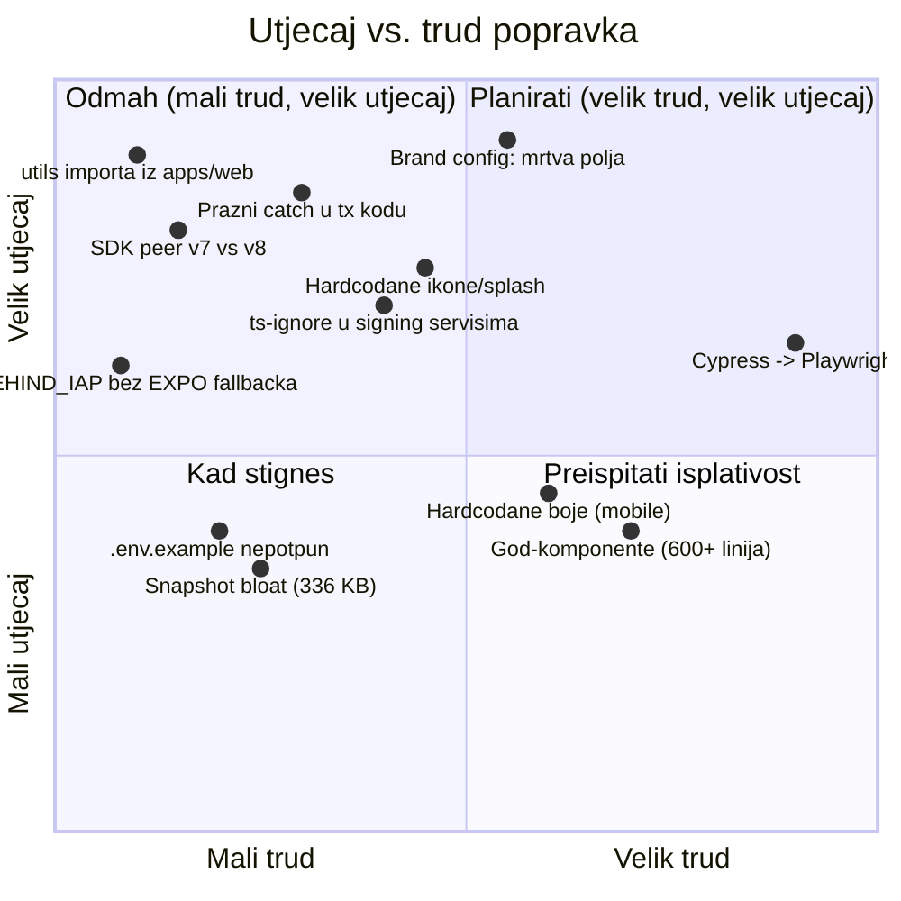

# Audit kodne baze — pregled i prioriteti

> Datum: 2026-07-04 · Grana: `custom` (airkuna fork) · Opseg: cijeli monorepo (apps/web, apps/mobile, packages/, CI, ovisnosti)
> Metoda: 5 paralelnih statičkih analiza (arhitektura, mobile, shared paketi, testovi/CI, ovisnosti/sigurnost)

## Sažetak

Kodna baza je općenito u dobrom stanju: nema hardcodanih tajni, nema `eval`-a, nema osjetljivih podataka u localStorageu, CI actioni su SHA-pinnani. Glavni rizici koncentrirani su u **4 područja**:

1. **White-label brand config je nedovršen** — `theme` i `backend.cgwBaseUrl` polja iz manifesta se validiraju ali nikad ne koriste; ikone/splash su hardcodani na Safe assete. _(direktno pogađa airkuna fork)_
2. **Cross-package coupling** — `packages/utils` importa iz `apps/web` (nedeklarirano), a `store` i `utils` su u cirkularnoj ovisnosti.
3. **Progutane greške u kritičnim putanjama** — prazni `catch {}` blokovi u tx-dispatch i dApp-provider sloju weba (8 na webu, 15 na mobileu).
4. **SDK version skew** — `packages/utils` deklarira `protocol-kit ^7` / `types-kit ^3` dok apps koriste `^8` / `^4` (cijeli major).

## Mapa dokumenata

| Dokument                                               | Sadržaj                                                                           |
| ------------------------------------------------------ | --------------------------------------------------------------------------------- |
| [01-arhitektura-paketi.md](01-arhitektura-paketi.md)   | Cross-package coupling, cikl. ovisnosti, env-var prefiksi, AUTO_GENERATED         |
| [02-web-app.md](02-web-app.md)                         | Progutane greške, `@ts-ignore` u signing kodu, god-komponente, stale TODO-ovi     |
| [03-mobile-white-label.md](03-mobile-white-label.md)   | Rupe u brand-config pipelineu, hardcodani asseti/boje, test gap u WC routingu     |
| [04-testovi-ci.md](04-testovi-ci.md)                   | Cypress→Playwright migracija (4,5 %), MSW kršenja, snapshot bloat, dupli E2E CI   |
| [05-ovisnosti-sigurnost.md](05-ovisnosti-sigurnost.md) | Version drift, resolutions pinovi, .env.example rupe, sigurnosna higijena (čisto) |

## Matrica prioriteta

## Top 10 akcija (redoslijedom preporuke)

| #   | Akcija                                                                                         | Severity  | Trud              | Dokument |
| --- | ---------------------------------------------------------------------------------------------- | --------- | ----------------- | -------- |
| 1   | Popraviti `BlockaidModule` import iz `@safe-global/web` → lokalni `utils/hex`                  | 🔴 High   | ~5 min            | 01       |
| 2   | Dodati `EXPO_PUBLIC_IS_BEHIND_IAP` fallback u `cgwClient.ts`                                   | 🟠 Medium | ~5 min            | 01       |
| 3   | Bumpati `packages/utils` peer deps na protocol-kit `^8` / types-kit `^4`                       | 🔴 High   | ~30 min + testovi | 05       |
| 4   | Prazne `catch {}` blokove u `safe-wallet-provider` i tx-dispatch rutati kroz logger            | 🔴 High   | ~2 h              | 02       |
| 5   | Wireati (ili maknuti iz scheme) `brand.theme` i `backend.cgwBaseUrl`                           | 🔴 High   | ~1–2 dana         | 03       |
| 6   | Brand-asseti (ikona, splash, adaptive icon) iz manifesta umjesto hardcode                      | 🔴 High   | ~1 dan            | 03       |
| 7   | Tipizirati `params: any` + maknuti `@ts-ignore` u `private-key-module` i `WalletConnectWallet` | 🔴 High   | ~1 dan            | 02       |
| 8   | ESLint pravilo: zabraniti `@safe-global/web` importe unutar `packages/`                        | 🟠 Medium | ~30 min           | 01       |
| 9   | Regenerirati `.env.example` (web: 5 od ~58 varijabli dokumentirano)                            | 🟠 Medium | ~1 h              | 05       |
| 10  | Testovi za `methodRouter.ts` (WalletConnect request routing, 248 linija, 0 testova)            | 🟠 Medium | ~1 dan            | 03       |

## Što je provjereno i čisto ✅

- Nema hardcodanih privatnih ključeva ni API tajni u sourceu
- Nema `eval` / `new Function`; jedan kontrolirani `dangerouslySetInnerHTML` (`_document.tsx`)
- localStorage ne sadrži osjetljive podatke (samo consent/metadata)
- Svi CI actioni SHA-pinnani (dobra supply-chain higijena)
- `lodash@4.18.1` provjeren protiv npm registryja — legitiman release (travanj 2026.), nije supply-chain incident
- react, react-dom, ethers, typescript, jest — verzije poravnate kroz workspace

## Što NIJE provjereno (ograničenja audita)

- Runtime ponašanje — sve je statička analiza, ništa nije pokretano
- `yarn audit` / CVE scan ovisnosti nije izvršen
- Smart-contract interakcije i ispravnost potpisivanja (samo tipovi/struktura koda)
- Performanse (bundle size, render performance)
