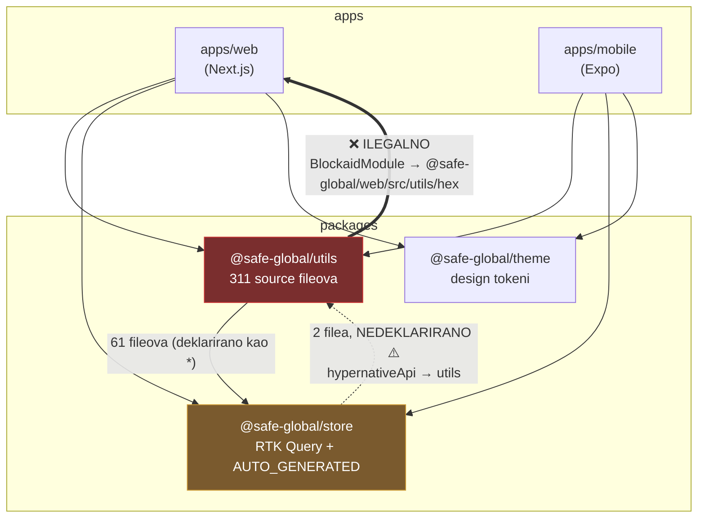
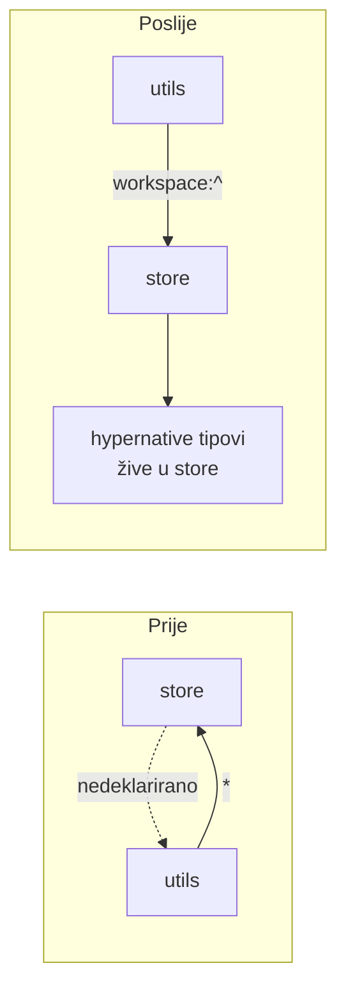

# Arhitektura i shared paketi

Opseg: `packages/store`, `packages/theme`, `packages/utils`, `config/`, root tooling (turbo.json).

## Trenutno stanje ovisnosti — problem



## Nalazi

### 1. 🔴 HIGH — `packages/utils` importa direktno iz `apps/web`

`packages/utils/src/services/security/modules/BlockaidModule/index.ts:15`:

```ts
import { numberToHex } from '@safe-global/web/src/utils/hex'
```

- `@safe-global/web` **nije deklariran** kao ovisnost u `packages/utils/package.json` → ruši izolirani build utils paketa i potencijalno mobile.
- Ironija: identična funkcija već postoji lokalno u `packages/utils/src/utils/hex.ts:3`.

**Fix (5 min):** promijeniti import na lokalni `utils/hex`. Zatim dodati ESLint `no-restricted-imports` pravilo koje zabranjuje `@safe-global/web` i `@safe-global/mobile` unutar `packages/`.

### 2. 🔴 HIGH — cirkularna ovisnost store ↔ utils, jedan smjer nedeklariran

- `utils → store`: 61 fileova, deklarirano kao `"@safe-global/store": "*"` (wildcard — fragilno).
- `store → utils`: 2 filea (`hypernative/hypernativeApi.dto.ts:6`, `hypernativeApi.ts:12`) — **uopće nije deklarirano** u `store/package.json`.

**Fix:** premjestiti shared hypernative tipove/konstante u `store` (ili leaf paket) i razbiti ciklus. Minimalno: deklarirati ovisnost i zamijeniti `"*"` s `workspace:^`.



### 3. 🟠 MEDIUM — dual-prefix env pravilo prekršeno u store

`packages/store/src/gateway/cgwClient.ts:16`:

```ts
const IS_BEHIND_IAP = process.env.NEXT_PUBLIC_IS_BEHIND_IAP === 'true'
```

Nema `EXPO_PUBLIC_` fallbacka → flag je **uvijek false na mobileu**. Svih 8 deklaracija u `packages/utils/src/config/constants.ts` ispravno koristi dual pattern; ovo je jedini prekršitelj.

**Fix (5 min):** `|| process.env.EXPO_PUBLIC_IS_BEHIND_IAP === 'true'`.

### 4. 🟡 LOW — AUTO_GENERATED fileovi bez "do not edit" bannera

26 generiranih fileova u `packages/store/src/gateway/AUTO_GENERATED/` (najveći `transactions.ts`, 1165 linija) nemaju `@generated` header — pravilo "ne diraj ručno" živi samo u AGENTS.md.

**Fix:** dodati banner komentar u output generatora.

### 5. 🟡 LOW — `build` task ne postoji u turbo.json

`store` ovisi o `build:dev` skripti za regeneraciju AUTO_GENERATED tipova, ali codegen se vrti izvan turbo grafa — nije cachiran ni orkestriran.

**Fix:** definirati `build` task u `turbo.json` s `schema.json` kao inputom i `AUTO_GENERATED/**` kao outputom.

### 6. ℹ️ Test coverage u paketima (signal, ne defekt)

| Paket | Testovi / source | Omjer |
| ----- | ---------------- | ----- |
| store | 7 / 41           | ~17 % |
| theme | 4 / 16           | ~25 % |
| utils | 60 / 311         | ~19 % |

Najtanji dio: store business logika (hypernative, persist transforms). Razmisliti o coverage gateu za `packages/` jer greška ovdje pogađa obje platforme.
