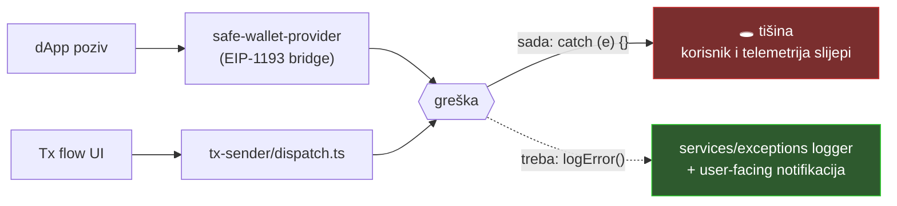

# Web app (apps/web)

Statistika: 3.173 `.ts*` fileova · 66× `: any` · 59× `@ts-ignore`/`@ts-expect-error` · 51× `eslint-disable` · 61× TODO/FIXME · 49× raw `console.*`

## Nalazi

### 1. 🔴 HIGH — progutane greške u transaction i provider putanjama

Prazni/ignorirani `catch` blokovi upravo tamo gdje su greške najskuplje — korisnik ne vidi zašto potpisivanje/izvršenje nije prošlo, a telemetrija ne dobiva ništa:

| Lokacija                                                                         | Kontekst                                |
| -------------------------------------------------------------------------------- | --------------------------------------- |
| `services/safe-wallet-provider/index.ts:381,395,444`                             | dApp EIP-1193 provider — `catch (e) {}` |
| `services/tx/tx-sender/dispatch.ts` (600 linija)                                 | tx dispatch sloj                        |
| `components/tx-flow/actions/ExecuteThroughRole/.../index.tsx:40` + `hooks.ts:52` | izvršenje kroz role                     |
| `hooks/useTxNotifications.ts:92`, `hooks/useTxTracking.ts:32`                    | notifikacije/tracking                   |
| `services/exceptions/index.ts:43`                                                | sam exception servis guta grešku        |

**Fix:** svaki od 8 blokova rutati kroz postojeći `services/exceptions` logger; gdje ima smisla, prikazati notifikaciju korisniku.

### 2. 🔴 HIGH — `@ts-ignore` + `any` klasteri u security-osjetljivim servisima

- `services/private-key-module/index.ts` — 5× `@ts-ignore` + 3× `any`, uključujući `eth_call: async ({ params }: { params: any })` (linije 65–142). Netipizirani `params` u RPC bridgeu = rizik pogrešnog parsiranja.
- `features/walletconnect/services/WalletConnectWallet.ts` — 6× `@ts-ignore`.

**Fix:** tipizirati EIP-1193 request/param interfaceove; `@ts-ignore` zamijeniti s `@ts-expect-error` (barem puca kad postane nepotreban).

### 3. 🟠 MEDIUM — god-komponente i god-servisi

| File                                                                | Linija |
| ------------------------------------------------------------------- | ------ |
| `components/ui/sidebar.tsx`                                         | 849    |
| `components/new-safe/create/steps/ReviewStep/index.tsx`             | 614    |
| `services/tx/tx-sender/dispatch.ts`                                 | 600    |
| `features/spaces/components/AddAccounts/index.tsx`                  | 526    |
| `services/safe-wallet-provider/index.ts`                            | 514    |
| `components/settings/PushNotifications/GlobalPushNotifications.tsx` | 507    |

**Fix:** izvući data-fetching u hookove, razbiti prezentacijske podkomponente; `dispatch.ts` dekompozirati po akcijama.

### 4. 🟠 MEDIUM — netipizirani `definitions.d.ts`

6 od 66 `any`-ja je u ambient deklaracijama → `any` curi kroz cijelu aplikaciju. **Fix:** konkretni tipovi za ambient module/globale.

### 5. 🟡 LOW/MEDIUM — stale TODO-ovi s produktnim posljedicama

- `SecurityEmptyState.tsx:78` — `// TODO: We're hidding it because of the incident` — feature skriven zbog incidenta, bez tracking reference.
- `SpaceSidebarNavigation/config.tsx:37` — `href: ''` shippan u navigaciji.
- `permissions/hooks/useRoles.ts:32` — `ModuleRole: false // TODO: Implement module role` — neimplementirana permisija tiho vraća `false`.

**Fix:** pretvoriti u tracked issue-e; prazni `href` i hard-false permisija su user-facing bugovi u čekanju.

### 6. 🟡 LOW — ostalo

- 3 identična copy-paste wrappera (`DisclaimerWrapper`, `SanctionWrapper`, `FeatureWrapper`) s istim stale TODO-om → konsolidirati u jedan composable guard.
- 49 raw `console.*` poziva → rutati kroz logger.
- 14 `eslint-disable` za feature-import pravila + 3 direktna kršenja `__core__` patterna → auditirati opravdanost.
