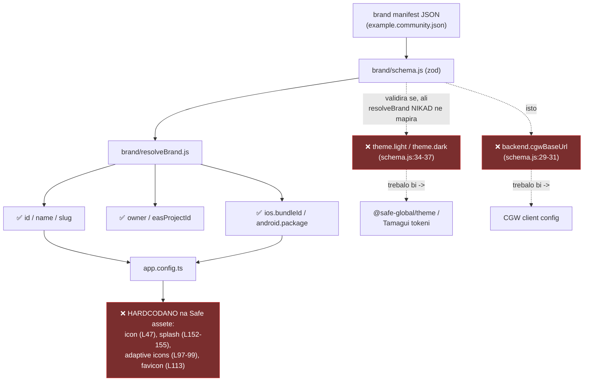

# Mobile app (apps/mobile) i white-label brand config

Statistika: 1.186 source fileova · samo 4× `any` (vrlo čisto) · 16× `@ts-ignore` · 15 progutanih `catch`-eva · 73 raw `console.*` · najveći file svega 418 linija (nema god-fileova)

> **Napomena za fork:** ovo poglavlje je najvažnije za airkuna white-label strategiju — brand pipeline (commit `f7cb87d44`) trenutno isporučuje samo _identitet_ (ime, bundle ID), ne i _vizual_ ni _backend_.

## Brand-config pipeline — što radi, a što je mrtvo

## Nalazi

### 1. 🔴 HIGH — `theme` i `backend` su mrtva schema polja

`brand/schema.js:34-37` deklarira `theme.light`/`theme.dark`, `:29-31` deklarira `backend.cgwBaseUrl`; `example.community.json` ih čak popunjava. Ali `resolveBrand.js:38-54` vraća samo id/name/slug/owner/ios/android — **grep za `cgwBaseUrl` i `brand.theme` u `src/` vraća nula pogodaka**. Fork koji postavi custom backend ili boje bit će tiho ignoriran.

**Fix:** ili wireati (`cgwBaseUrl` → CGW client config, `theme` → Tamagui/theme paket), ili maknuti polja iz scheme dok nisu implementirana da ne zavaravaju.

### 2. 🔴 HIGH — vizualni asseti hardcodani na Safe

`app.config.ts` čita brand stringove za imena/bundle ID-eve, ali ikona, splash, adaptive iconi, favicon i `safe-icons.ttf` su hardcodani na `./assets/images/...`. White-label build dobiva Safeovu ikonu i splash.

**Fix:** derivirati putanje iz manifesta (npr. `brand/assets/${BRAND_ID}/…`) s fallbackom na Safe defaulte.

### 3. 🟠 MEDIUM — ~100 hardcodanih hex boja zaobilazi theme paket

Uključujući brand-zelenu `#12FF80` kao default prop u `components/Loader/Loader.tsx:10` i skeleton sive u `SafeSkeleton.tsx:16-20`. Kad se brand `theme` jednom wirea (nalaz #1), ove komponente **neće promijeniti boju**.

**Fix:** zamijeniti literale theme tokenima — preduvjet da white-label theming uopće funkcionira.

### 4. 🟠 MEDIUM — placeholder EAS vrijednosti prolaze validaciju

`example.community.json`: `owner: "your-eas-account"`, all-zero UUID za `easProjectId` (prolazi `z.uuid()`), `appleTeamId: "XXXXXXXXXX"`. Fork otkriva problem tek na EAS submitu.

**Fix:** build-time guard koji odbija all-zero UUID / `XXXX` team ID.

### 5. 🟠 MEDIUM — test gap na security-osjetljivim mjestima

Od 120 hookova, 66 ima test (~55 %). Neistestirano, a osjetljivo:

- `features/WalletConnect/Wallet/store/methodRouter.ts` — 248 linija request routinga, 0 testova
- `features/WalletConnect/Wallet/store/walletKitListeners.ts`
- `hooks/useDelegateCleanup/utils.ts` — 258 linija

**Fix:** prioritetno pokriti WalletConnect routing i delegate-cleanup.

### 6. 🟡 LOW — higijena

- 15 progutanih `catch`-eva + 73 raw `console.*` unatoč postojećoj `Logger` apstrakciji (koristi se u 53 filea) → lint-ban `console.*` u `src/`.
- 69 raspršenih `Platform.OS` provjera → konsolidirati u platform util.
