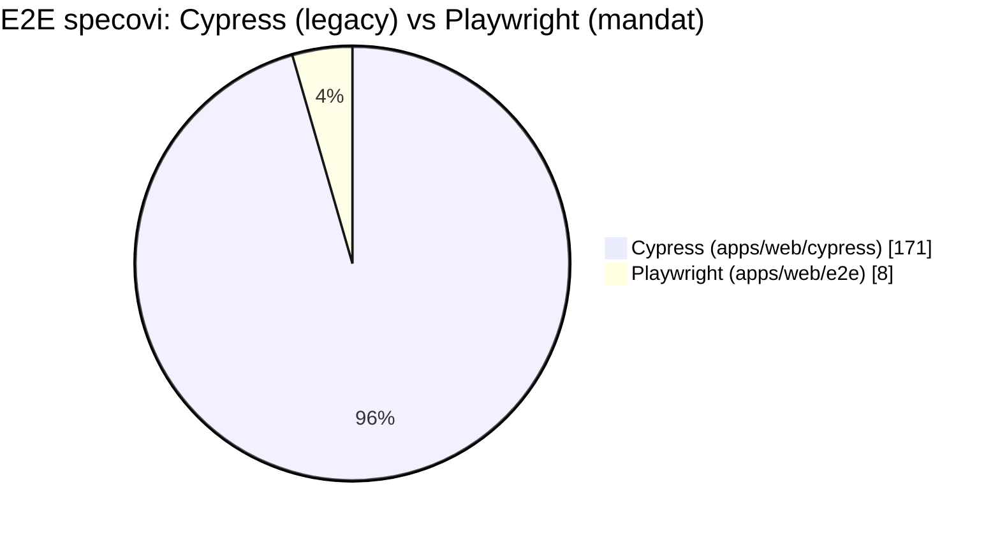
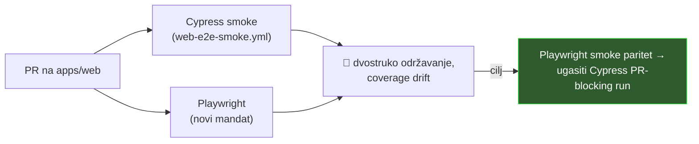

# Testovi i CI

## Brojke

| Workspace       | Source | Testovi | Omjer |
| --------------- | ------ | ------- | ----- |
| apps/web/src    | 2.336  | 765     | ~33 % |
| apps/mobile/src | 1.247  | 331     | ~27 % |
| packages/utils  | 311    | 60      | ~19 % |
| packages/store  | 41     | 7       | ~17 % |

30 CI workflowa · 93 `.snap` fileova (~26.600 linija) · 45 test fileova s MSW vs 29 s raw fetch mockingom

## Nalazi

### 1. 🟠 MEDIUM — Playwright migracija na ~4,5 %

AGENTS.md nalaže: svi novi E2E testovi u Playwright, Cypress je legacy. Realnost:

Playwright scaffold ima `.gitkeep` placeholdere u `regression/` i `e2e/` — praktički prazan. Migracijski vodič postoji (`apps/web/e2e/docs/CYPRESS_MIGRATION_GUIDE.md`), ali nema burndowna.

**Fix:** migracijski tracker + kvota po PR-u; prioritet smoke i prodhealthcheck suiteovi (najveća CI vrijednost).

### 2. 🟠 MEDIUM — dva E2E stacka paralelno u CI-ju

5 workflowa još vrti Cypress, uključujući `web-e2e-smoke.yml` **na svakom PR-u** koji dira `apps/web/**`. Dupli trošak održavanja + PR latencija.

### 3. 🟠 MEDIUM — 29 test fileova krši MSW mandat

AGENTS.md nalaže MSW umjesto mockanja `fetch`-a. Najveći klaster je **mobile services**: `ledger-execution.service.test.ts`, `ledger-safe-signing.service.test.ts`, `relayExecutor.test.ts`, `walletConnectExecutor.test.ts`, `walletconnect-signing.service.test.ts`… plus web (`vulnerableModules`, `recovery-state`, `useSimulation`) i `packages/store/cgwClient-hooks.test.ts`.

**Fix:** migrirati mobile klaster na MSW handlere; dodati lint pravilo za `global.fetch =` u testovima.

### 4. 🟡 LOW — snapshot bloat

93 `.snap` fileova; outlieri su full-DOM serializacije iz storyja:

- `safe-shield/__snapshots__/SafeShield.stories.test.tsx.snap` — **336 KB**
- `AssetsTable/__snapshots__/index.stories.test.tsx.snap` — 110 KB

Pucaju na svaku promjenu markupa, nitko ih smisleno ne reviewa. **Fix:** zamijeniti ciljanim assertionima ili malim inline snapshotima.

### 5. 🟡 LOW — ~6 stvarno skippanih testova čuva realne rupe

- `apps/mobile/.../useTransactionData.test.ts:127` — `it.skip` re-fetch na promjenu chainId-a (realna logika!)
- `apps/tx-builder/src/utils.test.ts:608,639` — tuple/BN parsing
- `apps/tx-builder/.../SolidityForm.test.tsx:95` — `xit` parameter collision
- `cypress/e2e/safe-apps/drain_account.spec.cy.js:58`

**Fix:** trijaža — popraviti ili otvoriti tracking issue, ne ostavljati tiho ugašeno.

### 6. ℹ️ CI higijena — dobra

Svi third-party actioni SHA-pinnani, nema `@master`/`@v3` floating tagova, kompozitni lokalni actioni dobro faktorizirani (`./.github/actions/yarn` × 31). Preporuka: Renovate/Dependabot policy da pinnani SHA-ovi ne odstare.
