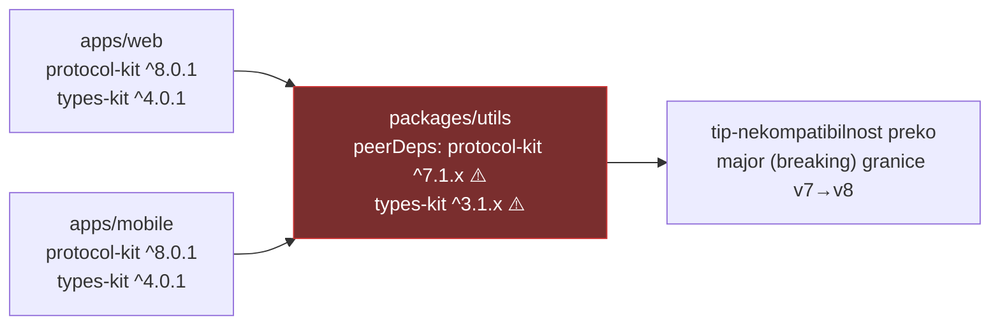

# Ovisnosti i sigurnosna higijena

Repo: yarn.lock ~1,73 MB · ~4.266 resolved paketa · Yarn 4 (Berry) · 4 lokalna patcha (`react-native`, `react-native-ble-plx`, `react-native-device-crypto`, `@tamagui/image`)

## Version drift — ključne ovisnosti

| Dependency                    | web          | mobile    | packages/utils | Status          |
| ----------------------------- | ------------ | --------- | -------------- | --------------- |
| react / react-dom             | 19.2.0       | 19.2.0    | —              | ✅              |
| ethers                        | 6.14.3       | 6.14.3    | 6.14.3         | ✅              |
| typescript                    | ~5.9.2       | ~5.9.2    | ~5.9.2         | ✅              |
| **@safe-global/protocol-kit** | ^8.0.1       | ^8.0.1    | **^7.1.x**     | 🔴 major skew   |
| **@safe-global/types-kit**    | ^4.0.1       | ^4.0.1    | **^3.1.x**     | 🔴 major skew   |
| react-hook-form               | 7.41.1 (pin) | ^7.54.2   | —              | 🟡 drift        |
| @safe-global/store            | workspace    | workspace | `*`            | 🟡 wildcard     |
| lodash                        | ^4.18.1      | ^4.18.1   | —              | 🟡 dupla kopija |

## Nalazi

### 1. 🔴 HIGH — SDK peer verzije u utils zaostaju cijeli major

Apps runaju SDK v8, a hrane `utils` koji očekuje v7 oblike tipova (`packages/utils/package.json:36,38`).

**Fix:** bump peer rangeova na `^8` / `^4`; usput `"@safe-global/store": "*"` → `workspace:^`.

### 2. 🟡 LOW — lodash: dvije kopije u bundleu (provjereno, nije incident)

Apps pinaju `^4.18.1`, dio transitivnih ovisnosti vuče `4.17.21` → dvije lodash kopije u stablu. **Provjereno protiv npm registryja:** `4.18.1` je legitiman službeni release (travanj 2026.), dakle nije supply-chain problem — samo dedupe prilika.

**Fix:** root `resolutions` unos za lodash, ili poravnati sve na jednu verziju. Usput: 4 filea importaju s barrela (`import { x } from 'lodash'`) — prebaciti na per-method import radi tree-shakinga.

### 3. 🟠 MEDIUM — `.env.example` dokumentira 5 od ~58 web varijabli

Kod referencira ~58 `NEXT_PUBLIC_*` varijabli; example dokumentira 5. Nedokumentirane a bitne: `NEXT_PUBLIC_CONFIG_SERVICE_KEY`, `NEXT_PUBLIC_GATEWAY_URL_PRODUCTION/STAGING`, `NEXT_PUBLIC_FIREBASE_OPTIONS_*`, `NEXT_PUBLIC_DATADOG_RUM_CLIENT_TOKEN`, `NEXT_PUBLIC_HYPERNATIVE_CLIENT_ID`. Mobile isto: fale `EXPO_PUBLIC_CONFIG_SERVICE_KEY`, `EXPO_PUBLIC_GATEWAY_URL_*`; a `EXPO_PUBLIC_INFURA_TOKEN` u exampleu izgleda stale. Bonus: typo `SERTIFICATE` u imenu varijable (`EXPO_PUBLIC_SECURITY_SERTIFICATE_HASH_BASE64`).

**Fix:** regenerirati oba `.env.example` iz stvarno referenciranih varijabli, grupirati required/optional. (Za fork ovo je i onboarding-blocker.)

### 4. 🟡 LOW — root `resolutions` pinovi bez dokumentacije

Hard pinovi: `ethers 6.14.3`, `viem 2.52.2`, `isows 1.0.7`, `webpack 5.97.1`, `elliptic ^6.6.1`, `stylus 0.64.0`… Pin na `elliptic` (kripto lib, povijesno CVE-sklon) je dobar _sada_, ali pinovi tiho zadržavaju security patcheve ako ih nitko ne revidira.

**Fix:** komentar/datum uz svaki resolution unos + periodični review (posebno elliptic, webpack, viem).

## Sigurnosna higijena — ✅ čisto

| Provjera                                                    | Rezultat                                                             |
| ----------------------------------------------------------- | -------------------------------------------------------------------- |
| Hardcodane tajne (`sk_live`, `PRIVATE_KEY =`, hex ključevi) | ✅ ništa — svi hex matchevi su javne contract adrese / test fixtures |
| `eval` / `new Function`                                     | ✅ nema                                                              |
| `dangerouslySetInnerHTML`                                   | ✅ 1 kontrolirano mjesto (`pages/_document.tsx`, statički payload)   |
| Plain-HTTP endpointi                                        | ✅ samo linkovi u cookie policy markdownu + 1 test mock              |
| localStorage osjetljivi podaci                              | ✅ samo consent/metadata, nikakav key materijal                      |
| Legacy libovi (moment, request, web3.js…)                   | ✅ nema                                                              |
| CI supply-chain                                             | ✅ svi actioni SHA-pinnani                                           |
