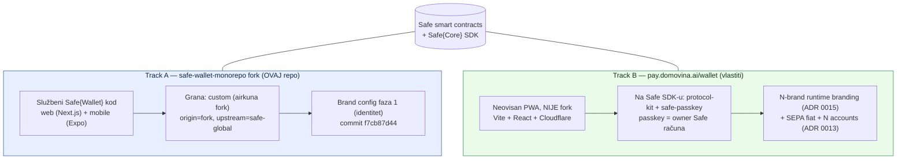
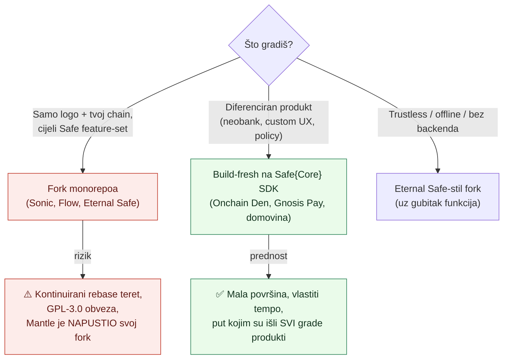

# 01 — Vizija i strategija

## Cilj

Izgraditi **N custom-brandiranih self-custody community walleta** iz **jedne brand-agnostičke kodne baze**, gdje se branding kontrolira **izvana** (u budućnosti iz SaaS dashboarda + baze podataka), a codebase sadrži **isključivo funkcionalnost**. Prvi modul je "osnovni wallet kao u Revolutu": N računa + jednostavno slanje drugim korisnicima (bankarski feel).

Princip: **branding kao podatak, ne kao fork.** Umjesto N forkova s hardkodiranim brandom, jedan codebase + manifest po brandu.

## Dva track-a

Trenutno postoje dvije paralelne implementacije, s komplementarnim jakim stranama:

|                   | Track A — Safe fork (ovaj repo)                                                 | Track B — domovina wallet                                                    |
| ----------------- | ------------------------------------------------------------------------------- | ---------------------------------------------------------------------------- |
| Odnos prema Safeu | **Fork** GPL-3.0 monorepoa                                                      | **Neovisan**, samo npm SDK (`protocol-kit`, `safe-passkey`)                  |
| Platforma         | Web + Mobile (native)                                                           | Web / PWA (native tek predložen — ADR 0014)                                  |
| Jaka strana       | Multi-asset/multi-chain portfelj, zreo send/contacts, **GTF Safe-pays** gasless | Passkey onboarding, **N accounts instant-mint**, SEPA fiat, runtime branding |
| Onboarding        | seed / private key / Ledger (bez passkeya)                                      | **passkey** (bez seeda)                                                      |
| Brand sustav      | manifest-driven _native identitet_ (faza 1)                                     | runtime hostname → CSS varijable (ADR 0015, gotovo)                          |

> Detalji feature pokrivenosti: [03 — Feature audit](03-feature-audit-revolut.md). Detalji brand sustava: [02](02-brand-config-sustav.md).

## Strateška odluka: fork frontend ili graditi na SDK-u?

Prior art daje jasan signal (detalji u [04](04-prior-art-landscape.md)):

**Zaključak:** za brzi **branded Safe mobilni app** — Track A fork je OK (i danas smo ga opremili brand configom). Za **diferencirani neobank** — prior art + tvoj vlastiti **ADR 0014** (RN/Expo klijent nad domovina jezgrom) pokazuju na **build-on-SDK** put. To je svjesna odluka koju treba donijeti, ne default.

## Dva sloja brandinga (vrijedi za oba track-a)

Ključna distinkcija koja određuje što ide u binary, a što u runtime/config:

| Sloj                 | Primjeri                                                     | Promjenjivo u runtimeu?   | Po brandu =                    |
| -------------------- | ------------------------------------------------------------ | ------------------------- | ------------------------------ |
| **Native identitet** | ime, packageName, bundleId, scheme, EAS, **Firebase (push)** | Ne — zapečeno po binaryju | zaseban binary + store listing |
| **Runtime branding** | boje, typography, in-app logo, copy, backend URL             | Da — može i OTA           | isti kod, drugi manifest       |

Bitno za očekivanja: **jedan community = jedan binary + jedan store listing.** SaaS automatizira _proizvodnju_ tih binarya iz konfiguracije, ali ih ne može spojiti u jedan app u storeu (Apple/Google to traže).

## Povezano

- [[fork-overlay-strategy]] (memory) — git topologija forka, overlay pravila
- [[domovina-wallet-and-neobank-strategy]] (memory) — sažetak istraživanja
- [02 — Brand config sustav](02-brand-config-sustav.md)
- [04 — Prior art landscape](04-prior-art-landscape.md)
