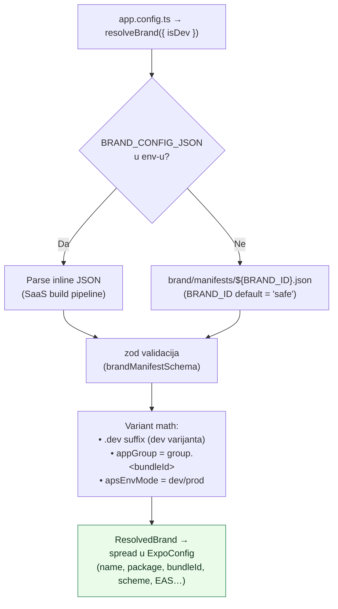
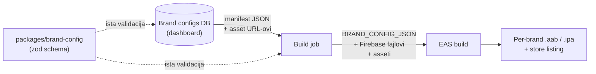
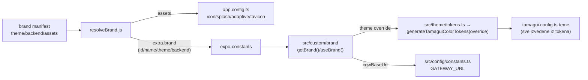

# 02 — Brand config sustav (faza 1: native identitet · faza 2: runtime branding)

> Izvor istine u kodu: [`apps/mobile/brand/`](../../apps/mobile/brand/README.md) · Isporučeno: faza 1 u commitu `f7cb87d44` (`feat(mobile): manifest-driven white-label brand config`), faza 2 (theme/backend/assets) u sklopu handoff [faze 1 — runtime branding](handoffs/faza-1-runtime-branding.md).

## Ideja

`app.config.ts` više **ne hardkodira** Safe identitet. Umjesto toga čita **brand manifest** (JSON) u build-timeu i "zapeče" identitet u binary. Codebase ostaje brand-agnostičan; identitet je podatak.

**Zašto CommonJS `.js` a ne `.ts`:** Expo-ov config loader transpilira **samo** `app.config.ts` (single-file, nije bundler) i onda `require`-a siblinge kroz obični Node resolver, koji ne razrješava `.ts`. Zato su `brand/*.js` (+ `.d.ts` za tipove) — isti obrazac kao postojeći `expo-plugins/*.js`.

## Datoteke

```
apps/mobile/brand/
├─ schema.js / schema.d.ts        # zod manifest schema (+ tipovi) — dijeljivo s budućim dashboardom
├─ resolveBrand.js / .d.ts        # sva variant-logika (.dev suffix, iOS app-group, APNs mode)
├─ resolveBrand.test.ts           # 6 testova (safe manifest = identično starom)
├─ README.md                      # dokumentacija
└─ manifests/
   ├─ safe.json                   # default (BRAND_ID unset) = Safe identitet 1:1
   └─ example.community.json       # template za novi brand
apps/mobile/app.config.ts          # čita brand.* umjesto hardkodiranog Safea
apps/mobile/.gitignore             # per-brand manifesti + Firebase fajlovi ignorirani
```

## Kako se manifest razrješava



**Prioritet:** `BRAND_CONFIG_JSON` (inline, SaaS) → `brand/manifests/${BRAND_ID}.json` → default `safe` (nepromijenjeno ponašanje).

## Native vs runtime slojevi

| Sloj                 | Polja u manifestu                                                                    | Kad se primjenjuje              | Faza               |
| -------------------- | ------------------------------------------------------------------------------------ | ------------------------------- | ------------------ |
| **Native identitet** | `name`, `android.package`, `ios.bundleIdentifier`, `scheme`, `owner`, `easProjectId` | build-time, po binaryju         | ✅ Faza 1 (gotovo) |
| **Vizualni asseti**  | `assets.*` (icon, splash, adaptive iconi, favicon)                                   | build-time, po binaryju         | ✅ Faza 2 (gotovo) |
| **Runtime branding** | `theme` (palette override), `backend.cgwBaseUrl`                                     | app startup (via `extra.brand`) | ✅ Faza 2 (gotovo) |
| **Feature flagovi**  | `features` (record; npr. `ff` klupski feature-pack)                                  | app startup (via `extra.brand`) | ✅ (FF MVP)        |
| **Identity**         | `identity` (ENS parent domena, registration proxy URL, resolver chain, reserved)     | app startup (via `extra.brand`) | ✅ Faza 4          |

Verificirano: `safe` default daje **bit-identičan** identitet starom (dev i prod), `BRAND_ID=example.community` prebacuje cijeli identitet, `BRAND_CONFIG_JSON` nadjačava sve.

## SaaS pipeline (cilj)



Dashboard i app validiraju **istim** zod schemom. Sljedeći korak: promovirati `schema.js` u `packages/brand-config` (dijele web + mobile + dashboard).

### Što je stvarnost od faze 5 (2026-07-22)

Ručno-pokretljiv deterministički pipeline **manifest in → potpisani build out** postoji:

- **`brand doctor`** (`apps/mobile/brand/doctor.js`, `yarn workspace @safe-global/mobile brand:doctor <id>`) — validira kompletnost brand paketa: schema, asseti, Firebase datoteke + podudaranje application id-jeva, OTA certifikat, `eas.json` profili. CI mod `--remote-firebase`.
- **EAS profili per brand** — `preview-<id>` / `production-<id>` u `eas.json`, nose samo `env.BRAND_ID`; Firebase configi putuju kao **file-type EAS env vars** u brandovom EAS projektu (gitignored datoteke ne ulaze u build arhivu).
- **CI** — `.github/workflows/mobile-brand-release.yml` (ručni `workflow_dispatch`: brand_id + variant + platform → doctor + EAS cloud build).
- **Store checklist** — [16 — Release checklist](16-release-checklist.md).

**Ostaje vizija (post-MVP):** dashboard koji generira manifest + profile, automatski `eas submit`, `packages/brand-config` dijeljena schema, OTA rebrand.

## Faza 2 — theme injection (isporučeno)

Implementirano ovako (vidi [handoffs/faza-1-runtime-branding.md](handoffs/faza-1-runtime-branding.md), "Zapisnik izvršenja"):



- Override se primjenjuje u **generiranju tokena** (`applyPaletteOverride` u `packages/theme`, dot-path ključevi), ne u provideru — Tamagui config se gradi statički pri učitavanju modula i nije reaktivan. Zbog toga je brand fiksan po binaryju; OTA rebrand (dohvat teme s backenda) ostaje moguća nadogradnja, zahtijevala bi restart-gated apply.
- `generateTamaguiThemes`/`generateTamaguiColorTokens` bez overridea vraćaju **byte-identičan** rezultat (bakcompat test), pa je `safe` build nepromijenjen. Web (`generateMuiTheme`, `css-vars`) se ne dira.

## Usporedba: kako je domovina wallet riješio branding (ADR 0015)

Track B je isti problem riješio **drugačije** i **na webu je gotov**:

|                  | Ovaj repo (Track A)                         | domovina wallet (Track B, ADR 0015)        |
| ---------------- | ------------------------------------------- | ------------------------------------------ |
| Što brenda       | **native identitet** (ime/package/bundleId) | **runtime vizual** (boje → CSS varijable)  |
| Kad              | build-time (po binaryju)                    | runtime, **jedan deployment N brendova**   |
| Rezolucija       | `BRAND_ID` / `BRAND_CONFIG_JSON`            | `window.location.hostname` → brand         |
| Gdje config živi | `brand/manifests/*.json`                    | `src/brands/<id>/brand.ts` (u repou)       |
| Tenanti          | safe, example.community (template)          | default, sportklub, zupa, **edemokracija** |

**Pouka:** kad Track A dođe do faze 2 (runtime vizual), domovina ADR 0007/0015 su gotov referentni dizajn — `applyBrandCss.ts` (CSS `--brand-*` varijable) je izravno prenosiv obrazac na web, a na mobileu ekvivalent su Tamagui token overrides.

## Povezano

- [`apps/mobile/brand/README.md`](../../apps/mobile/brand/README.md) — operativna dokumentacija (kako buildati brand)
- [01 — Vizija i strategija](01-vizija-i-strategija.md)
- [[fork-overlay-strategy]] (memory)
