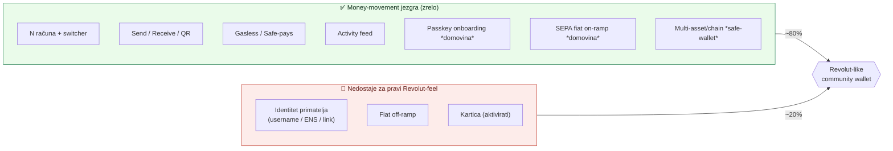

# 03 — Feature audit: "Revolut-like" spremnost

> Metoda: 3 paralelna subagenta (recon ovog monorepoa, recon `pay.domovina.ai/wallet`, web prior art), 2026-07-04.

## Zaključak

**~80% "Revolut-like osnovnog walleta" već postoji** — ali razdvojeno na dva codebasea s komplementarnim jakim stranama. Nijedan **sam** nije 100%; njihova **unija** je ~80%. Jedini pravi gap koji **oba** dijele — i koji prior art označava kao najvažniji — je **ljudski-čitljiv identitet primatelja**.

## Matrica sposobnosti

| Feature                                  | `domovina/wallet`                         | `safe-wallet` mobile                | Status                 |
| ---------------------------------------- | ----------------------------------------- | ----------------------------------- | ---------------------- |
| N računa + switcher                      | ✅ ADR 0013, instant mint bez gasa        | ✅ (samo import postojećih Safeova) | **gotovo**             |
| Passkey seedless onboarding              | ✅ Face ID, bez seeda                     | ❌ samo seed/PK/Ledger              | domovina               |
| Kreiranje **novog** računa u appu        | ✅ lokalno, bez gasa                      | 🟡 samo import                      | domovina               |
| Send na adresu / QR / recent             | ✅                                        | ✅ wizard + risk-validacija         | **gotovo**             |
| **Send po username / ENS / directoryju** | ❌                                        | ❌                                  | **GAP**                |
| Receive QR + payment link                | ✅ EIP-681 + share link                   | 🟡 gola adresa (bez iznosa)         | domovina               |
| Gasless / sponzorirano                   | ✅ vlastiti relayer (5/dan)               | ✅ relay + **GTF Safe-pays**        | **gotovo (oba)**       |
| Fiat on-ramp                             | ✅ SEPA/Monerium (IBAN→EURe)              | ❌ (mobile `onramp:false`)          | domovina               |
| Fiat off-ramp (cash-out)                 | ❌                                        | ❌                                  | gap                    |
| Kartica (VISA, Revolut-like)             | 🔬 kodirano, **flagged OFF** (Gnosis Pay) | ❌                                  | skoro                  |
| Multi-asset / portfelj                   | ❌ samo EURe                              | ✅ tokeni/NFT/DeFi                  | safe-wallet            |
| Multi-chain                              | ❌ samo Gnosis                            | ✅ switching + auto-discovery       | safe-wallet            |
| Runtime N-brand branding                 | ✅ ADR 0015 (4 tenanta)                   | 🟡 faza 1 (samo native identitet)   | domovina               |
| Activity feed / povijest                 | ✅ on-chain Transfer feed                 | ✅                                  | **gotovo**             |
| Address book / kontakti                  | 🟡 lokalni recent (max 20)                | ✅ per-chain CRUD, u Send wizardu   | djelomično/safe-wallet |

Legenda: ✅ gotovo · 🟡 djelomično · ❌ nema · 🔬 kodirano ali isključeno.

## Vizualno: pokrivenost i gap

## Što znači "GTF Safe-pays" (gasless u ovom repou)

GTF = per-chain feature flag (`FEATURES.GTF`) za **"Safe plaća gas"**. Transakcija je "Safe-paid" kad nosi GTF fee polja (`gasPrice>0`, `baseGas>0`, non-zero `refundReceiver`) koja triggeraju on-chain `Safe.handlePayment()` — Safe refundira relayera **iz vlastitog balansa u gas tokenu**, ne u native valuti.

- Predikat: [`packages/utils/src/utils/isGtfSafePaid.ts`](../../packages/utils/src/utils/isGtfSafePaid.ts)
- "Execute Free" red u UI-u pokazuje se signeru samo kad je GTF enabled → izvršava besplatno jer Safe plaća.
- Dva sloja: (a) **Relaying** (besplatno, dnevna kvota), (b) **GTF Safe-pays** (zaobilazi kvotu, Safe funda fee).

Ovo je najjači "neobank" diferencijator koji je u Safe mobile appu već produkcijski (nedavno očvršćen, #8156).

## Ključni gap: identitet primatelja

U **oba** codebasea slanje ide na **0x adresu / QR / spremljeni kontakt** — nema `.eth`, username, telefonski broj, ni directory korisnika. Prior art ([04](04-prior-art-landscape.md)) pokazuje da su **svi** uspješni neobank self-custody wallete (Daimo, Sling, Base App, Kresus, Peanut) riješili upravo to. Univerzalno pravilo: **nikad ne pokazuj hex adresu pošiljatelju.**

## Preporučeni redoslijed gradnje

1. **Identity layer** (najveći ROI) — ENS offchain subnames (Namestone/Durin → besplatan `ime.brand.eth`, gasless) + Peanut-stil claim linkovi (slanje ne-korisnicima).
2. **Aktivirati karticu** — Gnosis Pay flow je već kodiran u domovini, blokiran samo na partner-registraciji.
3. **Fiat off-ramp** — zaokružiti bankarski loop.
4. **Frictionless onboarding na Safe mobile forku** — passkey + kreiranje novog Safea (trenutno samo import).

## Povezano

- [04 — Prior art landscape](04-prior-art-landscape.md) — tko je i kako riješio identity layer
- [[domovina-wallet-and-neobank-strategy]] (memory)
