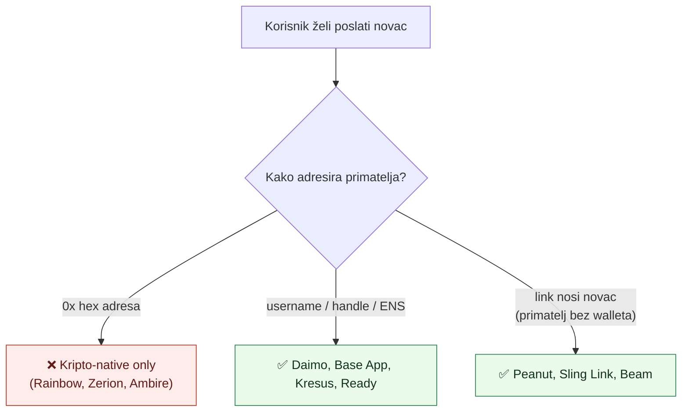

# 04 — Prior art landscape

> Kompilirano srpanj 2026. Nekoliko proizvoda je rebrandiralo/pivotiralo 2025–2026 — vidi "Staleness" na dnu. Metrike iz vendor izvora su okvirne.

## Ključni uvid

**Identitetski sloj je cijela igra.** Wallete s mainstream P2P-om (Base App, Sling, Peanut, Daimo) svi su zamijenili hex adresu nečim ljudskim — **username/handle**, **directory lookup**, ili **link koji nosi novac** (primatelj ne treba wallet). General-purpose EVM wallete (Rainbow, Zerion, Ambire) staju na ENS/adresi — dovoljno za kripto-native, slabo za "pošalji novac mami".

## A) Whitelabel / brandirani Safe forkovi

Safe{Wallet} monorepo je **GPL-3.0** — fork je dozvoljen ali derivati moraju ostati GPL-3.0.

| Projekt                                                                                    | Što je                                                            | Ishod / pouka                                         |
| ------------------------------------------------------------------------------------------ | ----------------------------------------------------------------- | ----------------------------------------------------- |
| **Eternal Safe** ([repo](https://github.com/eternalsafe/wallet))                           | Decentralizirani fork, bez backenda, P2P "Smart Links" za potpise | Referenca za puni fork — ali _obrisao_ dosta funkcija |
| **Sonic/Fantom** ([repo](https://github.com/Fantom-foundation/sonic-safe-wallet-monorepo)) | Fork za Sonic/Fantom                                              | Chain rebrand                                         |
| **Flow** ([repo](https://github.com/onflow/safeglobal-wallet-web))                         | Fork pod Flow orgom                                               | Chain rebrand                                         |
| **Mantle** ([blog](https://safe.global/blog/safe-is-now-live-on-mantle))                   | Bio branded Mantle fork                                           | **UGAŠEN**, vraćen na službeni `app.safe.global`      |
| **Protofire** ([site](https://protofire.io/projects/gnosis-safe-wallet/))                  | Deploya branded Safe na 100+ mreža                                | Danas formalizirano kroz Safe program                 |

**Produkti _na_ Safeu (ne UI fork):** Onchain Den (team wallet), Multis (**Safe ga apsorbirao 2024**), Gnosis Pay (Safe račun po korisniku), velike DAO riznice (Uniswap, Aave, ENS, Lido).

> ⚠️ Fireblocks (MPC) i Squads (Solana) **nisu** Safe forkovi.

## Safe{Core} SDK (službeni put za graditi vlastiti wallet)

| Kit                                              | Svrha                                            |
| ------------------------------------------------ | ------------------------------------------------ |
| **Starter Kit** (`@safe-global/sdk-starter-kit`) | Unified entry point, preporučeni default         |
| **Protocol Kit** (`@safe-global/protocol-kit`)   | Deploy/config/sign/execute/batch Safeova         |
| **API Kit**                                      | Safe Transaction Service (propose/confirm/list)  |
| **Relay Kit** (`@safe-global/relay-kit`)         | Gas abstrakcija (ERC-4337 + Gelato, sponzorstvo) |

- **Auth Kit je DEPRECATED** → novi pristup "**Signers**": integriraj Web3Auth/Magic/Privy/Dynamic/**passkeys** i priveži signer kao Safe ownera ([Signers docs](https://docs.safe.global/sdk/signers)).
- **Safe 4337 Module** pretvara Safe u native ERC-4337 račun (paymaster gas, batching, passkey signers).
- **"Launch your network with Safe"** ([safe.global/networks](https://safe.global/networks)) = co-branded hosted UI + podrška, **ne** turnkey "kloniraj svoj app".

**Pravilo:** logo-na-tvom-chainu → Safe networks program. Diferenciran wallet → **build na SDK-u**. Trustless/offline → Eternal Safe-stil fork. _Svi product-grade "powered by Safe" wallete izabrali su SDK, ne frontend fork._

## B) Neobank self-custody wallete — kako šalju

| Wallet                               | Identitet primatelja                            | Gas                                | Self-custody model                   | AA / passkey                  |
| ------------------------------------ | ----------------------------------------------- | ---------------------------------- | ------------------------------------ | ----------------------------- |
| **Gnosis Pay**                       | ENS na kartici; nema social                     | kartica sponzorirana (Gelato)      | Safe + Roles/Delay modul             | Safe (ne 4337)                |
| **Argent → Ready** ⚠️                | **ENS username, kontakti, payment link**        | gasless (paymaster)                | smart contract + guardian recovery   | Starknet AA; 4337+7702 na EVM |
| **Ambire**                           | ENS + Unstoppable                               | **gas-u-stablecoinu** ("gas tank") | email = 2/2 multisig                 | 4337 + EIP-7702               |
| **Daimo** ⚠️ (arhiviran '26)         | **username + payment link + FaceID**            | potpuno sponzorirano               | secure-enclave passkey               | **4337 + passkeys**           |
| **Base App** (ex-Coinbase Wallet) ⚠️ | **USDC-u-chatu, Basenames, Base Pay linkovi**   | sponzorirano, <2s                  | passkey smart wallet                 | **4337 + passkeys**           |
| **Rainbow**                          | ENS/adresa                                      | native                             | EOA (+ passkey backup, neprovjereno) | 4337 reported                 |
| **Zerion**                           | ENS/adresa + book                               | gasless na ZERO L2 (**gasi se**)   | MPC recovery (reported)              | AA na ZERO                    |
| **Sling Money**                      | **directory po imenu + claim-link (bez app-a)** | **free/sponsorirano**              | secure-enclave keypair, bez seeda    | Solana (ne 4337)              |
| **Peanut**                           | **link/QR, adresa nepotrebna**                  | gasless claim                      | non-custodial vault ugovor           | 4337-style, cross-chain       |
| **Kresus**                           | besplatan **`.kresus` handle**                  | sponzorirano                       | MPC + AA vault, seedless             | ERC-4337                      |

## Tehnički primitivi za "slanje u par tapova"

**Account abstraction:**

- **ERC-4337** — UserOperation → bundler → EntryPoint (ista adresa svaki chain).
- **EIP-7702** (Pectra, live svibanj 2025) — postojeći EOA privremeno dobiva smart-account kod **bez promjene adrese** → batching, sponzorstvo, session keys.
- **Paymasters** — ugovor plaća gas iz prefunda (Alchemy, Pimlico, Biconomy, ZeroDev, Coinbase CDP, Candide).
- **Passkeys/WebAuthn** — račun verificira **P-256 (secp256r1)** potpise; skupo on-chain → **RIP/EIP-7212 precompile**. Referenca: [Safe passkey modul](https://docs.safe.global/advanced/passkeys/passkeys-safe).

**Identitet / adresiranje:**

- **ENS + offchain subnames** preko CCIP-Read (ERC-3668) + wildcard (ENSIP-10) → gasless subnames. Alati: **Namestone** (offchain DB), **Durin** (L2 NFT registry).
- **Basenames** — onchain imena na Base (ENS tech), gasless registracija za Smart Wallet.
- **ERC-3770** — `shortName:address` chain-scoped format (npr. `eth:0x…`); nasljednik ERC-7930.
- **Farcaster** — FID → custody adresa; @username → payable.

**Payment/claim linkovi:**

- **Peanut Protocol** — sender deponira u vault; sredstva se otključavaju tajnom u URL-u; **gasless za primatelja**, radi za **primatelje bez walleta**. Repo: [`peanut-sdk`](https://github.com/peanutprotocol/peanut-sdk).
- **EIP-681** URI/QR (`ethereum:0x…?value=…`) — standard za request-money, ali nekonzistentno implementiran.

**Vrijednost + fiat:**

- **Stablecoini:** USDC (default AA rail); **Monerium EURe** (MiCA e-money s **on-chain IBAN** SEPA auto-mint/redeem — koristi ga i domovina wallet).
- **On/off-ramp:** MoonPay, Transak, Ramp, Coinbase Onramp, Onramper.

## Reusable OSS building blocks

| Block                               | Što daje                                                      |
| ----------------------------------- | ------------------------------------------------------------- |
| **permissionless.js** (Pimlico)     | viem-based ERC-4337, account-agnostic (Safe/Kernel/Nexus)     |
| **Safe Relay Kit + 4337 Module**    | audited gas abstrakcija + native 4337 Safe                    |
| **Peanut SDK**                      | link-based transferi, gasless claim, cross-chain              |
| **Namestone / Durin**               | ENS subnames (offchain gasless / L2 NFT) → ljudski handle-ovi |
| **Candide AbstractionKit**          | 4337/7702 SDK + Safe Social Recovery Module                   |
| **Reown AppKit** (ex-WalletConnect) | wallet-connection + web3 UX                                   |
| **Privy / Dynamic / Turnkey**       | embedded wallete / passkey / MPC key mgmt (kao Safe signer)   |
| **Coinbase CDP**                    | hosted paymaster + fiat onramp + embedded wallets             |

## UX obrasci za frictionless P2P send

1. **Nikad ne pokazuj hex adresu pošiljatelju** — handle/ENS/kontakt/link. Najveća poluga.
2. **Link koji nosi novac** (Peanut, Sling) — primatelj ne treba postojeći wallet.
3. **Nevidljiv gas** — paymaster (4337/7702) ili apsorbiraj sub-cent L2/Solana fee.
4. **Seedless self-custody** — passkey/secure-enclave ili MPC social login.
5. **Stablecoin-denominirano** da balans izgleda kao banka ("€X").
6. **Biometrija-za-slanje** u što manje tapova (Daimo FaceID referenca).
7. **Request-money + QR** kao inverzni tok; fiat on/off-ramp (ili IBAN auto-mint à la Monerium).

## Staleness / pouzdanost (srpanj 2026)

- **Potvrđene promjene 2025–26:** Auth Kit → Signers; Argent → **Ready**; Coinbase Wallet → **Base App** (srpanj 2025); **Daimo consumer app arhiviran** (velj 2026) → Daimo Pay B2B; Zerion ZERO L2 se gasi; Mantle fork ugašen; EIP-7702 live (Pectra, svibanj 2025).
- **Niža pouzdanost (provjeriti):** Rainbow 4337+passkey; Zerion MPC detalji; Gnosis Pay P2P-send gas sponzorstvo; Peanut formalni audit; adopcijske metrike su vendor figure.
- **Najbolje dizajn-reference za P2P send sloj:** stari **Daimo**, **Sling**, **Base App**, **Peanut**, **Kresus**.

## Povezano

- [03 — Feature audit](03-feature-audit-revolut.md) — gdje smo mi vs ovaj landscape
- [01 — Vizija i strategija](01-vizija-i-strategija.md) — build-vs-fork odluka
