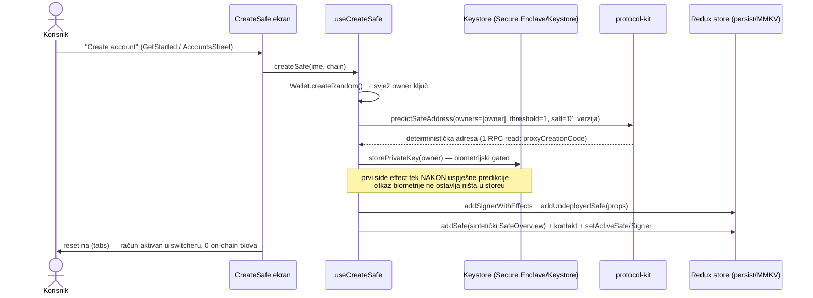
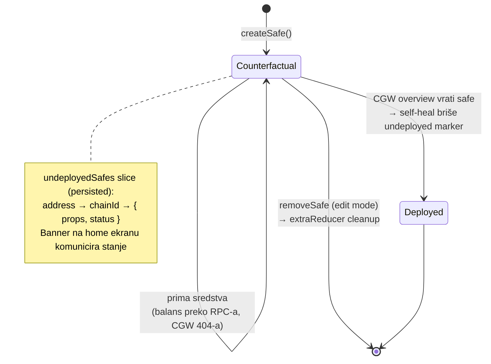
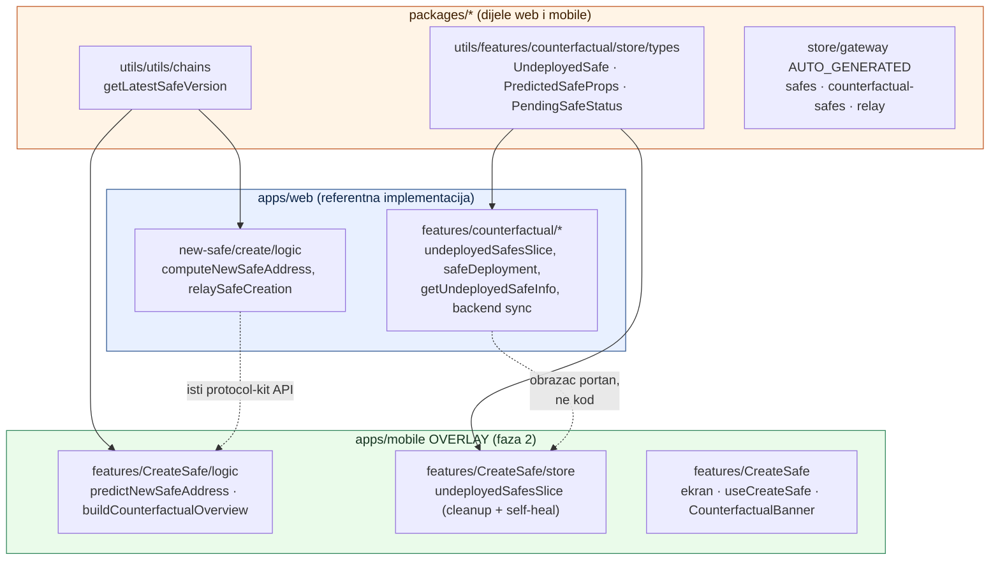
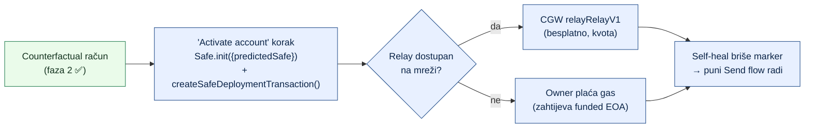

# 05 — Counterfactual onboarding (faza 2): arhitektura i naučene lekcije

> Datum: 2026-07-06 · Isporučeno u commitima `c9a4e47cf..102cf1c33` (grana `custom`) · Jezik: HR
> Trajni zapis arhitekture "Create account" flowa na Safe mobile forku — što je izgrađeno, zašto baš tako, i koje lekcije vrijede za sljedeće faze. Izvršni zapisnik faze je u [handoffs/faza-2](handoffs/faza-2-onboarding-novi-safe.md#zapisnik-izvršenja).

## Ideja u jednoj rečenici

Novi račun = **CREATE2 predikcija, ne transakcija**: adresa Safea je deterministička funkcija (owner, threshold, salt, verzija, factory), pa račun "postoji" i prima sredstva čim je izračunat — deploy se plaća tek kad korisnik prvi put nešto šalje.

## Tok kreiranja računa

Ključna invarijanta: **pohranjeni `props` (PredictedSafeProps) == ulaz u predikciju**. Kasniji deploy kroz `Safe.init({ predictedSafe: props })` gradi identičnu deployment transakciju → ista adresa. Zato je `saltNonce` fiksan (`'0'` — svjež owner sam čini adresu jedinstvenom) i zato testovi asertiraju upravo tu jednakost, a ne on-chain točnost.

## Životni ciklus counterfactual računa

Dva automatska prijelaza žive kao `extraReducers` u `undeployedSafesSlice` — **bez diranja upstream sliceova**:

- `removeSafe` (iz `safesSlice`) → briše i counterfactual entry.
- `safesGetOverviewForMany.matchFulfilled` → ako CGW vrati overview za (adresa, chain), safe je deployan i indeksiran → marker se briše. Isti matcher koji `safesSlice` koristi za refresh balansa; CGW **izostavlja** nepoznate safeove iz odgovora (ne erroira), pa counterfactual entry ne truje batch.

## Mapa koda: što je gdje (web ↔ shared ↔ mobile)

Bitna razlika prema webu: web danas koristi noviji `ReplayedSafeProps` (eksplicitni factory/singleton + vlastita CREATE2 matematika) i sinka counterfactual safeove na CGW backend. Mobile MVP namjerno koristi **stariji-ali-podržani `PredictedSafeProps`** (protocol-kit sam resolva kontrakte iz `safe-deployments`) i **nema backend sync** — nula novih ovisnosti, deploy path kasnije ide kroz isti protocol-kit.

## Thin seamovi (overlay disciplina)

Sva nova funkcionalnost je u novim datotekama; upstream je dirnut na točno 6 mjesta, ukupno ~20 linija: `store/index.ts` (reducer wiring), `app/_layout.tsx` (Stack.Screen), `app/create-safe.tsx` (novi route file), CTA u `GetStarted.tsx` i `MyAccountsFooter.tsx`, `<CounterfactualBannerContainer />` u `AssetsHeader.tsx` (renderira `null` za deployane safeove, pa je sigurno mountati bezuvjetno — isti obrazac kao postojeći `ReadOnlyContainer`).

## Naučene lekcije (vrijede za faze 3–5)

1. **Sintetički `SafeOverview` je dovoljan da račun "postoji" u cijelom appu.** Switcher, edit mode, kontakti — sve radi bez izmjena jer mobile store modelira račun kao `safes[address][chainId] = SafeOverview`. Novi tip računa = upiši kompatibilan overview, ne mijenjaj potrošače.
2. **CGW izostavlja nepoznate safeove iz overview odgovora umjesto da erroira** — na tome počiva i import flow (`deployedChainIds`) i naš self-heal. Ali pojedinačni endpointi (`safe-info`, `balances`) za nedeployan safe **404-aju** → balans se čita direktno s RPC-a (`useNativeBalance`), a Tokens tab ostaje poznati dug.
3. **Jest gotcha: per-file `jest.mock('expo-constants')` dolazi prekasno za module koje jest setup već evaluira.** Theme-token seam (faza 1) povuče `getBrand` pri setupu i zamrzne mu referencu na pravi modul. Rješenje: `jest.isolateModules` + require unutar izolirane registrije (vidi `getBrand.test.ts`). Vrijedi za svaki budući overlay modul koji se importa iz theme/config lanca.
4. **`const enum` iz shared paketa (npr. `PayMethod`) ne smije se value-importati u mobile** (babel ne inlinea cross-module const enume) — koristi string literal + `as PayMethod` cast uz `import type`.
5. **Side-effect redoslijed u onboarding flowu**: predikcija (čisto, može failati) → keystore (biometrija, može failati) → tek onda store upisi. Otkaz na bilo kojem koraku ne ostavlja polovičan račun.
6. **Tamagui `disabled` gumb i dalje okida `onPress` u react-native testing library** — guardaj handler (`onPress={canDo ? handler : undefined}`), ne samo prop.

## Što je svjesno odgođeno (i preporučeni put)

> **Ažuriranje 2026-07-10:** "Activate account" korak iz dijagrama ispod je implementiran točno po ovom putu (relay + owner-EOA fallback) u hardening prolazu — vidi [07 — Hardening: aktivacija + brand sigurnost](07-hardening-aktivacija-i-brand-sigurnost.md). Deploy-uz-prvu-transakciju ostaje odgođen.

Deploy-uz-prvu-transakciju (webov `wrapSafeTransactionIntoDeploymentBatch`) dira shared ConfirmTx/tx-sender flow — preveliko za overlay u jednoj fazi. Web referenca kad dođe vrijeme: `apps/web/src/features/counterfactual/services/safeDeployment.ts`.

## Povezano

- [02 — Brand config sustav](02-brand-config-sustav.md) — `backend.defaultChainId` (novo manifest polje iz ove faze) slijedi isti passthrough obrazac
- [03 — Feature audit](03-feature-audit-revolut.md) — red "Kreiranje novog računa" sada ✅ za oba tracka
- [handoffs/faza-2](handoffs/faza-2-onboarding-novi-safe.md) — izvršni zapisnik s dizajn odlukama i dugom
- [handoffs/faza-3](handoffs/faza-3-receive-payment-linkovi.md) — sljedeća faza (receive + payment linkovi)
