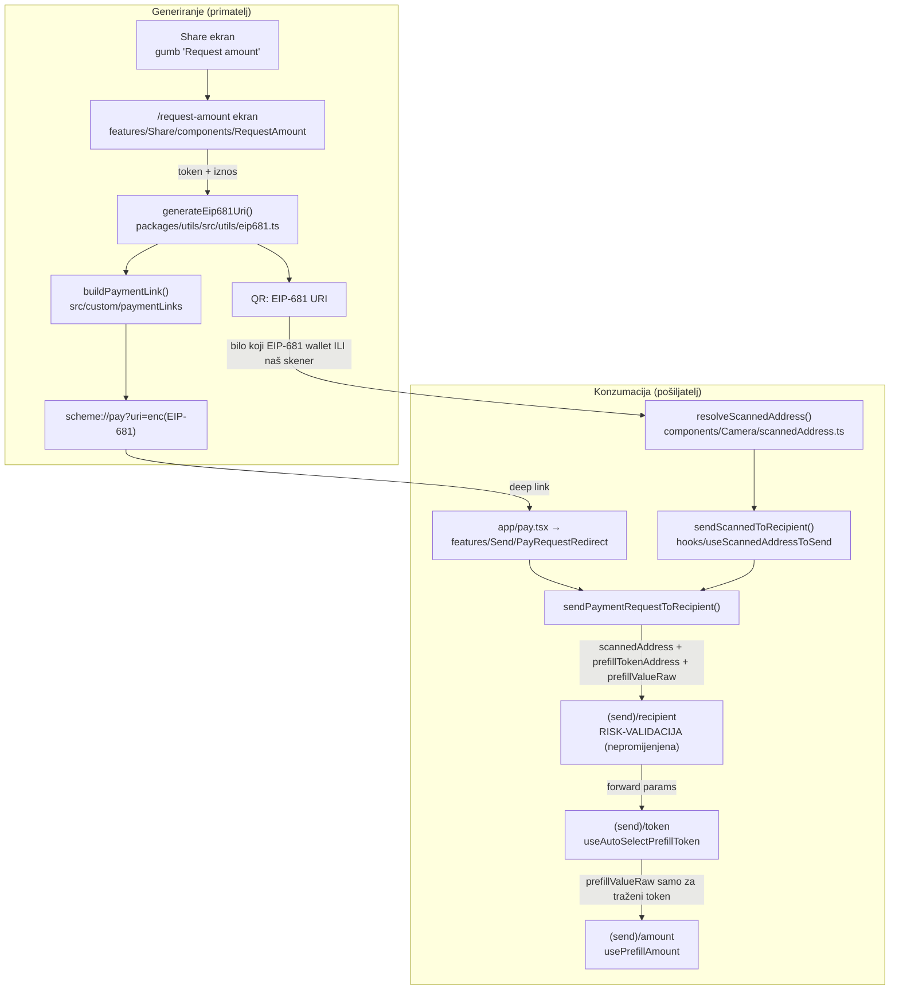

# 06 — Receive + payment linkovi (faza 3): arhitektura i naučene lekcije

> Datum: 2026-07-06 · Isporučeno u commitima `fe057476c` (feat) + `46a418aa8` (docs), grana `custom` · Jezik: HR
> Trajni zapis arhitekture EIP-681 receive/pay flowa na Safe mobile forku. Izvršni zapisnik faze je u [handoffs/faza-3](handoffs/faza-3-receive-payment-linkovi.md#zapisnik-izvršenja).

## Ideja u jednoj rečenici

"Request 20 €" = **standardni EIP-681 URI** u QR-u (čita ga svaki wallet, ne samo naš) + isti URI umotan u brand deep link (`<scheme>://pay?uri=…`) za slanje porukom; konzumacija UVIJEK slijeće na Send recipient ekran pa risk-validacija ostaje netaknuta.

## Tok (generiranje → konzumacija)

## Ugovori (contracts) koje sljedeće faze moraju poštovati

| Ugovor                         | Vrijednost                                                                                                       | Zašto                                                                                                                                                            |
| ------------------------------ | ---------------------------------------------------------------------------------------------------------------- | ---------------------------------------------------------------------------------------------------------------------------------------------------------------- |
| EIP-681 modul                  | `@safe-global/utils/utils/eip681` — `generateEip681Uri` / `parseEip681Uri` / `isEip681Uri`                       | Jedini parser/generator u monorepou; platform-agnostičan (samo `ethers`), smije ga koristiti i web. Parser nikad ne baca; generator baca na programerske greške. |
| Prefill router parametri       | `prefillTokenAddress`, `prefillValueRaw` (integer string u base units) uz postojeći `scannedAddress`/`scanNonce` | Provlače se recipient → token → amount. Faza 4 (identity) koja dira recipient path MORA ih dalje forwardati.                                                     |
| Native sentinel                | zero address (`ethers.ZeroAddress`)                                                                              | Ista konvencija kao `isNativeToken` u `features/Send/services/tokenTransferParams`; CGW native balance item ima zero adresu.                                     |
| Skener choke-point             | `resolveScannedAddress` u `components/Camera/scannedAddress.ts`                                                  | SVA TRI skenera (in-Send, WalletConnect header, import-read-only) idu kroz nju — novi QR formati se dodaju TU, ne po containerima.                               |
| Send navigacija skenera        | `sendScannedToRecipient(scanned, mode)` iz `useScannedAddressToSend`                                             | Jedini entry; interno rješava prefix/chainId mismatch warning i prefill policy.                                                                                  |
| Deep link format               | `<scheme>://pay?uri=<encodeURIComponent(EIP-681)>` → ruta `app/pay.tsx`                                          | Jedan parser za QR i link. Scheme runtime iz `Constants.expoConfig.scheme` preko `src/custom/paymentLinks` (preferira ne-`wc`).                                  |
| Chain mismatch policy          | chainId requesta ≠ aktivni chain → toast + prefill SAMO adrese                                                   | Token adrese su chain-specifične; iznos bez tokena laže. Ista politika u skeneru i pay ruti (jer dijele `sendPaymentRequestToRecipient`).                        |
| Iznos ne putuje na krivi token | `prefillValueRaw` se prosljeđuje u amount SAMO ako odabrani token == traženi                                     | Base units interpretirane tuđim decimals = krivi iznos na ekranu.                                                                                                |

## Ključne datoteke

- `packages/utils/src/utils/eip681.ts` (+ `__tests__/eip681.test.ts`, 38 testova uklj. malformed)
- `apps/mobile/src/custom/paymentLinks/` — scheme resolucija + link builder (overlay)
- `apps/mobile/src/features/Share/components/RequestAmount/` — container/view/`useRequestAmount`
- `apps/mobile/src/features/Send/PayRequestRedirect.tsx` — target `pay` rute
- `apps/mobile/src/features/Send/hooks/{useScannedAddressToSend,useAutoSelectPrefillToken,usePrefillAmount}.ts`
- Rute: `app/pay.tsx`, `app/request-amount.tsx` (+ registracija u `app/_layout.tsx`); `+native-intent.tsx` nije diran (`pay` nije protected)

## Zašto baš tako (odluke)

1. **Risk-validacija se ne zaobilazi**: payment request ne skače direktno na amount ekran nego na recipient (isti put kao ručni unos) — suspicious-address, self-send i cross-chain provjere rade identično. To je bio eksplicitni zahtjev faze i najlakše ga je garantirati reuse-om puta, ne dupliciranjem provjera.
2. **Router parametri umjesto transient storea** za prefill — expo-router idiomatski, vidljivo u navigaciji, ništa za čistiti. Cijena: mali editi u 3 upstream Send containera (svjesni thin-seam).
3. **Counterfactual-safe**: request ekran čita native token iz chain configa (`selectChainById`), NE iz CGW balances (koji 404-aju za nedeployane račune iz faze 2); ERC-20 opcije se dodaju tek ako balances postoje.
4. **Auto-select tokena jednom po mountu** (ref guard) — back s amount ekrana ne bounca korisnika naprijed.

## Naučene lekcije (vrijede za sljedeće faze)

- **Mobile ESLint nema `react-hooks/exhaustive-deps`** — `eslint-disable` komentar za to pravilo je lint ERROR; izostavi komentar.
- **Flaky pod opterećenjem**: puni mobile jest run zna srušiti nepovezani suite (`PendingTx.container`, `DelegateCleanupService`); izolirani rerun je prva dijagnostika.
- **Verify komanda**: `node scripts/verify.mjs --changed --workspace=mobile` (root `yarn verify:changed` krivo detektira workspace kad diff dira `packages/`); za `packages/utils` promjene dodatno utils type-check/test + web type-check. (Zapisano i u handoffs README pravilima.)
- **`jest.Mock<T>` umjesto `jest.fn<T, Args>()`** — generics forma `jest.fn<{...}, []>()` ne tipka se čisto s repo verzijom @types/jest; anotacija varijable radi.
- **`expect.objectContaining({ key: undefined })`** pada kad ključ ne postoji u primljenom objektu — asertaj `toBeUndefined()` odvojeno.
- Verify "Missing tests" heuristika očekuje ekstenziju identičnu izvornoj datoteci (`.ts` → `.test.ts`); hook testiran u `.test.tsx` (zbog JSX wrappera) ostaje kao WARN — ignorabilno.

## Post-MVP dug

- **Https universal link + web fallback** (`https://<brand-domena>/pay?uri=…` s istim param ugovorom → ista `pay` ruta): traži per-brand hosting (AASA + assetlinks + landing sa store fallbackom). SaaS teritorij, uz fazu 5+.
- Fiat unos na request ekranu (Send već ima `useFiatConversion`).
- Stock `safe` manifest registrira samo `wc` scheme → link je `wc://pay?...` (radi, ali ga presreću i drugi walleti); brand manifesti s vlastitim schemeom nemaju problem.
- ENS target u parseru namjerno nepodržan — faza 4 uvodi username sloj iznad adresa.
