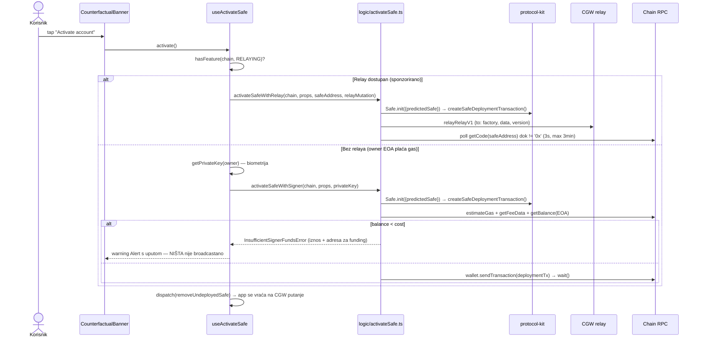
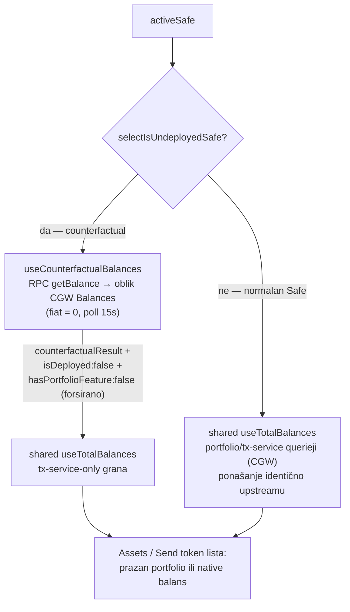
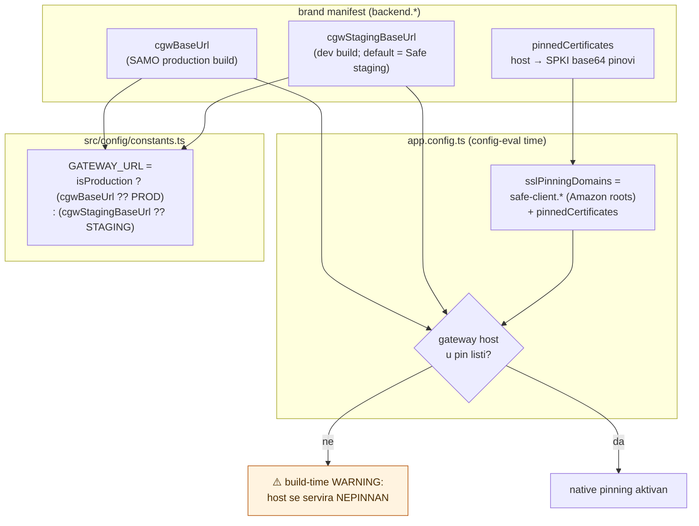

# 07 — Hardening prolaz: aktivacija Safea + brand sigurnost

> Datum: 2026-07-10 · Isporučeno u commitima `ce2cbe906`..`9d74267c3`, grana `custom` (nakon upstream mergea `4de3c35af`) · Jezik: HR
> Trajni zapis hardening prolaza nakon faza 1–3: multi-agent code review fork diffa (`upstream/dev...custom`) našao je 10 potvrđenih defekata; svi su popravljeni u istom prolazu. Ovaj dokument bilježi arhitekturu dva najveća popravka (aktivacija counterfactual Safea, brand transport-sigurnost) i naučene lekcije.

## Kontekst: što je review našao

Review (4 finder agenta po kutovima + nezavisni verifikator po nalazu) potvrdio je 10 defekata u tri klastera:

| Klaster                         | Defekti                                                                                                                                                             | Ozbiljnost                                        |
| ------------------------------- | ------------------------------------------------------------------------------------------------------------------------------------------------------------------- | ------------------------------------------------- |
| Counterfactual onboarding       | deployment props se nikad ne konzumiraju (obećana aktivacija ne postoji); balances hardkodira `isDeployed: true` → CGW 404 za svježe račune                         | kritično — primljena sredstva nepotrošiva iz appa |
| Whitelabel infrastruktura       | WC metadata reklamira `safe://` za sve brandove; SSL pinning ne pokriva brand CGW; `cgwBaseUrl` ubija dev/staging split; manifest se čita iz `process.cwd()`        | sigurnost + build breakage                        |
| Payment linkovi (faza 3 rubovi) | neograničen eksponent u eip681 (OOM iz QR-a); iznos se tiho gubi pri promjeni tokena; goli `ethereum:0x…` QR preselektira native coin; link bez računa tiho propada | UX/korektnost + DoS                               |

## Aktivacija counterfactual Safea (zatvara dug iz faze 2)

Faza 2 je svjesno odgodila deployment; preporučeni put iz [05 — Counterfactual onboarding](05-counterfactual-onboarding.md) ("Activate account" korak, relay kad je dostupan) sada je implementiran doslovno.

Ključne odluke:

- **Servis prima relay mutation injektiran izvana** (`relayMutation: (args) => Promise<{taskId}>`) — isti obrazac kao postojeći `services/tx-execution/relayExecutor.ts`, pa je servis testabilan bez RTK stora.
- **Funds preflight prije broadcasta**: `InsufficientSignerFundsError` nosi izračunati trošak i adresu signera, jer je za counterfactual račune tipično da EOA ima 0 (korisnik je fundirao _Safe_, ne signera). UI poruka je akcijska, ne RPC greška.
- **Relay nema completion signal** upotrebljiv offline — završetak se detektira pollanjem `getCode` na predviđenoj adresi.
- Marker se briše eksplicitno nakon uspjeha; postojeći self-heal (CGW overview matcher u `undeployedSafesSlice`) ostaje kao fallback.

## Balances za counterfactual račune

Problem: `useMobileTotalBalances` je hardkodirao `isDeployed: true`, pa je Assets ekran svježeg računa dobivao CGW 404 → error/retry state umjesto praznog portfolija.

**Zamka koja nije očita iz potpisa shared hooka**: `isDeployed: false` samo _skipa tx-service query_. Bez injektiranog `counterfactualResult` rezultat ostaje `loading: true` **zauvijek** (nema podataka, nema errora). Uz to, portfolio query se NE skipa za counterfactual — zato mobile wrapper za counterfactual forsira `hasPortfolioFeature: false` + `isAllTokensSelected: false`, čime garantira tx-service-only granu koja konzumira counterfactual rezultat. Web ovo izbjegava jer uvijek injektira `useCounterfactualBalances` rezultat.

## Brand transport-sigurnost (gateway + pinning)

Zašto ovako:

- **`cgwBaseUrl` je bio all-variant override** → dev build branda gađao je produkcijski CGW (push registracije s `apsEnvMode: development` na produkciji = push nikad ne stigne; test podaci u produkciji). Sada je production-only; dev ostaje na Safe stagingu osim uz eksplicitni `cgwStagingBaseUrl`.
- **Pinove deklarira manifest** (`pinnedCertificates`), jer se CA lanac brand gatewaya ne može pogoditi build-time. Nepinnan gateway host nije error (namjerno — staging/试 setup), ali **upozorava na svakom config evalu**.
- Pinati **CA rootove** na koje se lanac certifikata gatewaya veže (vidi Amazon Trust Services primjer u `app.config.ts`), ne leaf.

## WC metadata + primarni scheme (brand contract)

Upstream (merge `4de3c35af`, PR #8241) uveo je pravilo: **prvi scheme u configu mora odgovarati WC registry native linku i `SAFE_WALLET_METADATA.redirect.native`**. Za fork to znači:

- manifest `scheme` konvencija: `["<brand>", "wc"]` (safe.json = `["safe", "wc"]`)
- `SAFE_WALLET_METADATA` sada gradi `name` iz `getBrand()` i `redirect.native` iz `getPrimaryScheme()` (resolver premješten iz `paymentLinks` u `src/custom/brand` — jedan izvor istine za payment linkove i WC redirect)
- `redirect.universal` (app.safe.global) se emitira **samo** za stock `safe` brand — brand build koji bi ga reklamirao slao bi korisnike na Safeov web
- stock `safe` brand ostaje bit-identičan upstream vrijednostima (regresijski test u `metadata.test.ts`)

## Naučene lekcije (za buduće faze)

1. **Shared `useTotalBalances` ugovor**: `isDeployed: false` bez `counterfactualResult` = vječni loading; portfolio query se ne skipa za counterfactual — forsiraj tx-service-only granu (vidi gore). Svaka buduća potrošnja balancesa za nedeployane račune mora ići kroz `useCounterfactualBalances`.
2. **`useAsync` s pollingom**: default `clearData: true` briše podatke na svaki refresh → flicker; za poll obrasce proslijedi `false` (zadrži zadnju vrijednost dok je fetch u letu).
3. **Config-eval kod mora biti cwd-neovisan**: sve build-time putanje u `brand/` idu preko `__dirname`, nikad `process.cwd()` — `expo config` se evaluira iz monorepo roota, CI-ja i native build faza. Regresijski test: `process.chdir('/')` + `loadBrandManifest()`.
4. **Upstream scheme contract** (novo od PR #8241): pri svakom upstream mergeu provjeri da manifest `scheme` liste i dalje počinju brand schemeom — konflikt u `app.config.ts` oko `scheme` se rješava u korist `brand.scheme`, a upstream promjena se prenosi u `safe.json`.
5. **Injektiraj RTK mutation u servise** (obrazac `relayExecutor`): servis prima `(args) => Promise<T>` umjesto da dispatcha — testabilno bez stora, hook veže `useRelayRelayV1Mutation().unwrap()`.
6. **EIP-681 parser je attack surface**: sve što dolazi iz QR-a / deep linka tretiraj kao hostile — eksponent capiran na 78 (uint256 max znamenki) PRIJE `'0'.repeat()`. Isti oprez za svaki budući parser vanjskog inputa.
7. **Goli `ethereum:0x…` je de-facto format adresnih QR-ova** (MetaMask receive) — payment-request semantika kreće tek od prisutnog tokena ILI iznosa; bez njih tretiraj kao običan address scan (slobodan izbor tokena).
8. **Prefill trunkiranje umjesto tihog ispadanja**: input i generirani URI moraju uvijek nositi isti iznos; pri promjeni tokena s manje decimala vidljivo trunkiraj input (`safeParseUnits` inače vrati `undefined` i link tiho izgubi iznos).
9. **Puni mobile test run i dalje zna imati flaky suite pod opterećenjem** (ovaj put TxHistory) — pravilo iz faze 3 vrijedi: pali suite prvo pokreni izolirano; ako prolazi i nije u diffu, rerun cijelog runa.
10. **Multi-agent review fork diffa se isplati nakon svake ~3 faze**: 10 potvrđenih defekata (od toga 4 koja bi korisnika koštala sredstava/sigurnosti) u kodu koji je već prošao per-fazne verify prolaze.

## Što je svjesno odgođeno

- **Deploy-uz-prvu-transakciju** (batch deployment + tx) — i dalje odgođeno iz istih razloga kao u fazi 2 (dira shared ConfirmTx/tx-sender); eksplicitna aktivacija pokriva MVP.
- **Brand `url`/`icons` u WC metadati** — traži novo manifest polje (brand web presence); danas ostaju Safe vrijednosti.
- **Runtime MITM test SSL pinninga** i on-device test aktivacije (relay + EOA put) — verificirano na config/unit razini; fizički device test je na korisniku, kao i za OTA.

## Povezano

- [05 — Counterfactual onboarding](05-counterfactual-onboarding.md) — faza 2 arhitektura; dug "Activate account" zatvoren ovdje
- [06 — Receive + payment linkovi](06-receive-payment-linkovi.md) — faza 3 arhitektura; rubovi popravljeni ovdje
- [02 — Brand config sustav](02-brand-config-sustav.md) — manifest polja; `cgwStagingBaseUrl` i `pinnedCertificates` slijede isti passthrough obrazac
- `apps/mobile/brand/README.md` — operativna dokumentacija novih manifest polja
