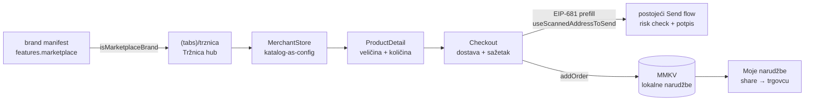

# 09 — Tržnica: ugrađeni marketplace ("Shopify za hrvatske MSP-ove" u self-custody walletu)

> Datum: 2026-07-11 · Status: **M1 isporučen** (feature-pack `marketplace`, pilot trgovac Crošulja) · Jezik: HR
> Kontekst: [08 — KUNAPay](08-kunapay-consumer-brand.md) (Tržnica je host funkcionalnost KUNAPay
> tracka), [01 — Vizija](01-vizija-i-strategija.md). Regulatorni sažetak u §4 nije pravni savjet.

## 1. Teza

Mali hrvatski brand danas za online prodaju treba: webshop, naplatu, izdavanje računa,
fiskalizaciju (od 1.1.2026. **za svaki B2C račun, neovisno o načinu plaćanja**), dostavu i
marketing. Tržnica to pakira **u wallet koji kupac ionako ima**: trgovac dobije izlog + naplatu
izravno na vlastiti Safe (self-custody, bez posrednika u novcu) + (faza M3) račun i fiskalizaciju
kao servis. Kupac plaća EURe transferom kroz postojeći Send flow — bez kartičnih naknada.

Pilot trgovac: **Crošulja** (crosulja.hr) — stvaran, svjež brand (launch ~23.6.2026., uz SP 2026)
s pet muških košulja sa šahovnicom; danas prodaju preko forme + uplatnice, bez ikakvog
e-commercea. Prvi lager ~1200 komada, prodano ~25 — točno profil MSP-a kojem je Shopify prevelik,
a Tržnica taman.

## 2. Pilot: Crošulja (snimka 2026-07-11)

| Polje                    | Vrijednost                                                                                                                                                   |
| ------------------------ | ------------------------------------------------------------------------------------------------------------------------------------------------------------ |
| Pravni subjekt           | MARCIDEA d.o.o., OIB 73208423335, Ulica Hrvatskog proljeća 63, 10410 Ribnica                                                                                 |
| Direktor                 | Marko Pejić · IBAN HR6323400091111350308 (PBZ) · info@crosulja.hr · +385 99 8745 847                                                                         |
| Modeli (akcijske cijene) | Croatica 99 € (S–2XL, slim) · Plamen 87,50 € (M–2XL, regular) · Jadran 87,50 € (S–2XL, regular) · Bura 87,50 € (M–2XL, slim) · Velebit 87,50 € (M–2XL, slim) |
| Uvjeti                   | Cijene s PDV-om i dostavom (BoxNow paketomat, samo RH); kupon CROSULJA10 (−10 %); povrat 14 dana                                                             |
| Današnji "webshop"       | WordPress/Divi, ručna forma → `send.php` → **uplatnica e-mailom** (bez kartica, bez WooCommercea)                                                            |
| Social                   | IG @crosulja (~300 pratitelja, #scrockajse), FB "Crošulja"; nula medijskih objava                                                                            |
| Signali zrelosti         | Slike = 3D renderi; sastav materijala nigdje ne piše; ženski modeli (Licitarka, Glagoljica) i family set najavljeni                                          |

Zaključak za produkt: Crošulja **nema ništa od e-commerce infrastrukture** — svaka funkcionalnost
Tržnice im je neto dobitak; a njihov postojeći flow (narudžba → e-mail → uplata → paket) je
točno MVP flow Tržnice, samo s EURe umjesto uplatnice.

## 3. Arhitektura (M1, isporučeno)

Overlay feature-pack `apps/mobile/src/custom/marketplace/` (host kod, GPL; nije submodule),
gated brand manifestom `features.marketplace` — isti obrazac kao FF pack:

Ključne odluke:

- **Katalog-as-config** (`catalog/registry.ts`): trgovac = podaci (naziv, OIB, Safe adresa,
  dostava, proizvodi). Novi trgovac = novi config zapis, nula novog koda. Backend katalog = M2.
- **Novac nikad ne prolazi kroz platformu**: Checkout gradi EIP-681 transfer na **trgovčev Safe**
  i predaje ga Send flowu istim putem kao skenirani QR (risk provjera primatelja se ne zaobilazi).
  Sva novčana aritmetika je string/cent/BigInt (`logic/order.ts`), bez floata.
- **Bez izmišljenih adresa**: dok trgovac nema deployan Safe (`safeAddress: undefined`), katalog
  je pregledan, a plaćanje onemogućeno (isti invariant kao FF fondovi). Crošulja danas NEMA Safe —
  ručni preduvjet, v. §6.
- **Narudžba do trgovca (MVP)**: narudžba se sprema lokalno (MMKV, izvan Reduxa) prije plaćanja;
  nakon plaćanja kupac je share sheetom (e-mail/WhatsApp) šalje trgovcu s referencom, stavkama,
  adresom i payer Safe adresom. Backend order-book s notifikacijom trgovcu = M2.
- **Račun izdaje trgovac** (jasno naznačeno na checkoutu). Fiskalizacija/e-račun kao servis = M3.

## 4. Regulatorni okvir (sažetak researcha 2026-07-11; nije pravni savjet)

Puni izvještaj s izvorima arhiviran u sesiji; ključno za dizajn:

1. **Fiskalizacija 2.0** (Zakon o fiskalizaciji, NN 89/25; na snazi 1.9.2025., primjena 1.1.2026.):
   B2C račun se fiskalizira **za svaki način plaćanja** (novčanice/kartica/transakcijski
   račun/ostalo) — dakle i webshop prodaja uplatom ili kriptom. B2B = obvezan eRačun (UBL 2.1,
   AS4, četverokutni model) + fiskalizacija eRačuna + eIzvještavanje (do 20. u mjesecu). Paušalci
   moraju **primati** eRačune od 1.1.2026., **izdavati** tek od 1.1.2027.
2. **Platforma smije fiskalizirati u ime trgovca**: Porezna Q&A #57 (izdavanje računa "u ime i za
   račun" drugoga uz strogu segregaciju po OIB-u) + Q&A #23 (trgovac u FiskAplikaciji ovlasti
   platformu da fiskalizira **platforminim certifikatom**; alternativa: trgovčev FINA .pfx u
   vaultu — Solo model). To je pravna osnova M3.
3. **Obveznik fiskalizacije = trgovac** (merchant of record), ne platforma. Trgovčevi ručni
   preduvjeti: poslovni prostor "internetska trgovina" u ePoreznoj, interni akt (numeracija
   računa), klauzula čl. 90 za paušalce.
4. **Plaćanje bez licence**: EURe ide **izravno kupčev Safe → trgovčev Safe**; platforma ne drži
   sredstva, ne mijenja valute, ne vodi escrow → izvan PSD2 ("funds") i izvan CASP opsega (MiCA
   ne hvata čisti self-custody softver). **Crvene linije**: platformin splitter ugovor za
   provizije, ugrađena konverzija kripto↔EUR, bilo kakvo držanje sredstava — svaka od tih ideja
   prvo ide na MiCA/CASP provjeru (HANFA). Fiat kartična tračnica post-MVP = licencirani PSP
   (Monri WSPay MarketPlace ima submerchant split; **Stripe Connect nije dostupan HR platformama**).
5. **DAC7**: platforma koja posreduje prodaju robe se registrira kod Porezne i godišnje (do 31.1.)
   prijavljuje prodavatelje; izuzeće za male (<30 prodaja i ≤2.000 € godišnje) pokriva rani pilot.
   EU "deemed supplier" PDV pravila se **ne** primjenjuju na domaću robu.
6. **Kripto plaćanje kod trgovca**: prihod se knjiži u EUR protuvrijednosti; fiskalizira se kao
   "ostalo" (⚠ nepotvrđeno — tražiti mišljenje Porezne); prihvaćati samo MiCA-autorizirane EMT-ove
   (EURe/EURC). Presedan: PayCek (EUR namira) + Fiskalna.hr integracija.

**Otvorena pitanja za pisana mišljenja prije M3 launcha**: klasifikacija stablecoin plaćanja u
fiskalnoj poruci; mehanika FiskAplikacija ovlaštenja za N trgovaca na jednom certifikatu; HANFA
potvrda ne-CASP statusa wallet-embedded marketplacea; multi-merchant numeracija naplatnih uređaja.

## 5. Faze

| #   | Faza                                                          | Handoff                                                                       | Ovisi o                           | Status |
| --- | ------------------------------------------------------------- | ----------------------------------------------------------------------------- | --------------------------------- | ------ |
| M1  | Feature-pack `marketplace` + pilot katalog Crošulja           | — (isporučeno ovom sesijom)                                                   | —                                 | ✅     |
| M2  | Backend order-book + notifikacija trgovcu + status plaćanja   | [trznica-2-order-book.md](handoffs/trznica-2-order-book.md)                   | M1; ručno: hosting                | ⬜     |
| M3  | Račun + fiskalizacija kao servis (FiskalAPI/Solo obrazac)     | [trznica-3-fiskalizacija.md](handoffs/trznica-3-fiskalizacija.md)             | M2; ručno: certifikati, mišljenja | ⬜     |
| M4  | Merchant onboarding (self-serve izlog, katalog backend, DAC7) | [trznica-4-merchant-onboarding.md](handoffs/trznica-4-merchant-onboarding.md) | M2                                | ⬜     |
| M5  | Fiat checkout tračnica (kartice preko PSP-a s split payoutom) | — (plan se piše nakon M3; WSPay MarketPlace kandidat)                         | M3, odluka o PSP-u                | ⬜     |

**MVP definicija (M1, ispunjeno):** kupac u brandiranom buildu vidi tab Tržnica, pregleda
Crošulja katalog (5 stvarnih modela, cijene, veličine, priče), složi narudžbu s podacima za
dostavu, plati točan iznos EURe na trgovčev Safe kroz postojeći Send flow (čim se Safe upiše u
config), i pošalje narudžbu trgovcu; `safe`/`ff` buildovi ostaju netaknuti.

## 6. Ručni preduvjeti (vlasnik, ne agent)

> Operativni runbook + upute za trgovca (in-app kreiranje Safe-a, multi-tenant tablica):
> [10 — Onboarding trgovca](10-onboarding-trgovca.md).

1. **Crošulja Safe**: dogovoriti s vlasnikom (prijatelj), kreirati Safe na Gnosisu (može kroz
   samu app — onboarding faza 2), upisati adresu u `catalog/registry.ts` (`safeAddress`).
2. **Crošulja pristanak i podaci**: potvrda kataloga (cijene se na siteu mogu mijenjati), dogovor
   o kanalu narudžbi (e-mail iz share sheeta) i o off-rampu (EURe → SEPA = KUNAPay K4 / Monerium).
3. **Brand odluka**: uključiti `features.marketplace` u KUNAPay manifest kad K1 bude gotov
   (danas je flag na `domovina` manifestu za testiranje na uređaju).
4. Prije M3: FINA/Porezna koraci iz §4 (test okruženje, ovlaštenja, mišljenja).

## 7. Odnos s lozom

Tržnica je **host funkcionalnost** (kao identity i payment linkovi): FF klubovi mogu sutra
prodavati dresove istim packom (`features.marketplace` + klupski trgovac u registru), KUNAPay je
horizontalna distribucija, a Crošulja je dokaz s pravim proizvodom. Provizija platforme (ako
ikad) ide kao zaseban B2B račun trgovcu (od 1.1.2026. eRačun) — nikad kao zahvat u kupčevu uplatu.
