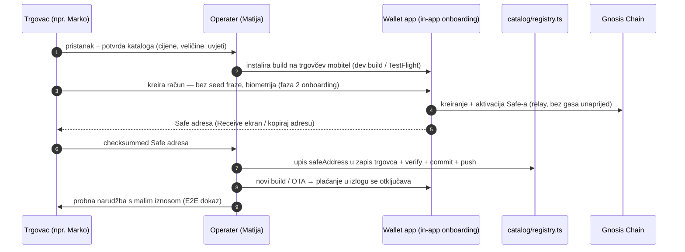
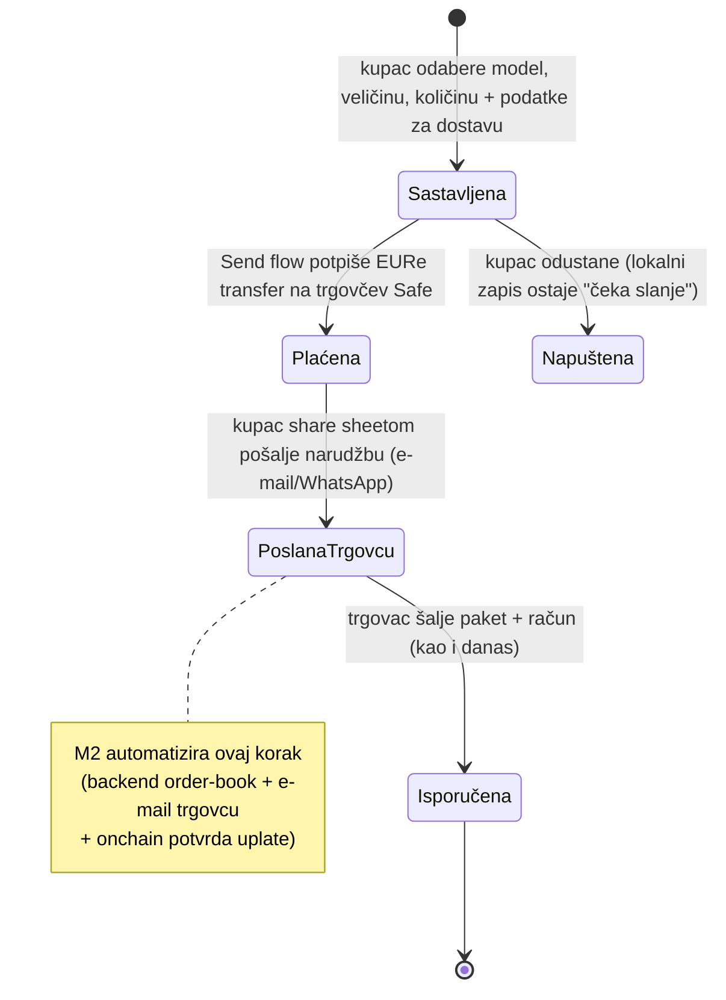
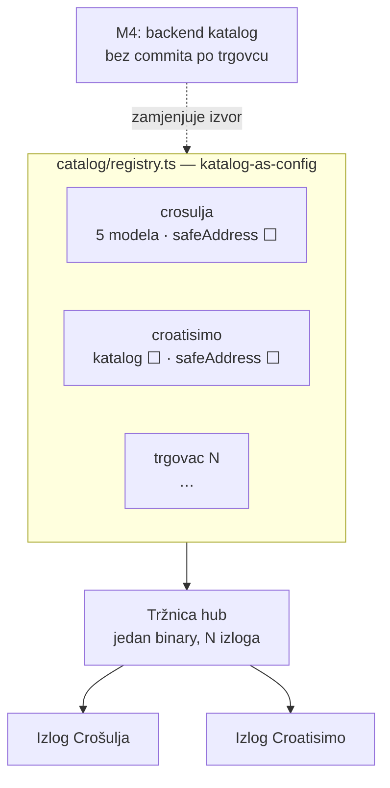

# 10 — Onboarding trgovca na Tržnicu (runbook + upute za trgovca)

> Datum: 2026-07-11 · Status: **aktivan runbook** · Jezik: HR
> Kontekst: [09 — Tržnica](09-trznica-marketplace.md) (arhitektura §3, regulatorno §4, ručni
> preduvjeti §6). Sve je **in-app**: trgovčev Safe se kreira kroz samu aplikaciju (onboarding
> faza 2 — bez seed fraze, biometrija, aktivacija bez plaćanja gasa unaprijed).

## 1. Tko je tko

- **Platforma (Tržnica)** — izlog + checkout u walletu; **nikad ne dira novac** (regulatorna
  linija iz [09] §4).
- **Trgovac** — merchant of record: prima EURe izravno na **vlastiti Safe**, izdaje račun,
  odgovara za fiskalizaciju i potrošačka prava.
- **Kupac** — korisnik walleta; plaća kroz postojeći Send flow (ista provjera rizika kao QR).

```mermaid
flowchart LR
  K[Kupac<br/>vlastiti Safe] -->|EURe, Gnosis<br/>EIP-681 kroz Send flow| T[Trgovčev Safe<br/>self-custody]
  K -->|narudžba<br/>share sheet / e-mail| M[Trgovac<br/>info@ adresa]
  M -->|paket + račun| K
  P[Platforma<br/>Tržnica pack] -.->|izlog, checkout,<br/>referenca narudžbe| K
  P -.->|nula pristupa<br/>sredstvima| T
```

## 2. Onboarding koraci (sequence)

Tehnički sve izvodi operater platforme (Matija) — trgovac samo donosi odluke, mobitel i
biometriju. Ista sekvenca vrijedi za svakog sljedećeg trgovca.



## 3. Životni ciklus narudžbe (MVP)



## 4. Upute za trgovca (verzija za Marka — pročitaj prije pristanka)

Netehnički sažetak; tehničke korake odrađujemo zajedno uživo u ~15 minuta.

1. **Što dobivaš:** izlog s tvojih 5 modela u mobilnoj aplikaciji + naplatu bez kartičnih
   naknada. Kupac plaća digitalni euro (EURe) **izravno tebi** — mi ne držimo tvoj novac ni
   sekunde i ne naplaćujemo ništa za pilot.
2. **Tvoj "račun za primanje" je Safe** — digitalni novčanik firme (MARCIDEA d.o.o.) koji
   kreiramo u samoj aplikaciji na tvom mobitelu: bez lozinki i "seed fraza" za pamćenje,
   otključava se tvojim otiskom/Face ID-em. Ključevi su na tvom uređaju, ne kod nas.
3. **Sigurnosna preporuka:** uz tvoj mobitel dodamo i rezervni ključ (Matijin) kao backup za
   slučaj gubitka uređaja; prag potpisa ostaje 1/1 da isplate možeš raditi sam. Kad promet
   naraste, prebacujemo na 2/3.
4. **Narudžbe** ti za sada stižu na `info@crosulja.hr` (kupac ih pošalje jednim klikom, s
   referencom, stavkama, adresom dostave i iznosom). Paket i račun šalješ kao i danas.
5. **Račun i fiskalizacija ostaju tvoji** kao i za uplatnice (od 1.1.2026. fiskalizira se svaka
   B2C prodaja neovisno o načinu plaćanja). Kasnije to automatiziramo (naša faza M3).
6. **Bitno ograničenje pilota:** EURe za sada ostaje "onchain" — pretvorba u eure na IBAN firme
   (SEPA isplata) traži verifikaciju firme (KYB) i dolazi u sljedećoj fazi. Za pilot od par
   narudžbi to je OK; reci ako želiš da KYB pokrenemo odmah.
7. **Što trebamo od tebe:** pristanak, 15 minuta s mobitelom, potvrdu kataloga (cijene sa
   crosulja.hr od 11.7.2026.; usput — "regularna" cijena Velebita 100,63 € izgleda kao tipfeler)
   i e-mail na koji želiš narudžbe.

## 5. Tehnički runbook (operater — Matija)

1. `git switch custom && git pull` — M1 mergean; `features.marketplace` uključen na ciljanom
   brand manifestu.
2. Na trgovčevom mobitelu: instaliraj build → in-app onboarding → **kreiraj novi račun** (faza 2;
   Gnosis je default chain iz manifesta) → aktivacija kroz relay.
3. (Preporuka iz §4.3) dodaj backup ownera i postavi threshold — in-app owner management;
   zapiši konfiguraciju u tablicu tenanata (§6).
4. Kopiraj **checksummed** Safe adresu → upiši `safeAddress` u zapis trgovca u
   `apps/mobile/src/custom/marketplace/catalog/registry.ts`.
5. `node scripts/verify.mjs --changed --workspace=mobile` (registry invariant test validira
   format adrese) → `yarn prettier:fix` → commit (`feat(mobile): aktiviraj plaćanje za <trgovac>`)
   → push.
6. Build/OTA na kupčeve uređaje; probna narudžba s malim iznosom (model s najmanjom cijenom,
   provjeri: referenca, iznos u Send flowu, EURe sjeo na trgovčev Safe, share e-mail stigao).
7. Ažuriraj tablicu tenanata (§6) i, ako je novi trgovac, dodaj katalog zapis (tipovi u
   `catalog/types.ts`; invariant testovi hvataju greške u cijenama/veličinama).

## 6. Multi-tenant: ako radi za 2, radi za N

Katalog je config (`catalog/registry.ts`) — novi trgovac je novi zapis, nula novog koda.
Tenant #2 je namjerno **vlastita firma** (ITalk) s webshopom croatisimo.hr: kontrast-test
kataloga (sportska oprema vs. košulje, više artikala, "rasprodano" stanja) bez ovisnosti o
vanjskom partneru. Kad oba rade, onboarding N-tog trgovca je ponavljanje §2 + §5.

| #   | Trgovac                    | Pravni subjekt                   | Katalog                                                                                                                                   | Safe                | Status                         |
| --- | -------------------------- | -------------------------------- | ----------------------------------------------------------------------------------------------------------------------------------------- | ------------------- | ------------------------------ |
| 1   | Crošulja (crosulja.hr)     | MARCIDEA d.o.o., OIB 73208423335 | ✅ u registru (5 modela, snimka 2026-07-11)                                                                                               | ⬜ čeka §2 s Markom | izlog živ, plaćanje zaključano |
| 2   | Croatisimo (croatisimo.hr) | ITalk (vlastita firma)           | ⬜ izvoz iz Shopifyja → registry zapis (sportski pokloni/oprema, npr. SUP 249–259 €, stolni nogomet 40 €; paziti na "rasprodano" artikle) | ⬜ isti §2 postupak | sljedeći                       |
| N   | …                          | …                                | registry zapis (do M4: backend katalog)                                                                                                   | §2 postupak         | —                              |

Napomene za tenant #2 (Croatisimo): Shopify ostaje primarni webshop — Tržnica je dodatni kanal;
u katalog ući samo artikli s lagerom (registry nema stock polje do M4 — rasprodano se rješava
izostavljanjem); dostava/uvjeti se prepisuju iz Shopify postavki u `shipping.note`.



## 7. Poznata ograničenja MVP-a (ponoviti svakom trgovcu)

| Ograničenje                                           | Rješenje                                             | Faza       |
| ----------------------------------------------------- | ---------------------------------------------------- | ---------- |
| Narudžba putuje share sheetom (kupac je mora poslati) | backend order-book + e-mail + onchain potvrda uplate | M2         |
| Račun/fiskalizaciju trgovac radi ručno                | fiskalizacija-as-servis (Porezna Q&A #23/#57 osnova) | M3         |
| Novi trgovac = commit u registry                      | admin katalog na backendu                            | M4         |
| EURe → SEPA isplata ne postoji                        | Monerium redemption + KYB firme                      | KUNAPay K4 |
| Nema stock/varijanti osim veličine                    | katalog proširenje                                   | M4         |
