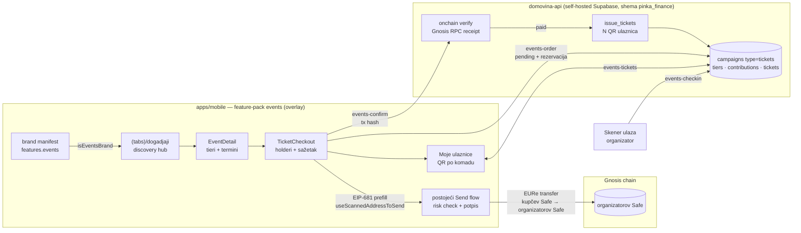
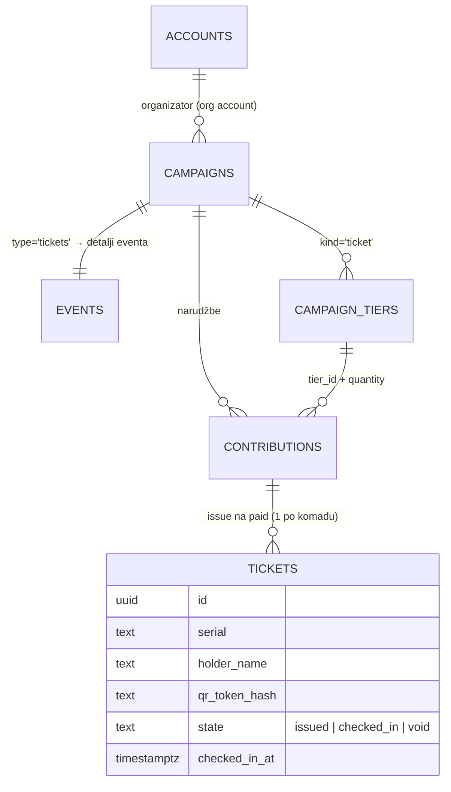
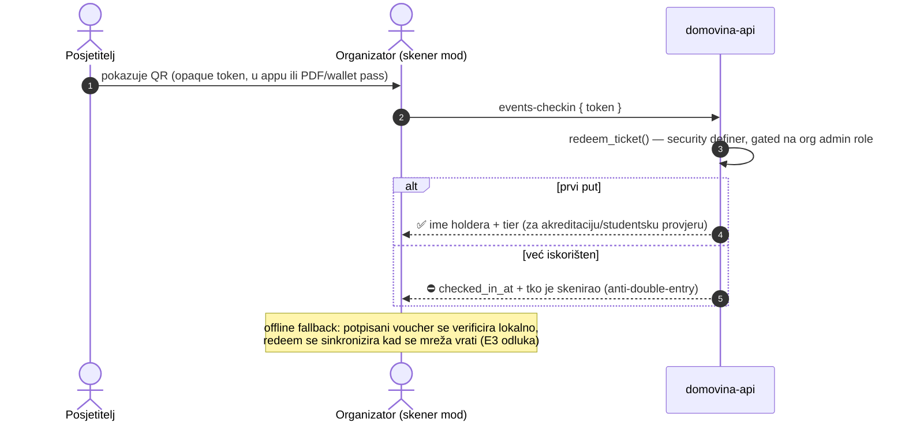
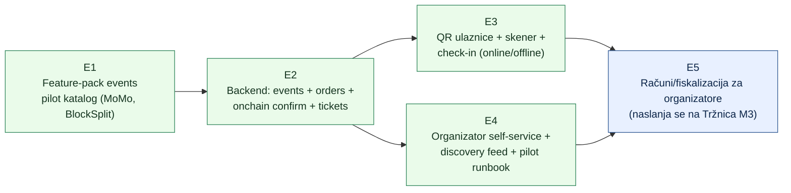

# 11 — Događaji: P2P ticketing marketplace (Entrio/Luma paritet bez posrednika)

> Datum: 2026-07-16 · Status: **E1 ✅ + E2 ✅ + E3 ✅ + E4 ✅** (produkcijski deploy E2–E4 = ručni korak) · Jezik: HR + EN sažetak (§9)
> Kontekst: [09 — Tržnica](09-trznica-marketplace.md) (isti payment rail i overlay obrazac),
> [08 — KUNAPay](08-kunapay-consumer-brand.md), [01 — Vizija](01-vizija-i-strategija.md).
> Backend: self-hosted Supabase `domovina-api` (`/Users/ms/git/domovinatv/domovina-api`), shema `pinka_finance`.
> Regulatorni sažetak u §6 nije pravni savjet.

## 1. Teza

Organizator eventa danas prodaje ulaznice preko posrednika (Entrio, Eventbrite, Luma) koji
naplaćuje **booking fee posjetitelju** i/ili proviziju organizatoru, drži novac do isplate i
posjeduje odnos s kupcem. Događaji to zamjenjuju **P2P modelom u walletu koji posjetitelj ionako
ima**: organizator prodaje ulaznice **izravno u EURe na vlastiti Safe** (self-custody), posjetitelj
plaća kroz postojeći Send flow bez ijedne treće naknade, a ulaznica je QR u appu s check-inom na
ulazu. Platforma nikad ne drži novac — isti invariant kao Tržnica: **novac nikad ne prolazi kroz
platformu**.

Povod: **2026-07-16 request Luke Sučića**, organizatora konferencija
[Money Motion](https://www.money-motion.eu/) i [BlockSplit](https://blocksplit.net/). Oba eventa
danas prodaju preko Entrija.

Konkretna motivacija (snimka Entrio stranica, 2026-07-16):

| Entrio stavka              | Iznos                     | Efektivna naknada |
| -------------------------- | ------------------------- | ----------------- |
| MoMo 2027 Super Early Bird | 149,00 € + **4,00 € fee** | ~2,7 %            |
| MoMo 2027 Student          | 49,00 € + **2,72 € fee**  | ~5,5 %            |

Booking fee je nepovratan i naplaćuje se za svaku ulaznicu, svaki način plaćanja. P2P model tu
naknadu svodi na **0** (trošak = gas na Gnosisu, ~zanemariv), a organizatoru daje trenutnu namiru
u EURe na vlastiti Safe umjesto odgođene isplate.

## 2. Pilot: Money Motion 2027 + BlockSplit (snimka 2026-07-16)

| Polje           | Money Motion 2027                                                                                        | BlockSplit                                                                     |
| --------------- | -------------------------------------------------------------------------------------------------------- | ------------------------------------------------------------------------------ |
| Termin / mjesto | 10.–11.3.2027., Zagrebački velesajam                                                                     | Unconference 2026 (9.–11.7., MEDILS Split) — **završen**; pilot = izdanje 2027 |
| Format          | Konferencija, 2 dana, 5 pozornica; 2026: 3000+ sudionika, 170+ govornika                                 | 3-dnevni unconference summer camp, manji i intimniji                           |
| Trenutni tieri  | Super Early Bird 149 € · Student 49 € (uz predočenje potvrde)                                            | (2026 rasprodan/završen) — stay paketi sa smještajem, roomsharing              |
| Posebnosti      | Ulaznica **glasi na ime i prezime, nije prenosiva**; mijenja se za akreditaciju na registracijskom pultu | Smještajni add-on (check-in 8.7., check-out 11.7.) → tier + add-on model       |
| Prodaja danas   | Entrio (fee 4,00 € / 2,72 €), B2B/grupne ulaznice e-mailom                                               | Entrio                                                                         |
| Organizator     | Money Motion (kontakt: Luka Sučić, tickets@money-motion.eu)                                              | UBIK (blocksplit@ubik.hr), kontakt: Luka Sučić                                 |

Zaključci za dizajn produkta (iz stvarnih zahtjeva ovih evenata):

1. **Imenske ulaznice su first-class**: tier nosi flag `imenska` (holder ime/prezime po komadu),
   jer je MoMo praksa "glasi na ime, nije prenosiva, mijenja se za akreditaciju".
2. **Tieri s fazama prodaje** (Super Early Bird → Early Bird → Regular) i **inventoryjem** su
   minimalni model; student tier = tier s napomenom o validaciji na ulazu.
3. **Check-in = zamjena za akreditaciju**: QR skeniranje na registracijskom pultu mora raditi
   brzo, uz anti-double-entry, i s offline tolerancijom (velesajam, mreža pod opterećenjem).
4. **Grupne/B2B kupnje** (više ulaznica u jednoj narudžbi) → narudžba nosi `quantity` + listu
   holdera, ne jedna-ulaznica-jedna-narudžba.

## 3. Arhitektura

Dva repoa, čvrsta podjela odgovornosti: **mobile feature-pack** (ovaj repo) za UX i plaćanje,
**domovina-api** (self-hosted Supabase) za sav offchain (katalog, narudžbe, izdavanje ulaznica,
check-in). Onchain verifikacija uplate JE autorizacija — backend nikad ne drži ni novac ni ključeve.



### 3.1 Mobile: feature-pack `apps/mobile/src/custom/events/`

Isti overlay obrazac kao `marketplace/` (host kod, nije submodule), gated brand manifestom
`features.events` + `isEventsBrand()`. Ponovo se koriste dokazani building-blockovi:

- **Payment rail**: checkout gradi `Eip681Transfer` (EURe, chainId 100) i predaje ga
  `useScannedAddressToSend.sendPaymentRequestToRecipient(transfer, 'replace')` — identično
  `marketplace/screens/Checkout.tsx` i `ff/screens/Doniraj.tsx`. Risk-validacija primatelja se
  nikad ne zaobilazi.
- **Novčana aritmetika**: string/cent/BigInt obrasci iz `marketplace/logic/order.ts`
  (`toBaseUnits`, `eurToCents`, `formatEur`) — nula floata; `null` ⇒ CTA onemogućen.
- **Bez izmišljenih adresa**: event bez upisanog `safeAddress` je pregledan, ali kupnja
  onemogućena (isti invariant kao FF fondovi i Tržnica trgovci).
- **Katalog-as-config u E1** (pilot eventi hardkodirani kao podaci), **backend katalog u E2** —
  isti evolucijski put kao Tržnica M1→M2, pack mijenja samo `catalog/` modul.
- **Identity**: organizator se prikazuje kao `@username` (postojeći `custom/identity/` pack) kad
  brand ima identity konfiguriran; hex adrese skrivene.
- **Skener ulaza NE ide kroz payment skener**: QR ulaznice se skenira u zasebnom modu koji ne
  dira `resolveScannedAddress` (payment choke-point) — pravilo preuzeto iz
  `ff/docs/handoffs/faza-10-dogadjanja.md`.

### 3.2 Backend: `domovina-api` proširenje sheme `pinka_finance`

Ključni nalaz analize (2026-07-16): `pinka_finance` **već ima ~80 % ticketing backenda** —
`campaigns.type` enum uključuje `'tickets'`, `campaign_tiers.kind` uključuje `'ticket'` s
`price_cents` + `inventory_total/claimed`, a `contributions` su narudžbe s `quantity`,
state-machineom (pending→paid→refunded/expired) i **tri idempotentna puta verifikacije EURe
uplate** (SEPA webhook s HMAC-om, cron onchain indexer, client-submitted tx hash kroz
`pinka-onchain-confirm` — "onchain verifikacija JE autorizacija"). Custody = per-campaign Safe
(`campaigns.destination_address`), backend ne drži ključeve (signing delegiran na
`pay.domovina.ai` rail).

Mapiranje domene (bez novog kotača):

| Ticketing pojam     | Postojeće u `pinka_finance`                                  | Novo (E2)                                     |
| ------------------- | ------------------------------------------------------------ | --------------------------------------------- |
| Event               | `campaigns` (type `'tickets'`, `destination_address` = Safe) | `events` (venue, termini, opis HR/EN, cover)  |
| Ticket tier         | `campaign_tiers` (kind `'ticket'`, cijena, inventory)        | polja: `imenska`, `sale_start/end`, add-on    |
| Narudžba            | `contributions` (quantity, idempotency, state machine)       | holders payload, rezervacija s TTL-om         |
| Ulaznica (komad)    | —                                                            | `tickets` (serial, holder, QR hash, check-in) |
| Organizator         | `public.accounts` (org) + `accounts_memberships` role        | —                                             |
| Verifikacija uplate | `pinka-onchain-confirm` / `record_onchain_contribution`      | `events-confirm` (vezanje tx ↔ narudžba)     |



### 3.3 Tok kupnje (E1 lokalno → E2 s backendom)

```mermaid
sequenceDiagram
  autonumber
  actor K as Kupac (Safe u appu)
  participant A as App (events pack)
  participant B as domovina-api
  participant G as Gnosis (EURe)
  participant O as Organizatorov Safe

  K->>A: odabir eventa, tiera, količine + imena holdera
  A->>B: events-order (pending narudžba, rezervacija inventoryja s TTL)
  B-->>A: order id + iznos + organizatorov Safe
  A->>A: EIP-681 prefill → postojeći Send flow (risk check)
  K->>G: potpis; EURe transfer kupčev Safe → organizatorov Safe
  G->>O: sredstva odmah kod organizatora (P2P, bez posrednika)
  A->>B: events-confirm { order id, tx hash }
  B->>G: RPC receipt → parse EURe Transfer log (iznos, primatelj)
  B->>B: paid → issue_tickets (N komada, QR tokeni) — idempotentno (tx hash + log index)
  B-->>A: ulaznice s QR-om u "Moje ulaznice"
```

U **E1** (bez backenda) narudžba živi samo u MMKV-u i "ulaznica" je onchain potvrda (tx hash) +
share poruka organizatoru — točno kao Tržnica M1. Backend putanja iznad je **E2**.

### 3.4 Check-in (E3)



## 4. Ključne dizajn odluke

1. **P2P namira, nula naknada**: EURe ide izravno kupčev Safe → organizatorov Safe. Platforma ne
   drži sredstva, ne radi escrow, ne splita provizije — svaka od tih ideja prvo ide na
   MiCA/CASP provjeru (v. [09] §4, iste crvene linije).
2. **Onchain verifikacija JE autorizacija** (preuzeto iz `pinka-onchain-confirm`): klijent javi
   tx hash, backend čita receipt s Gnosis RPC-a i kreditira isključivo stvarno sletjele EURe.
   Bez povjerenja u klijenta; idempotencija preko `(tx_hash, log_index)`.
3. **Rezervacija inventoryja na pending s TTL-om**: za razliku od donacija (pinka danas
   inkrementa inventory tek na paid), ulaznice se moraju rezervirati pri narudžbi da checkout ne
   preproda tier; istek TTL-a vraća rezervaciju (`contributions.state='expired'` već postoji).
   Ovo je najveća shema-promjena u E2.
4. **QR = Tier 0/1 iz postojećeg receipts plana** (`domovina-api/docs/pinka-onchain-receipts-tokenization-plan.md`):
   DB-backed opaque token (u bazi samo hash) + online redeem. NFT/attestation ulaznice (Tier 2+)
   su svjesno post-MVP — spec već postoji u tom dokumentu, ništa se ne izmišlja unaprijed.
5. **Imenska ulaznica kao config**: tier flag određuje traži li checkout ime/prezime (+ e-mail)
   po komadu; prenosivost je isto config (MoMo: neprenosiva). Secondary market / preprodaja =
   izvan opsega (svjesno).
6. **Organizator = izdavatelj računa** (merchant of record), isto kao Tržnica trgovac.
   Fiskalizacija kao servis se NE gradi ponovno — kad dođe na red, koristi se Tržnica M3
   infrastruktura ([trznica-3-fiskalizacija.md](handoffs/trznica-3-fiskalizacija.md)).
7. **Odnos s ff `faza-10-dogadjanja.md`**: taj handoff (klupska događanja, "entrio paritet") je
   idejni prethodnik ovog plana. Ovaj pack ga **generalizira kao host funkcionalnost**: etape 10a
   (kupnja) i 10b (validacija na ulazu) realiziraju se ovdje; ff brand kasnije konzumira `events`
   pack kroz `features.events` umjesto vlastite implementacije. U ff repou ostaje samo klupski
   katalog (eventi kao config).

## 5. Faze



| #   | Faza                                                            | Handoff                                                           | Ovisi o                             | Status            |
| --- | --------------------------------------------------------------- | ----------------------------------------------------------------- | ----------------------------------- | ----------------- |
| E1  | Feature-pack `events` + pilot katalog (MoMo 2027, BlockSplit)   | [dogadjaji-1-event-pack.md](handoffs/dogadjaji-1-event-pack.md)   | —                                   | ✅                |
| E2  | Backend: eventi, narudžbe, onchain confirm, izdavanje ulaznica  | [dogadjaji-2-backend.md](handoffs/dogadjaji-2-backend.md)         | E1 (tipovi); ručno: pristup serveru | ✅ (deploy ručno) |
| E3  | QR ulaznice + skener ulaza + check-in                           | [dogadjaji-3-qr-checkin.md](handoffs/dogadjaji-3-qr-checkin.md)   | E2                                  | ✅ (deploy ručno) |
| E4  | Organizator self-service + discovery + pilot runbook (L. Sučić) | [dogadjaji-4-organizator.md](handoffs/dogadjaji-4-organizator.md) | E2; ručno: pilot dogovor, Safe      | ✅ (deploy ručno) |
| E5  | Računi/fiskalizacija za organizatore                            | — (plan se piše nakon Tržnica M3; isti servis, druga vertikala)   | E3, E4, Tržnica M3                  | ⬜                |

**MVP definicija (E1–E3):** posjetitelj u brandiranom buildu otvori tab Događaji, vidi Money
Motion 2027, kupi 2 imenske ulaznice (unese imena), plati točan EURe iznos izravno na
organizatorov Safe kroz postojeći Send flow, dobije 2 QR ulaznice u "Moje ulaznice"; organizator
na ulazu skenira QR, vidi ime holdera, drugi sken iste ulaznice je odbijen; nijedna naknada nije
naplaćena nikome; `safe`/`ff` buildovi netaknuti.

## 6. Regulatorni okvir (sažetak; nije pravni savjet)

Naslanja se na research iz [09 — Tržnica](09-trznica-marketplace.md) §4; specifično za ulaznice:

1. **Obveznik fiskalizacije = organizator** (on prodaje uslugu ulaska), ne platforma. Prodaja
   ulaznica online s plaćanjem kriptom/transferom ulazi u Fiskalizaciju 2.0 obveze organizatora
   (B2C račun za svaki način plaćanja od 1.1.2026.). Platforma smije fiskalizirati "u ime i za
   račun" (Q&A #57/#23) — to je E5, dijeli infrastrukturu s Tržnicom M3.
2. **Ne-CASP status**: čisti self-custody + P2P transfer bez custody/escrow/konverzije ostaje
   izvan PSD2/MiCA opsega — **crvene linije identične** [09] §4 (nikakav split provizija,
   nikakva ugrađena konverzija, nikakvo držanje sredstava).
3. **DAC7**: platforma koja posreduje prodaju **osobnih usluga** (events vjerojatno jesu) ima
   godišnju obvezu izvještavanja o prodavateljima; izuzeće za male prodavatelje ne pokriva
   organizatore MoMo kalibra → registracija platforme kod Porezne i evidencija organizatora ide
   uz E4. ⚠ Tražiti pisano mišljenje: klasifikacija ulaznica kao "osobne usluge" po DAC7.
4. **GDPR**: imenske ulaznice = osobni podaci holdera (ime, e-mail) kod platforme i organizatora;
   minimalna retencija (brisanje nakon eventa + rok za reklamacije), pristup gated RLS-om na org
   account, holder podaci nikad u javnim viewovima.
5. **PDV na ulaznice**: mjesto oporezivanja za ulaz na priredbe = mjesto održavanja (RH);
   organizator obračunava PDV u svojoj cijeni — platforma ne dira porezni tretman jer nije u
   lancu isporuke. ⚠ Potvrditi tretman za strane kupce B2B ulaznica (reverse charge ne vrijedi
   za ulaznice).

## 7. Ručni preduvjeti (vlasnik, ne agent)

1. **Pilot dogovor s Lukom Sučićem**: potvrda pilota (koji event prvi — realno BlockSplit 2027
   kao manji, pa MoMo 2027), tieri i cijene, tko je pravni subjekt prodaje (MoMo d.o.o.? UBIK?).
2. **Organizatorov Safe**: kreirati Safe na Gnosisu za svaki event/organizatora (može kroz samu
   app — onboarding faza 2), upisati adresu u config (E1) odnosno backend (E2+). Bez adrese
   katalog je pregledan, kupnja onemogućena.
3. **EURe likvidnost organizatora**: dogovor kako organizator troši/off-rampa EURe (Monerium
   SEPA off-ramp — v. [kunapay-3-offramp.md](handoffs/kunapay-3-offramp.md) kontekst).
4. **Pristup `domovina-api` serveru** za E2 deploy (migracije + edge funkcije idu kroz
   `scripts/db-migrate.sh` / `deploy-functions.sh` — SSH preduvjet).
5. **Brand odluka**: u koji brand manifest ide `features.events` za pilot (airkuna? kunapay?
   zaseban "MoMo" brand?) — jedan binary može nositi sve, odluka je marketinška.
6. **Pisana mišljenja** (prije javnog launcha, ne prije pilota): DAC7 klasifikacija, fiskalna
   klasifikacija kripto naplate ulaznica (v. §6).

## 8. Otvorena pitanja

- **Reconciliation bez klijentovog confirma**: ako kupac plati, a app umre prije
  `events-confirm`, cron indexer (`pinka-onchain-ingest`) vidi uplatu na organizatorov Safe, ali
  je ne zna vezati uz narudžbu (isti iznos dvaju narudžbi!). E2 dizajn: unmatched uplate idu u
  "za ručno sparivanje" red + kupac može retroaktivno submitati tx hash iz "Moje narudžbe".
- **Refund flow**: organizator refundira P2P (Safe→Safe) — evidencija `refunded` postoji u
  shemi, UI je post-MVP.
- **Offline check-in**: opaque token zahtijeva mrežu; potpisani voucher (Ed25519/EIP-712)
  omogućuje offline verify uz odgođeni redeem — odluka u E3 na temelju realnih uvjeta na venueu.
- **Luma paritet za discovery** (kalendar, subscribe na organizatora, podsjetnici) = post-E4,
  nije MVP.
- **Ideje svjesno izvan E4 opsega** (zapis iz [dogadjaji-4](handoffs/dogadjaji-4-organizator.md)):
  plaćeni promo/featured eventi u feedu, multi-organizator suradnja na eventu (više org accounta
  dijeli event), web (ne-app) prodajna stranica s universal linkom, self-service upravljanje
  skener-osobljem, pravi organizator login/refresh umjesto pristupnog tokena, admin UI za
  allowlist moderaciju i refund flow.

## 9. English summary

**Thesis.** A P2P event-ticketing marketplace (Entrio/Luma parity) embedded in the self-custody
wallet: organizers sell tickets directly to attendees in EURe (Gnosis chain), settled instantly
Safe→Safe, with zero third-party fees (Entrio charges a non-refundable booking fee of e.g.
€4.00 on a €149 ticket / €2.72 on a €49 student ticket for Money Motion 2027). Trigger: a
2026-07-16 request from Luka Sučić, organizer of Money Motion and BlockSplit.

**Architecture.** Two repos, hard responsibility split:

- **Mobile** (this repo): a new overlay feature-pack `apps/mobile/src/custom/events/`, gated by
  brand manifest `features.events`, mirroring the proven `marketplace/` (Tržnica) pack. Payment
  reuses the existing rail verbatim: build an EIP-681 EURe transfer to the organizer's Safe and
  hand it to `useScannedAddressToSend` so the host Send flow's risk validation and signing are
  never bypassed. Money math is string/cent/BigInt (no floats); "no Safe address ⇒ browsable but
  not buyable" invariant; entry-QR scanning never goes through the payment scanner choke-point.
- **Backend** (`domovina-api`, self-hosted Supabase): the `pinka_finance` schema already covers
  ~80 % — `campaigns` with `type='tickets'`, `campaign_tiers` with `kind='ticket'` + inventory,
  `contributions` as orders with quantity and an idempotent pending→paid state machine, and
  onchain EURe verification where a client submits a tx hash and the backend reads the receipt
  from Gnosis RPC ("onchain verification IS the authorization"). Net-new: an `events` detail
  table, a `tickets` table (one row per unit: serial, holder name, QR token hash, check-in
  state), inventory reservation with TTL at order time, and edge functions `events-order`,
  `events-confirm`, `events-tickets`, `events-checkin` following existing conventions
  (security-definer RPCs, RLS via org-account roles, no signing keys on the backend).

**Phases.** E1 mobile pack + pilot catalog (config-as-data: Money Motion 2027, BlockSplit) →
E2 backend (orders, onchain confirm, ticket issuance) → E3 QR tickets + organizer scanner +
check-in (anti-double-entry, offline option via signed vouchers) → E4 organizer self-service +
discovery feed + pilot runbook → E5 invoicing/fiscalization as a service (shared with Tržnica
M3). Each phase has a self-contained handoff prompt in `handoffs/` for an autonomous Claude
Code session. Named non-transferable tickets (Money Motion's model) are first-class via a tier
flag; the platform never holds funds (non-CASP red lines identical to doc 09 §4); the organizer
is the merchant of record.
