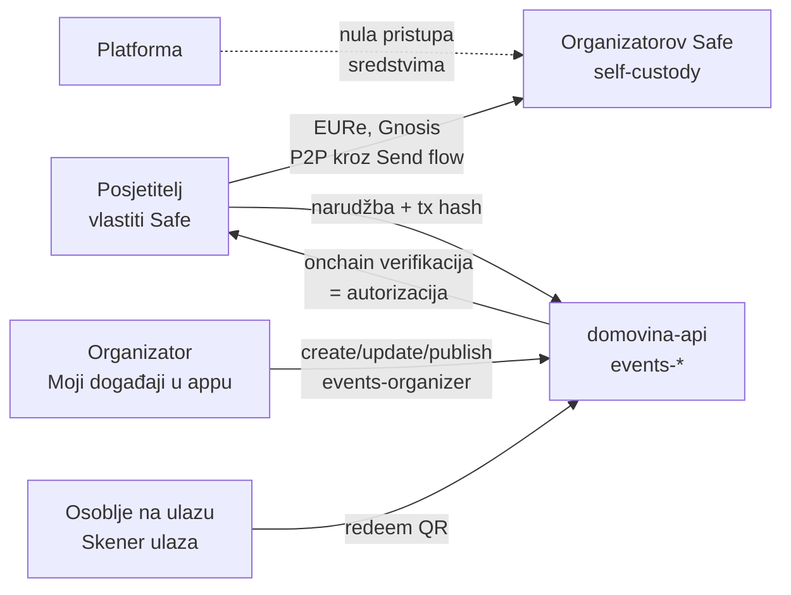

# 12 — Onboarding organizatora na Događaje (runbook + upute za organizatora)

> Datum: 2026-07-17 · Status: **aktivan runbook** (pilot: Luka Sučić — Money Motion / BlockSplit) · Jezik: HR
> Kontekst: [11 — Događaji](11-dogadjaji-p2p-ticketing.md) (arhitektura §3, regulatorno §6, ručni
> preduvjeti §7), [10 — Onboarding trgovca](10-onboarding-trgovca.md) (isti oblik runbooka za
> Tržnicu). Sve je **in-app i self-service** (E4): organizator kreira račun, Safe, event s
> tierima i objavi ga — bez ijednog commita; operater samo odobri objavu (allowlist) i upiše
> DAC7 evidenciju.

## 1. Tko je tko

- **Platforma (Događaji)** — discovery feed + checkout + QR check-in u walletu; **nikad ne dira
  novac** (ne-CASP crvene linije iz [11] §6 = [09] §4).
- **Organizator** — merchant of record: prima EURe izravno na **vlastiti Safe**, izdaje račun,
  odgovara za fiskalizaciju (E5) i uvjete eventa. Za pilot: Luka Sučić (pravni subjekt prodaje —
  odluka u ručnim preduvjetima, [11] §7.1).
- **Posjetitelj** — korisnik walleta; plaća kroz postojeći Send flow, ulaznica je QR u appu.
- **Osoblje na ulazu** — admini organizatorovog org accounta sa skenerom u istoj app.



## 2. Onboarding tok (sequence)

Organizator sve radi sam u appu; operater (Matija) ima tri točke dodira: instalacija builda,
**allowlist odobrenje** (moderacija objave — server-side) i **DAC7 evidencija**.

```mermaid
sequenceDiagram
  autonumber
  participant OR as Organizator (Luka)
  participant OP as Operater (Matija)
  participant APP as Wallet app (events pack)
  participant API as domovina-api
  participant CHAIN as Gnosis Chain

  OR->>OP: pilot dogovor (event, pravni subjekt, tieri i cijene)
  OP->>API: org account + admin membership + KYC za Luku (psql/pinka)
  OP->>APP: build na Lukin mobitel (dev build / TestFlight)
  OR->>APP: kreira račun — bez seed fraze, biometrija (onboarding faza 2)
  APP->>CHAIN: kreiranje + aktivacija Safe-a (relay, bez gasa unaprijed)
  OR->>APP: registrira @username (identity pack; npr. @momo)
  OP->>OR: pristupni token organizatora (GoTrue JWT org admina)
  OR->>APP: Događaji → "Tvoj događaj ovdje" → Novi događaj (naziv, termin, tieri)
  APP->>API: events-organizer create → draft (bez Safe adrese = placeholder)
  OR->>APP: upiše Safe adresu ("Upiši adresu ovog računa") + Spremi
  OP->>API: allowlist org accounta (ručni flag — moderacija pilota)
  OR->>APP: Objavi događaj
  API-->>APP: draft → active + public — event u feedu SVIH korisnika
  OR->>OR: promo: share link + QR s ekrana Moj događaj (plakat, društvene mreže)
  OP->>API: DAC7 zapis organizatora (upsert_organizer_record)
```

Bez ijednog commita/rebuilda: prodaja i check-in rade istog trena kad je event objavljen.

## 3. Upute za organizatora (verzija za Luku — pročitaj prije pilota)

Netehnički sažetak; tehničke korake odrađujemo zajedno u ~20 minuta.

1. **Što dobivaš:** prodaju ulaznica bez posrednika i bez booking fee-a (Entrio na MoMo Super
   Early Bird naplaćuje 4,00 € po ulaznici — ovdje 0). Kupac plaća digitalni euro (EURe)
   **izravno tebi**, novac ti je na računu u sekundi, ne čekaš isplatu.
2. **Tvoj račun je Safe** — digitalni novčanik koji kreiraš u samoj aplikaciji: bez lozinki i
   seed fraza, otključava se otiskom/Face ID-em. Ključevi su na tvom uređaju, ne kod nas.
   **Novac vidiš i diraš samo ti** — mi nemamo ni uvid ni pristup.
3. **Sigurnosna preporuka:** uz tvoj mobitel dodamo rezervni ključ (backup owner) za slučaj
   gubitka uređaja; prag potpisa ostaje 1/1 da isplate radiš sam.
4. **Event kreiraš sam u appu** (Događaji → "Tvoj događaj ovdje"): naziv, termin, mjesto, opis,
   kategorije ulaznica s cijenama i količinama. "Glasi na ime" uključi za imenske ulaznice
   (tvoja MoMo praksa: mijenja se za akreditaciju na pultu). Objava ide tek kad je Safe adresa
   upisana i kad mi odobrimo organizatora (anti-spam moderacija pilota).
5. **Cijene i "glasi na ime" se zaključavaju objavom** — kupci kupuju pod tim uvjetima. Za novu
   fazu prodaje (Super Early Bird → Early Bird → Regular) dodaš **novu kategoriju**, staroj
   istekne prodajni prozor.
6. **Promocija:** na ekranu svog eventa imaš link i QR — link otvara event direktno u aplikaciji
   kupca. Stavi QR na plakat, link u objave.
7. **Ulaz na event:** tvoje osoblje skenira QR ulaznice istom aplikacijom (Skener ulaza —
   dugi pritisak na "Tvoj događaj ovdje"). Svaki skener dobije pristupni token; drugi sken iste
   ulaznice je glasno odbijen s vremenom prvog ulaska.
8. **Račun i fiskalizacija ostaju tvoji** (od 1.1.2026. fiskalizira se svaka B2C prodaja
   neovisno o načinu plaćanja); automatizaciju gradimo u sljedećoj fazi (E5, isti servis kao
   Tržnica). Do tada račun izdaješ kao i za ostale kanale prodaje.
9. **Bitno ograničenje pilota:** EURe za sada ostaje "onchain" — pretvorba u eure na IBAN (SEPA
   isplata) traži verifikaciju (KYB) i dolazi kasnije (v. §6). Za pilot s ograničenim brojem
   ulaznica to je OK; reci ako želiš KYB odmah.
10. **Što trebamo od tebe:** pilot event (realno BlockSplit 2027 kao manji, pa MoMo), pravni
    subjekt prodaje, tiere i cijene, 20 minuta s mobitelom i e-mail za kontakt kupcima.

## 4. Tehnički runbook (operater — Matija)

**Preduvjeti (jednom po backendu):** E2–E4 migracije + funkcije deployane
(`domovina-api/docs/events-ticketing-curl-scenario.md`, sekcija Deploy), brand manifest cilja
`features.events` + `events.apiBaseUrl` ([11] §7.5).

1. **Org account + admin + KYC** (psql na domovina-api): kreiraj org account organizatora,
   dodaj Lukin user kao `admin` membera (`accounts_memberships`), upiši
   `identity_verifications` zapis (KYC uvjet RLS-a za kreiranje kampanje).
2. **Build na mobitel** → in-app onboarding → **kreiraj novi račun** (faza 2; Gnosis default)
   → aktivacija kroz relay → (preporuka) backup owner.
3. **@username** kroz identity pack (ako brand ima identity konfiguriran — [handoffs/faza-4](handoffs/faza-4-identity-layer.md)).
4. **Pristupni token**: izdaj GoTrue JWT Lukinog usera (pinka SPA login ili
   `/auth/v1/token?grant_type=password`); Luka ga zalijepi u "Moji događaji" (isti token vrijedi
   i za Skener ulaza). Istek tokena ⇒ poruka u appu + novi token (pravi login/refresh = post-MVP).
5. Luka kreira event + tiere u appu (draft) i upiše svoju Safe adresu.
6. **Allowlist** (moderacija objave — bez ovoga je publish server-side odbijen):
   ```sql
   insert into pinka_finance.organizer_allowlist (account_id, note)
   values ('<ORG_ACCOUNT_ID>', 'pilot: Luka Sucic (MoMo/BlockSplit)');
   ```
7. Luka objavi event → provjeri da se pojavio u Događajima na DRUGOM uređaju (bez izmjene
   koda/configa) → **probna kupnja s malim iznosom** (narudžba → Send flow → ulaznica s QR-om)
   → probni sken (✅ pa ⛔ na drugi sken).
8. **DAC7 evidencija** (upsert_organizer_record — pravni subjekt, OIB, adresa, financijski
   identifikator; polja v. [trznica-4](handoffs/trznica-4-merchant-onboarding.md)); podaci su
   RLS-zaključani (service_role + org admin), nikad u feedu.
9. **Skener osoblje**: za svaki uređaj na ulazu dodaj usera kao `admin` membera org accounta i
   izdaj mu token (self-service upravljanje osobljem = post-MVP).
10. Ažuriraj tablicu pilota (§5).

### Čekliste pilota (ostaviti prazne dok se ne izvrši)

| Korak                                        | Status |
| -------------------------------------------- | ------ |
| Pilot dogovor (event, pravni subjekt, tieri) | ⬜     |
| Org account + admin + KYC na backendu        | ⬜     |
| E2–E4 deploy na produkciju                   | ⬜     |
| Lukin Safe kreiran u appu (+ backup owner)   | ⬜     |
| @username registriran                        | ⬜     |
| Event + tieri kreirani (draft)               | ⬜     |
| Allowlist odobrenje                          | ⬜     |
| Objava + event vidljiv na drugom uređaju     | ⬜     |
| Probna kupnja + check-in                     | ⬜     |
| DAC7 zapis upisan                            | ⬜     |
| Skener tokeni za osoblje                     | ⬜     |

## 5. Piloti

| #   | Organizator | Event                         | Org account | Safe | Status                  |
| --- | ----------- | ----------------------------- | ----------- | ---- | ----------------------- |
| 1   | Luka Sučić  | BlockSplit 2027 (manji)       | ⬜          | ⬜   | čeka pilot dogovor      |
| 2   | Luka Sučić  | Money Motion 2027 (10.–11.3.) | isti/MoMo   | ⬜   | nakon BlockSplit dokaza |

## 6. Nakon eventa: što s EURe (off-ramp opcije)

Platforma NIKAD ne radi konverziju (ne-CASP linija) — organizator bira sam:

1. **Zadrži EURe** i plaćaj njime (P2P drugim korisnicima/dobavljačima u walletu).
2. **Monerium SEPA off-ramp** — EURe je Moneriumov e-money token: uz Monerium račun (KYB za
   pravni subjekt) EURe se 1:1 iskupljuje na IBAN firme; plan i kontekst u
   [kunapay-3-offramp.md](handoffs/kunapay-3-offramp.md) (faza K4).
3. **Vlastita burza/OTC** po izboru organizatora — izvan platforme, njegov odnos.

⚠ Za MoMo kalibar (tisuće ulaznica) KYB + Monerium put pokrenuti PRIJE prodaje, ne poslije.

## 7. FAQ (za organizatora)

**Što ako izgubim telefon?** Ključ je na uređaju, ali Safe nije vezan za uređaj: s backup
ownerom (preporuka iz §3.3) novac ostaje dostupan — na novom uređaju se račun obnovi, izgubljeni
ključ se zamijeni (owner swap). Zato backup owner postavljamo ODMAH pri onboardingu. Ulaznice i
event nisu ugroženi — žive na backendu, ne na tvom telefonu.

**Tko vidi moj novac?** Nitko osim tebe. Uplate idu kupčev Safe → tvoj Safe izravno na Gnosis
chainu; platforma vidi samo javne onchain podatke (kao i bilo tko), a pristup sredstvima nema
nikakav — ni tehnički (nema ključeva), ni pravno (nema custodyja).

**Kako refundiram kupca?** P2P, kao i naplata: pošalješ EURe natrag na kupčev Safe (adresa
je u narudžbi — `payer_address`). U backendu se narudžba označi `refunded` (za sada operater;
refund UI je post-MVP — [11] §8). Ulaznicu poništi (`void_ticket`) da QR ne prolazi na ulazu.

**Što ako kupac plati, a ulaznica ne stigne?** Uplata je onchain pa se ne može izgubiti:
kupac u "Moje ulaznice" ima retroaktivnu potvrdu (tx hash), a backend indexer hvata nesparene
uplate za ručno sparivanje ([11] §8). Nitko ne ostaje bez ulaznice ili novca.

**Mogu li mijenjati cijene nakon objave?** Ne za postojeće kategorije (kupci su kupovali pod
tim uvjetima; server to odbija) — dodaš novu kategoriju s novom cijenom i/ili prodajnim
prozorom.

**Tko smije skenirati na ulazu?** Samo admini tvog org accounta — svaki sken server autorizira
(rola se provjerava pri SVAKOM skenu), pa ukradeni telefon s aplikacijom bez tokena ne može
ništa.

## 8. Poznata ograničenja pilota (ponoviti svakom organizatoru)

| Ograničenje                                             | Rješenje                                          | Faza     |
| ------------------------------------------------------- | ------------------------------------------------- | -------- |
| Pristupni token se lijepi ručno i istječe               | pravi organizator login/refresh                   | post-MVP |
| Račun/fiskalizaciju organizator radi ručno              | fiskalizacija-as-servis (dijeli Tržnica M3)       | E5       |
| EURe → SEPA isplata traži KYB                           | Monerium redemption (KUNAPay K4)                  | K4       |
| Refund je ručni P2P + operaterska evidencija            | refund UI                                         | post-MVP |
| Skener osoblje dodaje operater (membership na backendu) | self-service upravljanje osobljem                 | post-MVP |
| Check-in traži mrežu (online-only)                      | potpisani voucher + odgođeni redeem (E3 zapisnik) | post-MVP |
| Allowlist odobrenje je ručno (psql)                     | admin UI moderacije                               | post-MVP |
