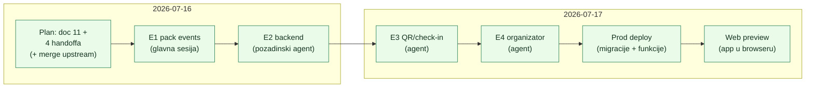
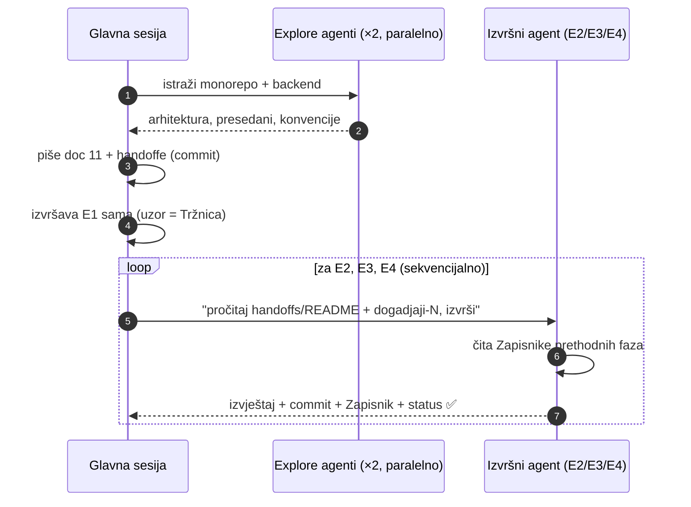

# 13 — Naučene lekcije: Događaji sesija (plan → autonomna implementacija u jednom danu)

> Datum: 2026-07-17 · Jezik: HR
> Kontekst: [11 — Događaji](11-dogadjaji-p2p-ticketing.md) (plan), [12 — Onboarding organizatora](12-onboarding-organizatora.md)
> (runbook). Ovaj dokument je trajni zapis **procesnih i tehničkih lekcija** iz sesije
> 2026-07-16/17 u kojoj je P2P ticketing isplaniran, implementiran (E1–E4, oba repoa),
> deployan na produkciju i pokrenut u browseru — sve u jednoj (nastavljanoj) Claude Code sesiji.

## 1. Što se dogodilo (kronologija)

Rezultat: 9 commitova (6 monorepo `custom`, 3 domovina-api `main`), 139 testova u packu,
backend SQL verificiran end-to-end na lokalnom Postgresu, produkcija živa
(`events-feed` → 200), app renderira u Chromeu.

## 2. Procesne lekcije (najvrjednije)

1. **Handoff dokument = jedinica autonomnog rada.** Format uhodan u ovom folderu (Cilj →
   Kontekst s točnim datotekama → Preduvjeti → Opseg In/Out → Sigurnost → Kriteriji →
   Zapisnik) bio je dovoljan da pozadinski agenti izvrše E2–E4 **bez ijednog dodatnog
   pitanja**. Ključno: handoff mora pokazivati na _presedane u kodu_ (kopiraj obrazac X iz
   datoteke Y), ne samo opisivati želje.
2. **Zapisnik izvršenja je ugovor između faza.** E3 agent je iz E2 Zapisnika saznao točna
   imena RPC-ova i odluke (bearer capability, once-only tokeni) — bez ponovnog čitanja koda.
   Pravilo: svaka faza upisuje odluke, odstupanja i gotchae u Zapisnik SVOJE faze.
3. **Faze koje diraju iste datoteke idu sekvencijalno, istraživanje paralelno.** Dva Explore
   agenta (monorepo + domovina-api) na početku paralelno; E2→E3→E4 strogo redom jer dijele
   `events/` pack, `config.toml` i status tablice.
4. **Agent pao na 529 (server overload) ≠ izgubljen posao.** Resume istom agentu
   ("nastavi gdje si stao, prvo provjeri git status i što si već napisao") očuva kontekst;
   agent je normalno dovršio fazu.
5. **Planiraj u istoj sesiji u kojoj istražuješ, izvršavaj gdje god.** Plan (doc 11) pisan s
   punim kontekstom oba repoa; izvršenje je onda čisto mehaničko — točno to omogućuje
   "prazan chat" nastavak.

## 3. Tehničke lekcije (dizajn)

- **Prije gradnje backenda — pročitaj što već postoji.** `pinka_finance` je pokrivao ~80 %
  ticketinga (`campaigns.type='tickets'` je čekao neiskorišten). Jedan Explore agent je to
  našao u 3 minute; bez toga bi se gradio paralelni sustav.
- **Poslovni ishodi kao status jsonb, NE exceptioni** (SQL RPC-ovi): exception rollbacka i
  audit event. Bug stvarno nađen u E2 SQL verifikaciji (`tx_already_credited` je brisao
  vlastiti audit zapis).
- **Onchain verifikacija JE autorizacija** — `events-confirm` ne treba JWT jer kreditira samo
  stvarno sletjele EURe; idempotencija na `(tx_hash, log_index)` unique indexu, ne u kodu.
- **Rezervacija inventoryja na pending s TTL-om** je nužna razlika ulaznica vs donacija
  (oversell), a istek se rješava postojećim `expired` statom + re-reserve na zakašnjeli confirm.
- **Order UUID = bearer capability** — wallet je guest-path (nema GoTrue sesiju); isti
  presedan kao postojeći `contribution_status`.

## 4. Tooling gotchae (da se ne otkrivaju ponovno)

| Gotcha                                                                                                            | Rješenje                                                                                                                                            |
| ----------------------------------------------------------------------------------------------------------------- | --------------------------------------------------------------------------------------------------------------------------------------------------- |
| Expo typed routes (`.expo/types/router.d.ts`, gitignored) stale nakon novih ruta → type-check pada i za tuđe rute | kratki `npx expo start --offline` (dovoljno da ispiše rute), pa type-check                                                                          |
| `yarn verify:changed` krivo detektira workspace kad diff dira `packages/`                                         | `node scripts/verify.mjs --changed --workspace=mobile`                                                                                              |
| `PendingTx.container` (i sl.) flaky pod punim test loadom                                                         | pokreni izolirano; ako prolazi i nije u diffu — nije tvoje (dokumentirano u handoffs README)                                                        |
| `perl -pe 's/\x{00AD}//g'` na UTF-8 datoteci **uništi multibyte znakove** (radi na byteovima)                     | za Unicode zamjene koristi Write/Edit tool ili `perl -CSD`; datoteku sam morao ponovno napisati                                                     |
| Entrio (i sl.) blokira direktan fetch (403)                                                                       | firecrawl scrape radi; podatke snimiti u doc s datumom snimke                                                                                       |
| Pozadinski `expo start` umire kad wrapper shell izađe                                                             | `nohup ... & disown`                                                                                                                                |
| domovina-api deploy                                                                                               | `db-migrate.sh --dry-run` → `db-migrate.sh` → `deploy-functions.sh --only=<fn>` (zadnja s `--restart -y`); idempotentne migracije = drugi run no-op |

## 5. Web preview (najveći tehnički side-quest)

App u browseru (`WEB_PREVIEW=1 npx expo start --web`) zahtijevao je 7 iteracija stubbanja
native-only modula. Cijela arhitektura, tablica stubova i **postupak debugiranja sljedećeg
modula koji pukne** (mapiranje bundle line → ime modula awk-om) trajno su zapisani u
[apps/mobile/docs/web-preview.md](../../apps/mobile/docs/web-preview.md). Ključna lekcija:
greška `__fbBatchedBridgeConfig is not set` znači "netko je dirnuo native bridge pri importu"
— krivac se nalazi mehanički iz stack line brojeva, ne pogađanjem.

## 6. Što bi sljedeći put drukčije

1. **Tx-hash šav prema Send flowu dizajnirati u E1**, ne ostavljati za E3 — sad je jedini
   ručni korak u kupovnom flowu (`recordTicketPayment` postoji, šav nedostaje).
2. **Organizator auth (GoTrue login u walletu) je bio podcijenjen** — "zalijepljeni JWT" je
   OK za pilot, ali je to prva stvar koju treba zamijeniti (v. Zapisnik E3/E4).
3. Handoffi za faze koje diraju **drugi repo** trebaju eksplicitnu commit konvenciju tog repoa
   (E2 agent ju je sam izveo iz `git log`, ali to je bilo sreće a ne dizajna — sad piše u promptu).
