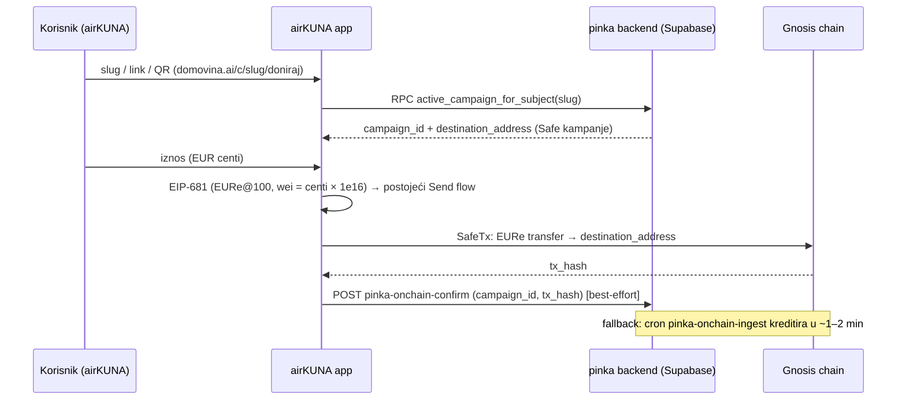

# 15 — airKUNA wallet: generički HR self-custody wallet s donacijama

> Datum: 2026-07-22 · Status: **plan** (handoff promptovi spremni, v. §9) · Jezik: HR
> Kontekst odluka: [01 — Vizija](01-vizija-i-strategija.md), [08 — KUNAPay](08-kunapay-consumer-brand.md),
> [14 — Upstream dnevnik](14-upstream-sync-dnevnik.md), `novcanik-template` (KATALOG-NOVCANIKA.md, roadmap 2026-07-21),
> brand SSOT `/Users/ms/git/airkuna/airkuna-web`.

## 1. Teza

**airKUNA** je generički hrvatski self-custody wallet (iOS/Android), brandiran po airkuna-web
identitetu, s **0% naknada** pozicioniranjem (mpt.hr naracija) i **slanjem donacija** na
`https://domovina.ai/c/<slug>/doniraj` kao ključnom funkcijom koja ga razlikuje od stock walleta.
Ne gradi se novi proizvod: airKUNA je **novi brand overlay na postojećem Safe forku** — brand
manifest + jedan novi feature-pack (`donations`) na već isporučenoj infrastrukturi (whitelabel
manifesti, theme injection, feature packovi; MVP faze 0–4 ✅). Razina ambicije: ITalk-razina
venture (~750 k€ seed brojke — **ne** miješati s e-Dem iznosima).

## 2. Odluka o smjeru: Safe whitelabel fork, ne ekstrakcija

Novcanik roadmap (2026-07-21, `novcanik-template`) računa troškove na ekstrakciji
`pay.domovina.ai/wallet` jezgre u samostalnu aplikaciju. Međutim, `novcanik/CLAUDE.md` eksplicitno
kaže da je **Safe whitelabel fork noviji smjer** — ovaj dokument to formalizira: airKUNA se gradi
na ovom forku, a `pay.domovina.ai/wallet` ostaje web Track B (v. [01 — Vizija](01-vizija-i-strategija.md)).

Mapiranje novcanik roadmap faza na stanje forka:

| Novcanik faza (2026-07-21)           | Stanje u forku                                                                                    | airKUNA akcija                                       |
| ------------------------------------ | ------------------------------------------------------------------------------------------------- | ---------------------------------------------------- |
| Onboarding (račun bez seed frikcije) | ✅ faza 2 + hardening (counterfactual Safe, relay/EOA aktivacija)                                 | samo brand manifest (A1)                             |
| Balans + povijest                    | ✅ upstream (Assets/TxHistory)                                                                    | —                                                    |
| Receive (QR/link s iznosom)          | ✅ faza 3 (EIP-681 + payment linkovi)                                                             | —                                                    |
| Send                                 | ✅ upstream `SEND_TRANSFERS` + relayed execution (PR #8156, v. [14](14-upstream-sync-dnevnik.md)) | zero-fee UX (A3)                                     |
| Donacije                             | ❌ ne postoji nigdje native (Flutter stub baca `UnsupportedError`)                                | **donations pack (A2) — jezgra**                     |
| SEPA top-up / off-ramp               | izvan scopea airKUNA MVP-a                                                                        | → KUNAPay K3/K4 ([08](08-kunapay-consumer-brand.md)) |
| Glasovanje, edEUR                    | izvan scopea                                                                                      | —                                                    |

## 3. Tri potvrđene odluke

1. **Valuta: EURe sada, KUNA kasnije.** Donacijski flow domovina.ai je hard-wired na EURe
   `0x420CA0f9B9b604cE0fd9C18EF134C705e5Fa3430` (Gnosis, chain 100). Prelazak na KUNA token je
   config (isti valuta-as-config invariant kao FF `clubs/currency.ts` — nijedan ekran ne
   hardkodira simbol/adresu/decimale).
2. **Scope: čisti wallet + donacije.** Manifest pali samo `features: { donations: true }`;
   marketplace/events/ff ostaju isključeni. Manji binary rizik, čišći store listing, brža revizija.
3. **Auth: EOA u Keychainu.** Postojeći verificirani put (keystore + biometrija, faza 2 +
   hardening). Passkey signer = kasnija faza roadmapa, ne blokira MVP.

## 4. Odnos prema KUNAPay i imenska napomena (nadopuna [08] §2)

[08 — KUNAPay](08-kunapay-consumer-brand.md) §2 razdvaja: KUNAPay = consumer app, airKUNA =
tračnica/token/DAO (razlog: Aircash pitch — aplikacija istog imena bila bi im konkurencija u
istom razgovoru). Ova odluka **dodaje airKUNA i kao app brand** za generički wallet s
donacijama; KUNAPay ostaje zaseban radni brand za KEKS/Aircash-UX smjer s fiat rampama.
Posljedica za Aircash pitch (dvije aplikacije, jedna nosi ime tračnice) je **poslovna odluka
vlasnika** — zabilježena kao rizik u §8; tehnički su brandovi neovisni manifesti na istom binaryju
i ne blokiraju jedan drugoga.

## 5. Donacijski interfejs (domovina.ai / pinka)

Izvor istine: `domovina.ai` repo, `lib/pinka_sdk/` (posebno `src/pinka_config.dart`) + Supabase
edge funkcije `pinka-contribute` / `pinka-onchain-confirm`. Native wallet integracija danas **ne
postoji** (Flutter stub baca `UnsupportedError`) — airKUNA puni točno tu rupu.

- **Donacija = ERC-20 `transfer`** EURe (`0x420CA0f9B9b604cE0fd9C18EF134C705e5Fa3430`) na
  Gnosisu (100) na `destination_address` kampanje (Safe kampanje iz `pinka_finance.campaigns`).
- **EIP-681 format** (isti kao QR na donacijskoj stranici):
  `ethereum:0x420CA0f9B9b604cE0fd9C18EF134C705e5Fa3430@100/transfer?address=<safe>&uint256=<wei>`
  gdje je `wei = centi × 1e16` (EURe ima 18 decimala; iznos se unosi u centima).
- **Kampanja** se dohvaća Supabase RPC-om `active_campaign_for_subject` (input: slug subjekta).
- **Instant kredit**: POST na edge fn `pinka-onchain-confirm` s `campaign_id` + `tx_hash`.
  Best-effort — bez confirma cron `pinka-onchain-ingest` kreditira donaciju u ~1–2 min.
- **Status**: `contribution_status` za provjeru je li donacija proknjižena.

## 6. Zero-fee strategija

mpt.hr dokumentira 0% rail: Monerium mint/redeem je besplatan (regulirani EMI sloj), a gas se
sponzorira. U forku **relayed execution već postoji** (upstream PR #8156 mergean, v.
[14](14-upstream-sync-dnevnik.md)): `src/services/tx-execution/relayExecutor.ts`,
`src/features/ExecuteTx/hooks/useRequiresRelay.ts` (gate = CGW chain feature `RELAYING` +
`useRelayGetRelaysRemainingV1Query` dnevna kvota), `HowToExecuteSheet` s Relay(Un)Available UI-jem;
relayed **aktivacija** Safea postoji od hardening faze (`useActivateSafe`).

- **MVP (opcija A)**: koristiti CGW relay gdje `RELAYING` postoji za Gnosis; airkuna-3 samo
  dodaje "Bez naknade" UX (default na relay kad je dostupan + pošteni fallback copy kad signer
  plaća gas).
- **Opcija B (fallback/dopuna)**: vlastiti relayer `pay.domovina.ai /api/relay` (5 tx/dan/signer,
  Turnstile) — POST postojećeg potpisanog SafeTx-a. Veći zahvat; **odluka delegirana u fazu A3**
  nakon provjere CGW chain configa.
- **Marketing tvrdnje** uskladiti s mpt.hr: airKUNA "nije licencirana platna usluga"; Monerium je
  regulirani sloj; 0% vrijedi za EURe transfere na sponzoriranoj tračnici, uz pošten copy kad
  relay nije dostupan.

## 7. Brand smjernice za mobile

SSOT: `/Users/ms/git/airkuna/airkuna-web` (README sekcija "Brand"). Pravila prenesena na mobile:

| Token / pravilo | Vrijednost                      | Mobile primjena (Tamagui dot-paths)                          |
| --------------- | ------------------------------- | ------------------------------------------------------------ |
| Navy            | `#002F6C`                       | `theme.light`: `primary.main`, `secondary.main`              |
| Zlato           | `#C8912A` / svjetlija `#E3AF35` | `static.textBrand`; **dark mod**: `primary.main` = `#E3AF35` |
| Crvena          | `#C0181C`                       | **NE koristi se** — rezervirana za `.org` kontekst           |
| Logo            | `coin.svg` (512×512)            | rasterizirati → icon / splash / androidAdaptiveIcon          |
| Typography      | Fraunces + Inter (web)          | mobile ostaje na app fontovima (font swap = post-MVP)        |
| Ton             | sentence case, bez emojija      | svi airKUNA-vidljivi stringovi, HR                           |

Napomena: airkuna-web je light-only, ali mobile app ima dark mod — manifest daje i `theme.dark`
(kunapay-1 presedan: navy je pretaman na tamnoj podlozi, zlato preuzima primarnu ulogu).

## 8. Ručni preduvjeti i rizici

**Ručni preduvjeti** (bez njih se u manifestu koriste placeholderi; A4 je njima blokiran):

| Preduvjet                                            | Gdje se upisuje                                     | Status                                                                                                                                                      |
| ---------------------------------------------------- | --------------------------------------------------- | ----------------------------------------------------------------------------------------------------------------------------------------------------------- |
| EAS projekt za airkuna (`easProjectId`)              | manifest `easProjectId`                             | ✅ 2026-07-22 `@airkuna/airkuna` = `a3bfe1f6-16bd-4b0c-a171-86410842cbaf` (u manifestu)                                                                     |
| EAS owner račun (prijedlog: `airkuna`, kao ff)       | manifest `owner`                                    | ✅ org `airkuna` postoji; `stepanic` dodan kao member                                                                                                       |
| Apple Team (ITalk `6SCK58757K` ili vlastiti — TBD)   | manifest `ios.appleTeamId`                          | ✅ odluka vlasnika: ITalk `6SCK58757K` (u manifestu)                                                                                                        |
| Bundle id / package (prijedlog `com.airkuna.wallet`) | manifest `ios.bundleIdentifier` / `android.package` | ✅ `com.airkuna.wallet` (+ `.dev` varijanta)                                                                                                                |
| Firebase projekti (iOS+Android, push)                | gitignored fileovi (v. `brand/README.md`)           | ✅ projekt `airkuna-production` (vlasnikov), 4 appa; configi `*-airkuna*` + SA ključ `keys/airkuna/` lokalno u `apps/mobile/`                               |
| Scheme `airkuna://`                                  | manifest `scheme` (nije blokada — samo odluka)      | ✅ u manifestu (`airkuna`, `wc`)                                                                                                                            |
| AASA / universal link na domovina.ai                 | domovina.ai hosting + entitlements (→ A4/post-MVP)  | 🔶 iOS AASA živ 2026-07-22 (`/c/*` → com.airkuna.wallet, domovina.ai v2.0.105); ostaje app entitlement (schema) + Android assetlinks (čeka signing cert A4) |
| pinka backend allowlist (ako CORS/origin gating)     | domovina-api                                        | ✅ nema gatinga — A2 verificirao živi RPC + edge fns s javnim anon keyem (2026-07-22)                                                                       |

**Rizici:**

1. **EURe hard-wire** u donacijskom flowu — KUNA swap zahtijeva promjenu i na pinka strani, ne
   samo config u walletu (mitigacija: valuta-as-config od prvog dana, odluka 1 u §3).
2. **CGW `RELAYING` dostupnost na Gnosisu** — ako nije uključen, "0% naknada" pada na opciju B
   (vlastiti relayer) ili pošteni copy; provjera je prvi korak A3.
3. **Upstream `CreateSafe` kolizija** — naš overlay je ispred upstreama; kad upstream shipa svoje
   kreiranje Safea, odluka migracije (v. [14](14-upstream-sync-dnevnik.md), Implikacije §2).
4. **Aircash pitch imenska kolizija** (v. §4) — poslovna odluka vlasnika, ne tehnička blokada.
5. **CGW `SEND_FLOW` izostaje na Gnosisu (prod)** — ✅ RIJEŠENO 2026-07-22 brand overrideom.
   Nalaz istrage: prod CGW `safe-client.safe.global` za chain 100 nema `SEND_FLOW` u features
   arrayu (staging uopće nema chain 100), a jedini gate u mobile kodu je
   `useHasFeature(FEATURES.SEND_FLOW)` u `AssetsHeader.container.tsx` (`showSendButton`) —
   same `(send)` rute nisu gateane. Backend je **potpuno funkcionalan** bez flaga: živi CGW
   `POST …/transactions/{safe}/preview` i `GET …/safes/{safe}/nonces` na chainu 100 vraćaju
   valjane odgovore, a web app uopće ne gatea slanje po `SEND_FLOW` (nula referenci u
   `apps/web`) — flag je čisto client-side rollout switch za Safe{Mobile}. Razmotrene opcije:
   (a) zahtjev Safeu da uključi flag za Gnosis (izvan naše kontrole, spor), (b) vlastiti CGW
   preko `backend.cgwBaseUrl` (preskup za jedan flag), (c) **odabrano** — brand-gated override:
   manifest `features.forceSendFlow: true` (airkuna) + allowlist seam
   `src/custom/features/forcedFeatures.ts` u `useHasFeature` (i `.e2e` varijanti); samo
   `SEND_FLOW` se može forsirati, safe/domovina bez flaga = identično upstream ponašanje.

## 9. Faze i handoff promptovi

Redoslijed: A1 (brand + schema) je preduvjet svemu; A2 (donacije) je jezgra; A3 (zero-fee UX)
polira Send; A4 (release) može paralelno s A2/A3 čim su ručni preduvjeti riješeni.

| #   | Faza                                              | Handoff                                                 | Ovisi o                           | Status                                                                          |
| --- | ------------------------------------------------- | ------------------------------------------------------- | --------------------------------- | ------------------------------------------------------------------------------- |
| A1  | Brand manifest + `donations` schema polje         | [airkuna-1-brand.md](handoffs/airkuna-1-brand.md)       | —                                 | ✅ 2026-07-22                                                                   |
| A2  | Donations feature-pack (`src/custom/donations/`)  | [airkuna-2-donacije.md](handoffs/airkuna-2-donacije.md) | A1                                | 🔄 u tijeku                                                                     |
| A3  | Zero-fee slanje ("Bez naknade" UX + relay odluka) | [airkuna-3-zerofee.md](handoffs/airkuna-3-zerofee.md)   | A2                                | ✅ 2026-07-22                                                                   |
| A4  | Release pipeline za `airkuna`                     | [airkuna-4-release.md](handoffs/airkuna-4-release.md)   | A1, faza 5, ručni preduvjeti (§8) | 🔄 automatizirani dio ✅ 2026-07-22 (Zapisnik); ručno: ASC/Play koraci vlasnika |
