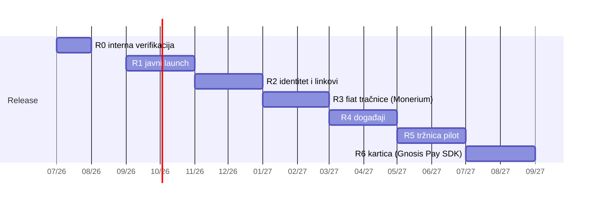

# airKUNA roadmap — 12 mjeseci (Q3 2026 → Q3 2027)

> Nastalo 2026-07-22, nakon završetka MVP implementacije (A1–A4, v.
> [15](15-airkuna-wallet.md)). Temelji se na dva internet-research prolaza (tržište +
> regulativa — puni nalazi s izvorima u [18](18-research-trziste-regulativa-2026-07.md))
> i stanju codebasea. Ovo je arhitektonski plan isporuke —
> što ide u koji store release i zašto tim redoslijedom.

## Filozofija releasa

- **Store release = milestone** s novim native surfaceom (moduli, entitlements, schema);
  između njih JS iteracije. OTA je za MVP isključen (odluka A4); ponovno se otvara u R2
  kad javna baza korisnika opravda self-hosted OTA kanal (infra već postoji —
  ota.domovina.ai presedan).
- **Svaka faza ima izlazni kriterij** — bez njega se ne ide u sljedeću.
- **Regulatorna nit vodilja**: airKUNA ostaje čisti self-custody softver — nikad ne drži
  sredstva, ne prima naloge s diskrecijom, ne posreduje novac. Svaka faza se provjerava
  protiv te granice (MiCA CASP / PSD2 acquiring / zakon o financiranju polit. aktivnosti).

## Ključni nalazi researcha (2026-07-22)

**Tržište:**

- Naš stack (Safe + Gnosis + EURe + Monerium IBAN) je **dokazani EU obrazac**: Gnosis Pay
  ($131M lifetime card spend kraj 2025, cilj $1B 2026) + Zeal (passkey, Monerium IBAN,
  cashback) su template "Revolut-like" EURe walleta. Gnosis Pay **SDK za white-label
  kartice postoji od 7/2025** — kartica je integracija, ne licenca.
- **Monerium: trenutno 0 € naknada** (IBAN po adresi, SEPA↔EURe mint/redeem; partner LHV);
  cjenik je diskrecijski — budžetirati buduće naknade.
- Adoption driveri kroz 2025-26 launcheve: **passkeys, korisnička imena (ENS), payment/claim
  linkovi (Peanut pattern), push notifikacije, kartica**. Daimo lekcija: standalone P2P
  consumer app bez rampi/use-casea nije održao traction.
- Euro stablecoini rastu ali su niša: compliant cap $296M → $674M YoY; EURC dominira,
  EURe ~$30M ali jedini s native IBAN-om po korisniku.
- **Yield na EURe saldo je MiCA-om zabranjen** (čl. 45(12)/50 — i za posrednike);
  dopuštena poluga = usage-based cashback, ne balance-time-based.
- Storeovi: Google Play (politika 10/2025) traži licence samo za **kastodijalne** wallete —
  self-custody izuzet (potvrđeno 8/2025); Apple bez novih blokada za self-custody.

**Regulativa:**

- Čisti self-custody wallet **nije CASP** (settled). HR: CASP režim živ od 1.7.2026
  (HANFA; Electrocoin prva licenca 4/2026) — ne dira nas dok ne pređemo granicu.
- **Relayer/sponzorirani gas**: nema eksplicitne EU smjernice; rizik je "reception &
  transmission of orders" ako naš backend diskreciono prosljeđuje. Mitigacija: relayer =
  glupa cijev, user-signed tx, dokumentirana arhitektura. CGW relay (Safeov) je danas
  još čišća pozicija.
- **Političke donacije = najveće regulatorno trenje**: zabranjene anonimne donacije i
  donacije preko posrednika; cap fizičke osobe €3.981,68/god; strane donacije zabranjene;
  novac **mora na poseban račun kampanje u banci** — direktna on-chain EURe donacija
  političkoj kampanji NIJE compliant. Donacije udrugama/civilnom sektoru su bitno
  slobodnije (humanitarne kampanje → Zakon o humanitarnoj pomoći, registracija po kampanji).
- **Fiskalizacija 2.0** (1.1.2026): trgovac plaćen u EURe i dalje fiskalizira račun +
  e-reporting B2C — obveza na trgovcu, ali marketplace mora davati fiskalizaciji
  kompatibilan export.
- **TFR/travel rule**: P2P self-hosted ↔ self-hosted izvan scopea; CASP-ovi traže dokaz
  vlasništva adrese >€1.000 → wallet treba **message-signing proof-of-ownership** UX.
- **GDPR (EDPB smjernice o blockchainu, final 7/2026)**: adresa + tx metadata = osobni
  podaci; mapping adresa↔identitet (nužan za donacije) držati off-chain, minimiziran.
- **"0% naknade" copy (UCPD)**: dopušteno samo uz disclosure tko plaća gas i da Monerium
  koraci mogu imati svoje naknade — postojeći "pošteni fallback copy" (A3) je točan smjer.

## Faze

### R0 — Interna verifikacija (sad → kolovoz 2026)

Cilj: MVP potvrđen na stvarnim uređajima, store računi spremni, donacije pravno očišćene.

- Ručno testiranje na Androidu i iPhoneu (build: lokalni `eas build --local` recept u
  [eas-build-debugging.md](../../apps/mobile/docs/eas-build-debugging.md) + cloud potvrda).
- Ručni koraci vlasnika iz airkuna-4 Zapisnika: ASC API key + TestFlight, Play Console
  app + prvi AAB, interni track.
- **Klasifikacija pinka kampanja: politička vs. udruga/humanitarna.** Političke kampanje
  gateati (ili isključiti) dok ne postoji compliant flow (v. R3); civilne/udruge idu u R1.
- Izlazni kriterij: E2E prolaz (onboarding → primi → pošalji → doniraj) na oba OS-a;
  TestFlight + Play interni track žive.

### R1 — Javni launch: "pošalji, primi, doniraj" (rujan–listopad 2026)

Prvi javni release na App Store + Google Play. Postojeći MVP **jest dovoljan za traction**
uz dva dodatka koja korisnici smatraju higijenom:

- **Push notifikacije za transakcije** (upstream infra postoji — uključiti/QA za airkunu).
- **HR lokalizacija svih airKUNA-vidljivih flowova** (sentence case, bez emojija).
- Donacije: samo civilne/udruge (R0 odluka); "0% naknade" copy s UCPD disclosureom.
- Store listing, privacy labels, GDPR privacy policy (adresa = osobni podatak).
- Izlazni kriterij: oba storea odobrila; crash-free > 99%; prvi vanjski korisnici.

### R2 — Identitet i linkovi (studeni–prosinac 2026)

Dva features najjače korelirana s mainstream adopcijom (research §tržište):

- **Korisnička imena**: ENS subdomene (faza 4 handoff; ručni preduvjeti: ENS domena +
  Namestone key + proxy).
- **Payment/claim linkovi** (Peanut pattern; kunapay-4 handoff) — primatelj bez walleta
  dobiva link/QR; ključno za donacije i P2P.
- Proof-of-ownership signing (TFR UX — prolaz CASP provjera).
- OTA kanal se ponovno otvara (self-hosted, presedan domovina) za JS iteracije.
- Izlazni kriterij: slanje na ime i na link radi E2E; store update objavljen.

### R3 — Fiat tračnice (siječanj–veljača 2027)

- **Monerium IBAN onramp/offramp** (kunapay-2/3 handoffi): korisnik ugovara i KYC-a se
  **direktno kod Moneriuma** (mi smo softver; referral fee OK). SEPA uplata → auto-mint
  EURe; redeem → SEPA out.
- Time se otvara i **compliant politička donacija** (opcionalno, poslovna odluka):
  EURe → redemption → SEPA na poseban račun kampanje, s punim identitetom donatora,
  cap enforcement i screening stranih donatora. Ako je preskupo — političke ostaju trajno
  isključene, gubitak je mali.
- Security audit prije ove faze (prvi put diramo fiat novac korisnika u UX smislu).
- Izlazni kriterij: kruženje EUR → EURe → EUR E2E na produkciji; audit nalazi zatvoreni.

### R4 — Događaji (ožujak–travanj 2027)

- Events pack **već implementiran** (E1–E4, backend na api.domovina.ai) — uključiti
  `features.events` za airkunu, pilot s prvim organizatorom, org allowlist.
- Ticketing nije crypto-trading (regulativa čista); consumer law + jasni uvjeti.
- Izlazni kriterij: prvi stvarni događaj s naplatom ulaznica kroz app.

### R5 — Tržnica pilot (svibanj–lipanj 2027)

- Marketplace pack M2–M4 (trznica handoffi): pilot MSP trgovci.
- Fiskalizacija 2.0: export računa/podataka za trgovčevu fiskalizaciju; provjeriti
  tretman kripto-plaćanja u tehničkim specifikacijama Porezne uprave.
- **DAC7 procjena prije nego platforma počne posredovati** (listing ≠ posredovanje);
  order-book smije biti samo za robu/ulaznice, nikad token-za-token (MiCA trading granica).
- Izlazni kriterij: prvi trgovac s fiskaliziranim EURe prometom kroz app.

### R6 — Kartica (srpanj–rujan 2027)

- **Gnosis Pay SDK** white-label debitna kartica — airKUNA = brand/distributer, licencirani
  sloj kod partnera (isti pattern kao Zeal/MetaMask Card). KYC opet kod Moneriuma.
- Usage-based cashback kao poluga (NE yield na saldo — MiCA zabrana).
- Izlazni kriterij: prve kartične transakcije korisnika.

## Poprečne teme (cijelu godinu)

- **Upstream sync** mjesečno (dnevnik u [14](14-upstream-sync-dnevnik.md)); posebno pratiti
  upstreamov CreateSafe i passkey smjer (naš EOA-u-Keychainu auth → passkey migracija kad
  upstream sazrije, vjerojatno R2-R3 prozor).
- **Buildovi**: lokalni `eas build --local` za dev/preview (queue-free), cloud za
  produkciju; paid EAS tier razmotriti kad queue postane blokada release kadence.
- **Praćenje regulative** (open items): ESMA/EBA smjernice o frontendima/relayerima;
  Fisk 2.0 tretman kripta; redraft zakona o financiranju polit. aktivnosti; PSD3/PSR u
  OJ (H2 2026, primjena ~2027/28 — bez akcije u ovom horizontu).
- **Što svjesno NE radimo**: yield/kamata na EURe (zabranjeno), custodial featurei
  (gubimo store izuzeće i ne-CASP status), vlastiti acquiring/checkout gdje mi primamo
  EURe pa prosljeđujemo trgovcu (PSD2 acquiring), token-za-token order-book.
