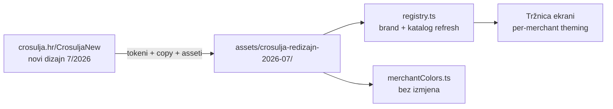

# 19 — Crošulja redizajn (srpanj 2026): analiza i design tokeni

**Izvor:** https://crosulja.hr/CrosuljaNew/elementor-home/ (staging, `noindex`; WordPress + Elementor, izradio Brick and Bytes prema dizajnu dizajnerice)
**Preuzeto:** 2026-07-29 (Firecrawl: markdown + HTML + full-page screenshot + branding ekstrakcija)
**Referentni fajlovi:** [assets/crosulja-redizajn-2026-07/](assets/crosulja-redizajn-2026-07/) — `crosulja-home-full.png` (cijela stranica), `crosulja-branding.json` (sirovi tokeni), `sadrzaj.md` (kompletan copy)

Crošulja je pilot-tenant Tržnice (doc [09](09-trznica-marketplace.md), pack `apps/mobile/src/custom/marketplace`). Ovaj doc je referenca novog vizualnog identiteta za usklađivanje in-app kataloga i per-merchant theminga — staging URL će vjerojatno nestati nakon lansiranja, zato je sve preuzeto lokalno.

**Puni lokalni mirror staginga** (svih 11 stranica, offline, verificiran 1:1 s remoteom 2026-07-29) živi izvan monorepoa: development repo webshopa je `~/git/crosulja/crosulja-hr/` (snapshot + docs 01–05 + git checkpoint; `./serve.sh` → http://127.0.0.1:8123/CrosuljaNew/elementor-home/). Gotcha za refresh: LiteSpeed wget/curlu servira "guest" varijantu HTML-a bez Google Fonts — puna varijanta traži `Cookie: _lscache_vary=guest` + Chrome UA; detalji u `docs/05-snapshot-recept.md` tamo.

## 1. Design tokeni

| Token           | Vrijednost                                                                  | Napomena                                                  |
| --------------- | --------------------------------------------------------------------------- | --------------------------------------------------------- |
| Primarna (CTA)  | `#C4121A`                                                                   | crvena — gumbi "Naruči", "Izaberi ovaj model", akcenti    |
| Tamna crvena    | `#820202`                                                                   | sekundarna crvena (hero istaknuti redak, hover)           |
| Navy            | `#071D38`                                                                   | sekundarni gumbi, popust-banner pozadina, footer, linkovi |
| Pozadina        | `#F8F3EC`                                                                   | topla krem — i `theme-color` meta                         |
| Tekst           | `#272B31`                                                                   | tamno sivo-plava                                          |
| Display font    | Cormorant Garamond                                                          | veliki naslovi (h1 64px)                                  |
| Heading font    | Lora (serif)                                                                | podnaslovi (h2 48px)                                      |
| Body font       | Montserrat                                                                  | tekst, mikro-labele u uppercase + letter-spacing          |
| Radius          | 3–4px                                                                       | gumbi i kartice — oštro, "premium" izdanje                |
| Gumb primarni   | `#C4121A` bg / bijeli tekst, bez sjene                                      | radius 4px                                                |
| Gumb sekundarni | `#071D38` bg / bijeli tekst, bez sjene                                      | radius 4px                                                |
| Logo            | `crosulja-logo-500x250-1.png` (uploads/2026/01), rukopisni logotip u okviru | novi asset                                                |

Karakter: svijetla krem podloga + duboka crvena/navy, serifni naslovi s rukopisnim akcentima (potpis, "Dodi i budi dio naše priče") — elegantniji i "editorial" u odnosu na staru stranicu.

## 2. Struktura stranice (sekcije redom)

1. **Hero** — full-bleed fotografija (Dubrovnik, model u crvenoj Crošulji), hashtag `#scrockajse`, naslov "Navijačka elegancija. Business kombinacija.", CTA "Pogledaj modele" + "Naruči odmah"
2. **USP traka** — 5 kartica s line-ikonama: 100% pamuk, premium kvaliteta, veličine S–XXL, brza dostava (1–3 radna dana), podrška pri kupnji
3. **Brand intro** — "Crošulja: više od košulje" + product flat-lay fotka
4. **Popust banner** (navy) — kružni badge "10% popusta", kod `CROSULJA10` za prvu kolekciju
5. **Katalog** — "UNISEX KOLEKCIJA / Odaberi svoj model Crošulje"; 5 kartica: Plamen, Bura, Jadran, Velebit (100,00 € → **87,50 €**), Croatica (115,00 € → **99,00 €**); precrtana stara cijena + akcijska; CTA otvara Elementor popup (obrazac za narudžbu, ne klasična košarica)
6. **Grupne narudžbe** (crveni banner sa šahovnicom) — "Veći smo jači – i povoljniji!", popusti za tvrtke/udruge/klubove/timove, CTA "zatraži ponudu"
7. **Naša priča** — fotografija (crkva sv. Marka), tekst osnivača s potpisom (Marko i Lucija)
8. **FAQ** — 10 pitanja u accordion layoutu (unisex, materijal, veličine + tablica mjera, naručivanje, zamjena/povrat, popust kod, dostava 1–3 dana samo RH, održavanje, grupne narudžbe)
9. **Instagram/zajednica** (navy) — `@crosulja` + `#scrockajse`, mjesečni nagradni izbor objave
10. **Footer** — logo, brzi linkovi, informacije (impressum, privatnost, povrat), kontakt: Velika Gorica, +385 99 8745 847, info@crosulja.hr

## 3. Razlike prema stanju u marketplace packu

Registry (`apps/mobile/src/custom/marketplace/catalog/registry.ts`) je punjen sa stare stranice 2026-07-11. Novi dizajn mijenja:

| Područje        | Registry danas                           | Novi dizajn                                                        |
| --------------- | ---------------------------------------- | ------------------------------------------------------------------ |
| Brand primarna  | `#C8102E`                                | `#C4121A`                                                          |
| Brand accent    | `#1A1A1A` (crna)                         | navy `#071D38` (+ krem pozadina `#F8F3EC`)                         |
| Pozicioniranje  | "Muške košulje" (story)                  | **unisex kolekcija** — eksplicitno u naslovu i FAQ-u               |
| Cijene          | samo akcijska (`87.50` / `99.00`)        | precrtana stara + akcijska (100 → 87,50; 115 → 99) — akcija ostaje |
| Veličine        | Plamen/Bura/Velebit od M                 | FAQ: sve S–XXL (S–2XL); provjeriti po modelu prije izmjene         |
| Slike proizvoda | `uploads/2026/06/` png i jpeg (stara)    | novi asseti `uploads/2026/07/*.png.webp` (1-1, new, 3, 5, 4)       |
| Priče modela    | Bura: "…kamenih pejsaža i čiste prirode" | Bura: "…snage i bezvremenske elegancije hrvatskog identiteta"      |
| Popust          | nema                                     | kod `CROSULJA10`, 10% na prvu kolekciju                            |
| Grupne narudžbe | nema koncepta                            | istaknuta sekcija (tvrtke/udruge/klubovi/timovi, ponuda po mjeri)  |
| Hashtag/social  | nema                                     | `#scrockajse`, IG mjesečni nagradni mehanizam                      |
| Logo            | —                                        | novi logotip `uploads/2026/01/crosulja-logo-500x250-1.png`         |

Napomena: naručivanje i na novoj stranici ide preko obrasca (Elementor popup) + naknadna potvrda s detaljima plaćanja — nema webshop checkouta. In-app Tržnica s plaćanjem na Safe ostaje komplementarna, ne konkurentna.

## 4. Preporuke za pack (kad se krene u usklađivanje)

1. `registry.ts` — novi brand hexovi (`primaryHex: '#C4121A'`, `accentHex: '#071D38'`), unisex copy u `story`, nove priče modela, novi `imageUrl`-ovi (webp s nove stranice nakon lansiranja — staging putanje `CrosuljaNew/` će se promijeniti).
2. `types.ts` — razmotriti opcionalno `oldPriceEur` (precrtana cijena) i `discountCode` na merchant razini; UI kartica proizvoda tada prikazuje akcijski par kao na webu.
3. `merchantColors.ts` obrazac ostaje — navy accent preko `contrastColor` daje bijeli tekst, radi bez izmjena.
4. Grupne narudžbe = kandidat za M2+ (ponuda po mjeri ≈ off-app flow; u MVP-u eventualno samo CTA koji otvara mail).
5. Prije izmjene veličina po modelu potvrditi s Crošuljom stvarnu dostupnost (FAQ generalizira S–XXL).

