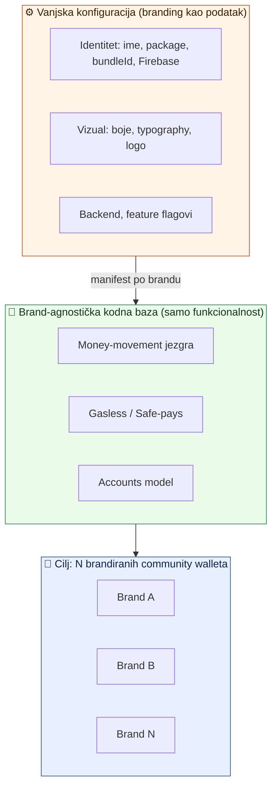

# Whitelabel Wallet — Knowledge Base

> Datum: 2026-07-04 · Grana: `custom` (airkuna fork) · Jezik: HR
> Trajni zapis strateškog i arhitekturalnog znanja o gradnji **N brandiranih community self-custody walleta** iz jedne brand-agnostičke kodne baze.

Ova knowledge baza dokumentira **zašto** i **kako** gradimo whitelabel wallet platformu — odvojeno od [`docs/codebase-audit/`](../codebase-audit/00-pregled.md) koji pokriva **kvalitetu koda** (any, TODO, version drift, testovi, sigurnost). Ova pokriva **produkt i arhitekturu**.

## Sadržaj

| Dok                                                                                          | Tema                                                                                                                          |
| -------------------------------------------------------------------------------------------- | ----------------------------------------------------------------------------------------------------------------------------- |
| [01 — Vizija i strategija](01-vizija-i-strategija.md)                                        | Cilj (N community walleta), dva track-a (Safe fork vs domovina wallet), build-vs-fork odluka                                  |
| [02 — Brand config sustav](02-brand-config-sustav.md)                                        | Manifest-driven brand config koji smo izgradili (faza 1, commit `f7cb87d44`); native vs runtime slojevi; SaaS pipeline        |
| [03 — Feature audit (Revolut-like)](03-feature-audit-revolut.md)                             | Koliko je "Revolut-like" wallet već gotov (~80%), matrica sposobnosti, ključni gap = identitet primatelja                     |
| [04 — Prior art landscape](04-prior-art-landscape.md)                                        | Tko još forka Safe, neobank self-custody wallete, P2P-send obrasci, reusable OSS                                              |
| [05 — Counterfactual onboarding](05-counterfactual-onboarding.md)                            | Arhitektura "Create account" flowa (faza 2): CREATE2 predikcija, undeployedSafes lifecycle, naučene lekcije                   |
| [06 — Receive + payment linkovi](06-receive-payment-linkovi.md)                              | Arhitektura EIP-681 receive/pay flowa (faza 3): QR + deep link, konzumacija kroz Send risk-validaciju                         |
| [07 — Hardening: aktivacija + brand sigurnost](07-hardening-aktivacija-i-brand-sigurnost.md) | Hardening prolaz (10 review nalaza): aktivacija counterfactual Safea (relay/EOA), gateway split, SSL pinning, WC metadata     |
| [08 — KUNAPay consumer brand](08-kunapay-consumer-brand.md)                                  | Generički consumer brand (KEKS/Aircash UX) na istoj tračnici; fiat on/off-ramp, claim linkovi                                 |
| [09 — Tržnica marketplace](09-trznica-marketplace.md)                                        | Ugrađeni marketplace za HR MSP-ove (pilot: Crošulja); regulatorni okvir (Fiskalizacija 2.0, DAC7, ne-CASP)                    |
| [10 — Onboarding trgovca](10-onboarding-trgovca.md)                                          | Operativni runbook za trgovca (in-app Safe, multi-tenant tablica)                                                             |
| [11 — Događaji: P2P ticketing](11-dogadjaji-p2p-ticketing.md)                                | Event-ticketing marketplace bez posrednika (Entrio/Luma paritet); pilot MoMo/BlockSplit; backend na `pinka_finance`           |
| [handoffs/](handoffs/README.md)                                                              | **Izvršni planovi po fazama** — samodostatni handoff promptovi za praznu Claude Code sesiju (MVP, KUNAPay, Tržnica, Događaji) |

## Kontekst u jednoj slici

## Ključni zaključci (TL;DR)

1. **~80% "Revolut-like" walleta već postoji** — razdvojeno na dva tvoja codebasea (Safe mobile fork + `pay.domovina.ai/wallet`). Vidi [03](03-feature-audit-revolut.md).
2. **Jedini pravi gap = ljudski-čitljiv primatelj** (username/ENS/link umjesto 0x). Prior art jednoglasno kaže da je to najvažnija stvar. Vidi [04](04-prior-art-landscape.md).
3. **Nitko product-grade ne forka Safe frontend** — svi grade na Safe{Core} SDK-u. `domovina/wallet` je već na tom putu. Vidi [01](01-vizija-i-strategija.md).
4. **Brand config faza 1 je isporučena** — manifest-driven _identitet_ na mobileu. Vizual (boje/typography) i backend su faza 2. Vidi [02](02-brand-config-sustav.md).
5. **MVP se gradi u 5 faza, ne u jednoj** — runtime branding → onboarding (novi Safe) → receive/payment linkovi → identity layer → release pipeline. Handoff prompt po fazi u [handoffs/](handoffs/README.md).
6. **Prvi feature-pack konzument brand sustava: FF Wallet** (nogometni klubovi, jedan binary + N klubova kao runtime tenanti) — git submodule na `apps/mobile/src/custom/ff`, plan i handoffi u tom repou (`docs/PLAN.md`). Pali se manifestom `features.ff`; stock brandovi ostaju netaknuti.
