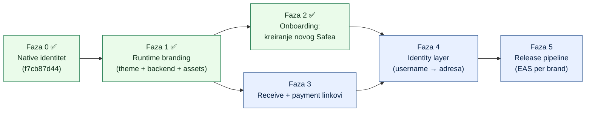

# Handoff promptovi — Revolut-like MVP (Track A, Safe mobile fork)

> Datum: 2026-07-05 · Grana: `custom` (airkuna fork) · Jezik: HR
> Svaki dokument u ovom folderu je **samodostatan handoff prompt**: kopiraš ga (ili referenciraš path) u **praznu Claude Code sesiju** i agent može izvršiti fazu bez dodatnog konteksta.

## Odluka: zašto 5 faza, a ne jedna

MVP se **ne može kvalitetno napraviti u jednoj fazi** iz četiri razloga:

1. **Veličina konteksta** — svaka faza je dimenzionirana za jednu Claude Code sesiju s čistim verify-loopom (`yarn verify:changed`); jedna mega-faza bi potrošila kontekst prije kraja i onemogućila reviziju.
2. **Verifikacija** — svaka faza ima vlastite acceptance kriterije koji se mogu izolirano potvrditi na uređaju; jedan veliki diff nitko ne može pregledati.
3. **Upstream kadenca** — između faza radi se `git merge upstream/dev` ([[fork-overlay-strategy]]); manji diffovi = manje konflikata.
4. **Ovisnosti** — faza 4 (identity) zahtijeva odluku o backendu koja ne smije blokirati faze 1–3; faza 5 ovisi o svemu prije.

## Mapa faza



| Faza | Dokument                                                               | Cilj                                                                        | Status |
| ---- | ---------------------------------------------------------------------- | --------------------------------------------------------------------------- | ------ |
| 0    | — (isporučeno, commit `f7cb87d44`)                                     | Manifest-driven native identitet (ime, packageId, Firebase, EAS)            | ✅     |
| 1    | [faza-1-runtime-branding.md](faza-1-runtime-branding.md)               | Manifest `theme`/`backend` polja se konzumiraju; brand assets; hex čišćenje | ✅     |
| 2    | [faza-2-onboarding-novi-safe.md](faza-2-onboarding-novi-safe.md)       | Kreiranje **novog** Safea u appu (danas: samo import)                       | ✅     |
| 3    | [faza-3-receive-payment-linkovi.md](faza-3-receive-payment-linkovi.md) | EIP-681 QR s iznosom + share link + deep-link u Send                        | ⬜     |
| 4    | [faza-4-identity-layer.md](faza-4-identity-layer.md)                   | Send po usernameu (ENS offchain subnames), hex adrese skrivene              | ⬜     |
| 5    | [faza-5-release-pipeline.md](faza-5-release-pipeline.md)               | EAS build per brand manifest + smoke test + store priprema                  | ⬜     |

## Kako koristiti

U praznoj Claude Code sesiji (u rootu ovog repoa, grana `custom`) zalijepi:

```
Pročitaj docs/whitelabel-wallet/handoffs/README.md pa docs/whitelabel-wallet/handoffs/faza-1-runtime-branding.md
i izvrši tu fazu točno po uputama iz dokumenta. Na kraju ažuriraj status tablicu u handoffs/README.md.
```

(zamijeni ime datoteke fazom koju radiš)

**Pravila koja vrijede za SVE faze** (detalji u [[fork-overlay-strategy]] memoryju i [01 — Vizija](../01-vizija-i-strategija.md)):

- **Overlay, ne fork-edit**: nova funkcionalnost ide u NOVE datoteke/dirove; upstream datoteke se diraju samo kroz "thin seams" (~1 linija) — route wrappere, `app/_layout.tsx`, `app.config.ts`.
- Prije početka: `git fetch upstream && git merge upstream/dev` (na grani `custom`).
- Prije committa: `yarn verify:changed` mora proći; conventional commits (`feat(mobile):`, `docs(whitelabel):`…).
- Novi kod = novi kolocirani testovi (`*.test.ts(x)`).
- Nakon faze: označi fazu ✅ u tablici gore i zapiši odstupanja od plana u sam handoff dokument (sekcija "Zapisnik izvršenja" na dnu).

## MVP definicija (što znači "gotovo")

Korisnik s brandiranim buildom (npr. `airkuna`) može: **(1)** otvoriti app u brand bojama/logotipu, **(2)** kreirati novi račun bez seeda-frikcije i bez plaćanja gasa unaprijed, **(3)** primiti novac preko QR-a/linka s iznosom, **(4)** poslati novac na `@username` bez da ikad vidi hex adresu, **(5)** a build za novi brand nastaje iz manifesta bez diranja koda. Kartica, off-ramp i multi-brand SaaS dashboard su **post-MVP**.
