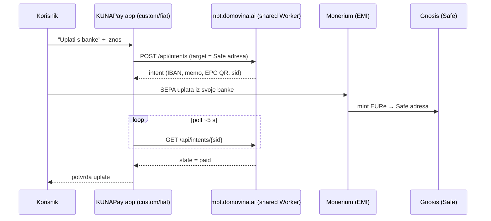

# KUNAPay 2 (K3) — fiat on-ramp: SEPA uplata → EURe u native appu

> Handoff prompt za praznu Claude Code sesiju. Repo: `/Users/ms/git/safe-global/safe-wallet-monorepo`, grana `custom`.
> Prije početka pročitaj [handoffs/README.md](README.md), [08 — KUNAPay](../08-kunapay-consumer-brand.md) i [03 — Feature audit](../03-feature-audit-revolut.md) (red "Fiat on-ramp": Track B ✅, mobile ❌).
> Preduvjet u repou: K1 mergean (`kunapay` manifest postoji).

## Cilj

Korisnik u native appu otvori ekran "Uplati s banke" i vidi SEPA podatke (IBAN, BIC, poziv na broj / memo, EPC QR) za uplatu koja se kroz Monerium mint pretvara u EURe na **njegovoj Safe adresi na Gnosisu**; ekran polla status i prikaže potvrdu kad je uplata sjela. Funkcionalnost je host feature-pack gated per-brand kroz manifest `features.fiat` — vrijedi za kunapay, FF i svaki budući brand ([08] §6).

## Kontekst i izvori

**Track B je referentna implementacija.** Web tier (`pay.domovina.ai/wallet`) ovo već ima kroz **Monerium payment intents** na shared Workeru `mpt.domovina.ai` (host-agnostičan, CORS za sve origine — v. ADR 0015). Native app koristi **isti intents API** — ne gradi se novi backend.

- Klijentski ugovor kakav Track B danas konzumira: `/Users/ms/git/domovinatv/pay.domovina.ai/wallet/src/lib/paymentIntent.ts` — `createPaymentIntent` (`POST /api/intents` s `target_address`, `amount_eur`, `label`, `metadata`, `expires_in_seconds`), `getPaymentIntent` (`GET /api/intents/{sid}`), `subscribePaymentIntent` (poll svakih 5 s; SSE endpoint postoji u tipu ali backend ga još ne implementira). Intent nosi `iban`, `bic`, `beneficiary_name`, `memo`, `epc_qr_data`, `state: pending|paid|expired`, `expires_at`…
- Base URL: `PAYMENT_INTENT_API_BASE = https://mpt.domovina.ai` (`wallet/src/lib/constants.ts`).
- Arhitektonska pozadina: `/Users/ms/git/domovinatv/pay.domovina.ai/docs/decisions/0015-runtime-brand-resolution-and-external-brand-repos.md` (intents = shared remote Worker, za razliku od relaya koji je per-deployment).
- Monerium mehanika (interno znanje): `/Users/ms/git/domovinatv/pay.domovina.ai/docs/monerium-private.md`.
- Gating presedan: `apps/mobile/src/custom/ff/isFfBrand.ts` (`getBrand().features?.ff === true`) + šavovi u [FF PLAN.md](../../../apps/mobile/src/custom/ff/docs/PLAN.md) §6.
- Overlay presedan bez ruta: `apps/mobile/src/custom/paymentLinks/` (faza 3).

**GPL napomena:** Track B kod je vlasnikov vlastiti, ne-GPL. Njegovi obrasci i API ugovor **smiju** se portati u ovaj GPL fork (smjer fork←vlastito je u redu). Obrnuti smjer — kopiranje GPL koda iz forka u ne-GPL repoe — **nikad**.

## Preduvjeti

**Ručni (vlasnik projekta):**

| Preduvjet                                                                                   | Zašto                                                                                                       | Status |
| ------------------------------------------------------------------------------------------- | ----------------------------------------------------------------------------------------------------------- | ------ |
| Monerium partner račun + povezivanje (linkanje) korisničkih Safe adresa s KYC-anim profilom | adresa mora biti povezana da smije primati EURe mintove (v. monerium-private.md, sekcija o linkanju adresa) | ⬜     |
| Pristup/konfiguracija `mpt.domovina.ai` za kunapay promet (kvote, identifikacija izvora)    | shared Worker je Track B infrastruktura                                                                     | ⬜     |
| Odluka o KYC flowu za native korisnike (gdje i kako korisnik prolazi Monerium KYC)          | bez KYC-anog profila nema minta na korisnikovu adresu                                                       | ⬜     |

Ako preduvjeti nisu ispunjeni, faza se svejedno može izvršiti do kraja s mock/MSW testovima; end-to-end uplata pravim novcem je ručni korak vlasnika — zapiši u Zapisnik.

**Automatski (postoji):** kunapay manifest (K1), `features` mehanizam u schemi i `RuntimeBrand` tipu, `getBrand()/useBrand()`, QR render u Receive flowu (faza 3), Safe adresa aktivnog računa kroz postojeće hookove.

## Opseg

**In:** overlay modul `apps/mobile/src/custom/fiat/` (API klijent + hookovi + ekran), gating `features.fiat`, jedna nova ruta, status polling, EPC QR prikaz, kolocirani testovi (MSW).

**Out (svjesno):** off-ramp / isplata (→ [kunapay-3-offramp.md](kunapay-3-offramp.md)), in-app KYC onboarding (ručna odluka pa zasebna faza), push notifikacija "uplata sjela" (poll je dovoljan za MVP), web tier (već postoji u Track B), kartične/instant on-ramp metode.

## Točne datoteke i šavovi

Novi kod ide u overlay; šavove držati minimalnima (FF disciplina):

| Datoteka                                                    | Izmjena                                                                              |
| ----------------------------------------------------------- | ------------------------------------------------------------------------------------ |
| `apps/mobile/src/custom/fiat/` (novi dir)                   | `isFiatEnabled.ts`, `api/intents.ts` (+ tipovi), `hooks/`, ekran komponente, testovi |
| `apps/mobile/src/app/fiat-onramp.tsx` (ili slično)          | **novo** — tanki route wrapper oko overlay ekrana (aditivno)                         |
| ulazna točka u UI (npr. Assets/Home ili Receive)            | ~1 linija: gumb/akcija "Uplati s banke", vidljiv samo uz `isFiatEnabled()`           |
| `apps/mobile/brand/schema.js` + `src/custom/brand/types.ts` | samo ako je potrebno novo config polje (v. korak 3) — inače ništa                    |
| kunapay manifest                                            | `"features": { "fiat": true }`                                                       |

**Gotcha (typed routes, FF PLAN.md §7):** ova faza **dodaje novu rutu** — nakon dodavanja pokreni nakratko `npx expo start` da se regenerira `.expo/types/router.d.ts`, inače `router.push` na novu rutu pada na type-checku.

## Koraci

1. **Istraži točan API ugovor mpt workera (obavezno, prije bilo kakvog koda).** Jedini potvrđeni endpointi su oni koje Track B klijent stvarno zove (`POST /api/intents`, `GET /api/intents/{sid}`). Pročitaj `wallet/src/lib/paymentIntent.ts` i `constants.ts`, pa pronađi i pročitaj sam Worker kod (kreni od komentara u `constants.ts`; provjeri `backend/` u `pay.domovina.ai` repou i `docs/monerium-private.md`). Utvrdi: točna polja requesta/responsa, ponašanje kod isteka, postoji li autentikacija/rate limiting/Turnstile za intents (relay ga ima — intents provjeri, ne pretpostavljaj), i je li SSE u međuvremenu implementiran. **Ne izmišljaj endpointe ni polja** — sve što ne potvrdiš na izvoru ide u Zapisnik kao otvoreno pitanje.

2. **Regression checklist** (obrazac iz root AGENTS.md): šavovi su ulazna točka u postojeći ekran + nova ruta; provjeri da brandovi bez `features.fiat` (safe, ff bez flaga) ne mountaju ništa i da Receive/Send flowovi ostaju netaknuti.

3. **Config odluka:** gdje živi intents base URL? Prijedlog: novo opcionalno manifest polje (npr. `backend.intentsBaseUrl`) s defaultom `https://mpt.domovina.ai` u overlay konstanti — brand bez polja radi, a budući brand može donijeti svoj Worker. Ako dodaješ polje: šav u `schema.js`, passthrough u `resolveBrand.js`, `app.config.ts` i `RuntimeBrand` (isti obrazac kao `features` u FF PLAN.md §6). Odluku i razlog zapiši.

4. **Overlay API modul** `src/custom/fiat/api/intents.ts`: port Track B klijenta (create/get/subscribe-poll) na React Native fetch, s tipovima prepisanima iz stvarnog ugovora utvrđenog u koraku 1. `metadata.source` označi kao kunapay native app (uzor: Track B šalje `source: 'wallet.domovina.ai'`). Testovi s MSW (nikad mock `fetch` ručno; pravilo iz root AGENTS.md).

5. **Ekran "Uplati s banke"** (sentence case, bez emojija): unos iznosa u EUR → create intent za **Safe adresu aktivnog računa na Gnosisu** (chain 100; ako je aktivni račun na drugoj mreži, istraži i odluči UX — najjednostavnije: akcija dostupna samo na Gnosisu, zapiši odluku) → prikaz `iban`, `bic`, `beneficiary_name`, `memo` (s copy akcijama) + EPC QR iz `epc_qr_data` (reuse QR komponente iz Receive flowa faze 3) → poll statusa → stanja `pending` (s `expires_at` odbrojavanjem), `paid` (potvrda s iznosom), `expired` (ponudi novi intent). Obavezno loading/error/empty stanja.

6. **Gating:** `isFiatEnabled()` po uzoru na `isFfBrand()`; ulazna točka u UI i ruta ne renderiraju ništa kad je flag odsutan. `features.fiat: true` dodaj u kunapay manifest.

7. **Testovi:** unit za API modul (MSW: sretan put, 4xx/5xx, expired), component test ekrana (pending→paid tranzicija kroz mock poll), test da bez flaga ulazna točka ne postoji.

8. **Dokumentacija i predaja:** matrica u `03-feature-audit-revolut.md` (red "Fiat on-ramp": mobile ❌→✅), status K3 u `handoffs/README.md` i [08] §3, Zapisnik (otvorena pitanja iz koraka 1, ručni preduvjeti, config odluke). Commit `feat(mobile): fiat on-ramp via monerium payment intents`, push na `origin custom`.

## Kriteriji prihvaćanja

- [ ] API ugovor mpt workera dokumentiran u Zapisniku **iz izvora** (klijent + Worker kod), s eksplicitnim popisom nepotvrđenih pretpostavki (idealno: prazan).
- [ ] Uz `features.fiat: true` (kunapay build) ekran je dostupan, kreira intent za Safe adresu aktivnog računa, prikazuje IBAN/BIC/memo/EPC QR i kroz poll dolazi do stanja `paid` (MSW/mock scenarij).
- [ ] Bez flaga (BRAND_ID=safe i ff): nijedan fiat surface se ne mounta; postojeći flowovi netaknuti.
- [ ] Stanja pending/paid/expired + error/loading pokrivena UI-em i testovima; nijedan endpoint ni polje nije izmišljeno.
- [ ] Nikakav tajni ključ nije u appu ni repou (intents API je javni Worker; ako korak 1 otkrije auth, ključ ide kroz proxy/env — nikad u binary).
- [ ] `node scripts/verify.mjs --changed --workspace=mobile` čist; novi modul potpuno pokriven testovima.
- [ ] End-to-end s pravom SEPA uplatom: ako ručni preduvjeti nisu spremni, eksplicitno zapisano u Zapisniku kao otvoreno (nije blokada za merge).

## Zapisnik izvršenja

_(prazno — popunjava agent koji izvrši fazu)_
