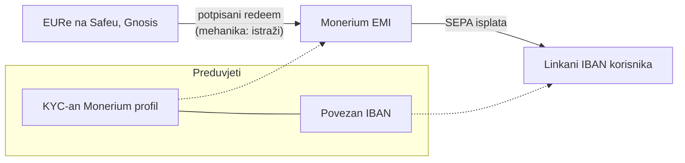

# KUNAPay 3 (K4) — fiat off-ramp: EURe → SEPA isplata (Monerium redemption)

> Handoff prompt za praznu Claude Code sesiju. Repo: `/Users/ms/git/safe-global/safe-wallet-monorepo`, grana `custom`.
> Prije početka pročitaj [handoffs/README.md](README.md), [08 — KUNAPay](../08-kunapay-consumer-brand.md) i **obavezno** [kunapay-2-fiat-onramp.md](kunapay-2-fiat-onramp.md) (ova faza gradi na njegovoj infrastrukturi i Zapisniku).
> Preduvjet u repou: K3 (on-ramp) mergean — overlay `apps/mobile/src/custom/fiat/`, gating `features.fiat` i poznavanje mpt ugovora već postoje.

## Cilj

Korisnik s EURe na svom Safeu (Gnosis) pokrene "Isplati na banku": poveže svoj IBAN (jednokratno), unese iznos i dobije SEPA isplatu na svoj račun kroz Monerium redemption. Ovo je **pretežno istraživačka faza** — off-ramp mehanika (redemption, potpisi, KYC/IBAN linkanje) mora se utvrditi iz izvora prije nego što se išta tvrdi ili kodira; mjerljivi rezultat je dokumentiran ugovor + sandbox/testnet flow ako je dostupan.

## Kontekst i izvori

- [03 — Feature audit](../03-feature-audit-revolut.md): "Fiat off-ramp" je **gap za oba codebasea** (ni Track B ga nema u produkciji) — ovdje se ne portaju gotovi obrasci nego se istražuje uz Track B znanje kao polazište.
- **Primarni interni izvor:** `/Users/ms/git/domovinatv/pay.domovina.ai/docs/monerium-private.md` — sadrži sekcije "Outgoing SEPA (redeem)", "Signing rules (redeem)" i tablicu orderā (`kind: "issue" | "redeem"`; redeem = EURe → EUR, "Our app, via signed POST /orders"). Tretiraj kao polazište za istraživanje, ne kao potvrđen ugovor — provjeri protiv aktualnih Monerium developer docs.
- **Ključne poznate činjenice iz tog dokumenta (provjeriti, ne prepisivati slijepo):** svaki redeem zahtijeva potpisanu poruku walleta koji drži EURe; adresa mora biti povezana s KYC-anim Monerium profilom prije nego što smije držati EURe i potpisivati redeeme.
- mpt worker (`mpt.domovina.ai`): danas radi **issue** smjer (uplata → mint). Ima li ikakvu redemption podršku — istraži (v. Koraci).
- On-ramp infra: `apps/mobile/src/custom/fiat/` iz K3 (API klijent, gating, ekran obrasci).
- GPL napomena (ista kao u kunapay-2): Track B kod i dokumentacija su vlasnikovo vlastito, ne-GPL — obrasci se smiju portati u ovaj fork (fork←vlastito); GPL kod se nikad ne kopira u ne-GPL repoe.

## Preduvjeti

**Ručni (vlasnik projekta):**

| Preduvjet                                                                        | Zašto                                                 | Status |
| -------------------------------------------------------------------------------- | ----------------------------------------------------- | ------ |
| Monerium profil po korisniku s dovršenim KYC-om                                  | redemption ide samo s KYC-anog profila                | ⬜     |
| Povezan (linkan) IBAN na profilu korisnika                                       | isplata ide na verificirani IBAN, ne na proizvoljan   | ⬜     |
| Odluka: ide li redemption kroz mpt worker (proširenje) ili direktno app→Monerium | određuje gdje žive tokeni/potpisi i tko nosi API auth | ⬜     |
| Monerium sandbox pristup za razvoj                                               | acceptance uključuje sandbox flow ako je dostupan     | ⬜     |

**Automatski (postoji):** `features.fiat` gating, fiat overlay modul, EURe balans na Safeu vidljiv kroz postojeći balances flow, Send/potpisivanje transakcija u hostu (za EURe transfer korak, kad se mehanika potvrdi).

## Opseg

**In:** istraživanje i dokumentiranje redemption ugovora; UX dizajn + implementacija linkanja IBAN-a i isplate **u mjeri u kojoj potvrđena mehanika dopušta**; sandbox/testnet flow ako postoji; sve gated pod `features.fiat` (isti fiat paket kao on-ramp — ako istraživanje pokaže potrebu za zasebnim flagom, npr. `features.offramp`, odluči i zapiši).

**Out (svjesno):** produkcijska isplata pravim novcem (ručni preduvjeti), in-app KYC onboarding (ista odluka kao u K3), cross-chain redeem/bridging (monerium-private.md ga spominje — eksplicitno izvan opsega), kartice i treće strane za off-ramp.

## Točne datoteke i šavovi

| Datoteka                                             | Izmjena                                                                                  |
| ---------------------------------------------------- | ---------------------------------------------------------------------------------------- |
| `apps/mobile/src/custom/fiat/offramp/` (novi poddir) | redemption API klijent, hookovi, ekrani "Poveži IBAN" i "Isplati na banku", testovi      |
| ruta za offramp ekran (`apps/mobile/src/app/…`)      | **novo** — tanki wrapper (typed-routes gotcha: regeneriraj tipove kroz `npx expo start`) |
| ulazna točka u UI                                    | ~1 linija uz postojeću "Uplati s banke" akciju iz K3                                     |
| `docs/whitelabel-wallet/03-feature-audit-revolut.md` | red "Fiat off-ramp" nakon isporuke                                                       |

Ako istraživanje pokaže da je potrebno proširenje mpt workera — to je **Track B posao u Track B repou** (vlasnikov ne-GPL kod); ovdje se samo dokumentira potreban ugovor u Zapisniku.

## Koraci

1. **Istraži redemption mehaniku (obavezno prvo; ništa se ne kodira dok ovo nije u Zapisniku).** Redoslijed izvora: (a) `docs/monerium-private.md` u Track B repou — sekcije o redeem orderima, signing rules i linkanju adresa; (b) aktualna Monerium developer dokumentacija (API reference za orders, profile, IBAN linkanje, sandbox); (c) mpt worker kod — postoji li već išta za redeem smjer. Utvrdi i dokumentiraj:
   - Točan API poziv za redeem (endpoint, polja, auth model) — **ne izmišljaj**; što ne potvrdiš, označi "nepotvrđeno".
   - **Mehaniku prijenosa:** je li redemption EURe transfer na korisnikovu Monerium burn/treasury adresu, poziv `POST /orders` sa potpisom, ili oboje u kombinaciji — **istraži točnu mehaniku, ne tvrdi unaprijed**.
   - **Model potpisa za Safe:** redeem traži potpisanu poruku walleta koji drži EURe, a naš wallet je Safe (smart contract) — istraži kako Monerium prihvaća potpis za smart account (EIP-1271? potpis ownera? posebna registracija?). Ovo je najveći tehnički rizik faze.
   - **Auth lanac:** čiji su Monerium API tokeni u igri (partner vs per-user OAuth) i gdje smiju živjeti (nikad u binaryju — proxy/mpt ako treba tajna).
   - Kamo ide isplata (samo linkani IBAN?), limiti, trajanje, naknade — **naknade ne pretpostavljaj, istraži**.
2. **Arhitektonska odluka (zapiši u Zapisnik):** app→Monerium direktno (per-user OAuth) vs app→mpt→Monerium (partner model). Kriteriji: gdje živi tajna, KYC/profil vlasništvo, koliko se K3 klijenta može reusati. Ako mpt treba proširenje, specificiraj ugovor (request/response) kao deliverable za Track B.
3. **Regression checklist** (root AGENTS.md obrazac) — offramp dodaje ekrane uz K3 šavove; provjeri da on-ramp flow, Send i balansi ostaju netaknuti te da brandovi bez flaga ne mountaju ništa.
4. **UX za linkanje IBAN-a:** ekran "Poveži IBAN" (jednokratno; stanje "povezan" persistirano/dohvatljivo iz profila — istraži odakle se čita). Copy hrvatski, sentence case, bez emojija.
5. **Ekran "Isplati na banku":** iznos (validacija protiv EURe balansa) → pregled (iznos, IBAN, procijenjeno trajanje — samo potvrđeni podaci) → potpis/transakcija po mehanici iz koraka 1 → praćenje statusa do isplaćeno. Obavezno loading/error/empty stanja; iznos preko balansa i nepovezan IBAN su prvorazredna stanja, ne rubni slučajevi.
6. **Sandbox/testnet verifikacija:** ako Monerium sandbox postoji i pristup je dan, provedi cijeli flow tamo i zapiši dokaze (id ordera, statusi). Ako nije dostupan — implementiraj protiv MSW mockova izvedenih iz dokumentiranog ugovora i eksplicitno zapiši da end-to-end nije verificiran.
7. **Testovi:** unit za redemption klijent (MSW), component za oba ekrana, regression da on-ramp iz K3 prolazi nepromijenjen.
8. **Dokumentacija i predaja:** Zapisnik s kompletnim nalazima istraživanja (i onim negativnima), matrica u 03 dokumentu, status K4 u README tablici, commit `feat(mobile): eure to sepa off-ramp via monerium redemption` (ili `docs(whitelabel): offramp research` ako faza završi samo istraživanjem — v. kriterije), push.

## Kriteriji prihvaćanja

Faza je dvodijelna: istraživački deliverables su **obavezni**; implementacijski vrijede u mjeri u kojoj ih potvrđena mehanika i sandbox pristup omogućuju (što je manje isporučeno, to Zapisnik mora preciznije reći zašto i što je sljedeći korak).

**Istraživanje (obavezno):**

- [ ] Redemption ugovor dokumentiran u Zapisniku iz izvora (monerium-private.md + aktualne Monerium docs), s jasno odvojenim potvrđenim i nepotvrđenim tvrdnjama.
- [ ] Model potpisa za Safe (smart account) razriješen ili eksplicitno označen kao blokada s opisom što nedostaje.
- [ ] Arhitektonska odluka (direktno vs kroz mpt) donesena i obrazložena; ako treba mpt proširenje, njegov ugovor specificiran.
- [ ] Popis ručnih preduvjeta ažuriran sa statusima.

**Implementacija (uvjetno):**

- [ ] Ekrani "Poveži IBAN" i "Isplati na banku" postoje pod `features.fiat`, s potpunim stanjima i testovima; bez flaga ništa se ne mounta.
- [ ] Sandbox flow proveden end-to-end **ako je sandbox dostupan**; inače MSW pokrivenost + eksplicitna napomena u Zapisniku.
- [ ] Nijedan endpoint, adresa ni naknada nije izmišljena; tajne nisu u appu ni repou.
- [ ] `node scripts/verify.mjs --changed --workspace=mobile` čist.

## Zapisnik izvršenja

_(prazno — popunjava agent koji izvrši fazu)_
