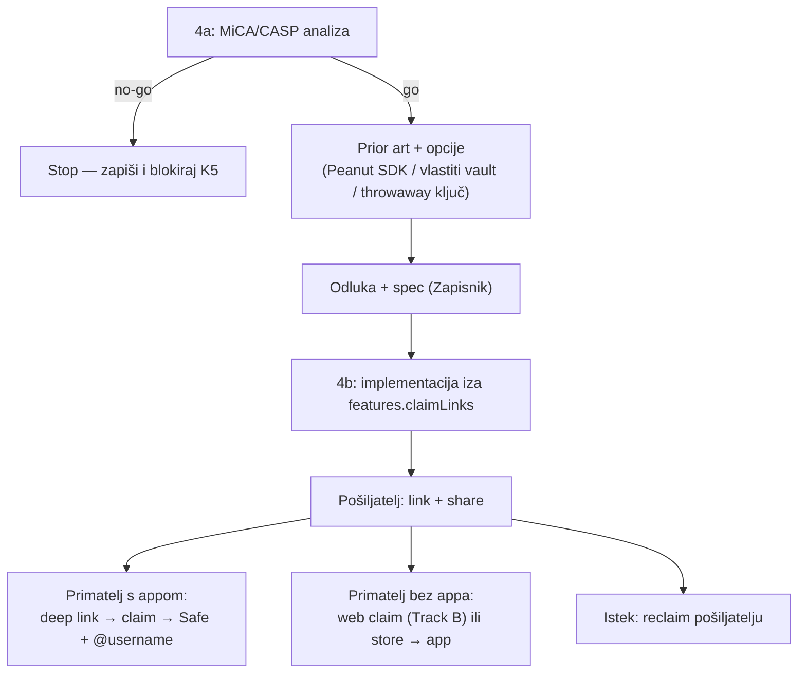

# KUNAPay 4 (K5) — claim linkovi: slanje ne-korisniku

> Handoff prompt za praznu Claude Code sesiju. Repo: `/Users/ms/git/safe-global/safe-wallet-monorepo`, grana `custom`.
> Prije početka pročitaj [handoffs/README.md](README.md), [08 — KUNAPay](../08-kunapay-consumer-brand.md) (§4 — regulatorni okvir!) i **obavezno** [04 — Prior art](../04-prior-art-landscape.md) (Peanut, Sling, Beam).
> Ovisnosti: tehnički neovisna, ali za dobar UX ovisi o [faza-4-identity-layer.md](faza-4-identity-layer.md) (K2) — primatelj koji claima trebao bi odmah dobiti @username, ne hex.

## Cilj

Korisnik pošalje novac osobi koja **nema aplikaciju**: nastane link koji nosi vrijednost; primatelj klikne, instalira app (ili claima na webu) i novac je njegov — viralna petlja iz [08] §3. Faza je **eksplicitno dvostupanjska**: **4a** = analiza rizika + istraživanje + odluka (bez koda), **4b** = implementacija iza `features.claimLinks` — i to **samo ako 4a zaključi da je dizajn regulatorno održiv**.

## Kontekst i izvori

- [04 — Prior art](../04-prior-art-landscape.md): "link koji nosi novac" je jedan od dva dokazana mainstream P2P obrasca (Peanut, Sling Link, Beam). **Peanut Protocol** — sender deponira u vault ugovor; sredstva se otključavaju tajnom u URL-u; gasless za primatelja; radi za primatelje bez walleta; repo [`peanut-sdk`](https://github.com/peanutprotocol/peanut-sdk). Napomena niže pouzdanosti iz [04]: Peanut formalni audit = provjeriti.
- [08] §4: samostalni escrow **s diskrecijom operatera** je upravo vrsta funkcionalnosti koja može stvoriti custody obvezu — zato ova faza ima obavezan regulatorni korak prije svega.
- Relayer prior art (za gasless claim): `/Users/ms/git/domovinatv/pay.domovina.ai/wallet/docs/relayer-architecture.md` — Track B relay Workeri (per-deployment `RELAYER_PRIVATE_KEY`, limiti, Turnstile, CREATE2 guard disciplina). Obrasci se smiju portati (fork←vlastito; GPL kod nikad natrag u ne-GPL repoe).
- Web claim fallback: Track B wallet (`pay.domovina.ai/wallet`) kao ciljna površina za primatelje koji ne žele instalirati app — specificira se ugovor, implementacija web strane je Track B posao.
- Gating presedan: `apps/mobile/src/custom/ff/isFfBrand.ts` + šavovi u FF PLAN.md §6; deep link ulaz: `scheme` iz brand manifesta (`kunapay://…`) + postojeći deep-link handling iz faze 3.

## Preduvjeti

**Ručni (vlasnik projekta):**

| Preduvjet                                                      | Zašto                                       | Status |
| -------------------------------------------------------------- | ------------------------------------------- | ------ |
| Prihvaćanje nalaza MiCA/CASP analize (4a) — go/no-go za 4b     | analiza može ubiti ili bitno suziti feature | ⬜     |
| Odluka o pravnom savjetu (interna analiza nije pravni savjet)  | custody/e-novac granice su pravno pitanje   | ⬜     |
| Ako odluka = relayer za gasless claim: deploy + ključ + budžet | relayer je infra izvan ovog repoa           | ⬜     |
| Ako odluka = web claim fallback: Track B claim stranica        | živi u `pay.domovina.ai` repou, ne ovdje    | ⬜     |

**Automatski (postoji):** deep-link infrastruktura (faza 3 payment linkovi), brand `scheme`, `features` gating, Send flow s risk validacijom, identity (K2) ako je do tada mergean.

## Opseg

**In (4a):** MiCA/CASP analiza rizika (obavezno prva), istraživanje prior arta i implementacijskih opcija, sigurnosna analiza link-as-bearer-asset, dokumentirana odluka s go/no-go.

**In (4b, samo uz go):** odabrana implementacija iza `features.claimLinks`, slanje + claim + reclaim/expiry UX, testovi.

**Out (svjesno):** vlastiti escrow ugovor **s admin/diskrecijskim ovlastima** (regulatorno najopasnija opcija — smije ući u razmatranje samo s eksplicitnim pravnim pokrićem), fiat vrijednost u linku (linkovi nose EURe/token, ne fiat obećanje), masovni/batch linkovi, web claim implementacija (Track B).

## Točne datoteke i šavovi

Za 4a: **nijedna datoteka koda** — deliverable je analiza u Zapisniku ovog dokumenta (+ eventualno zaseban doc u `docs/whitelabel-wallet/` ako preraste Zapisnik).

Za 4b (okvirno — konačan popis ovisi o odluci iz 4a):

| Datoteka                                        | Izmjena                                                               |
| ----------------------------------------------- | --------------------------------------------------------------------- |
| `apps/mobile/src/custom/claimLinks/` (novi dir) | logika kreiranja/claima linka, state, ekrani, testovi                 |
| ruta za claim ekran (`apps/mobile/src/app/…`)   | **novo** — deep-link target (typed-routes gotcha: regeneriraj tipove) |
| ulazna točka u Send flow                        | ~1 linija: opcija "Pošalji linkom" uz `features.claimLinks`           |
| kunapay manifest                                | `"claimLinks": true` u `features`                                     |

## Koraci

### 4a — analiza i odluka (bez koda)

1. **MiCA/CASP analiza rizika (OBAVEZNO PRVI KORAK — prije bilo kakvog koda; nalaz ide u Zapisnik i može ubiti feature).** Pitanja na koja analiza mora odgovoriti, po dizajnu escrowa:
   - Tko kontrolira deponirana sredstva između slanja i claima? Ima li operater (mi) **bilo kakvu diskreciju** — mogućnost vraćanja, zamrzavanja, admin ključ, upgrade ugovora? Diskrecija ⇒ potencijalna obveza skrbništva ("custody and administration of crypto-assets on behalf of clients" po MiCA-i) ⇒ CASP licenca — to ruši temeljnu tezu iz [08] §4 (mi ne držimo tuđi novac).
   - Je li link-as-bearer instrument u nekoj varijanti izdavanje e-novca ili platna usluga (PSD2), pogotovo jer je nosivi asset EURe?
   - Postoji li **potpuno non-custodial dizajn** (trustless vault bez admin ovlasti; timeout nakon kojeg sredstva može povući isključivo pošiljatelj) koji analizu prolazi? Usporedi kako se Peanut i Sling pravno pozicioniraju (istraži njihove ToS/dokumentaciju — ne pretpostavljaj).
   - Mijenja li relayer (mi plaćamo gas claima) regulatornu sliku?

   Analiza je interna procjena, **ne pravni savjet** — označi to i pobroji pitanja za pravnika. **Ishod (go / no-go / go-s-ogradama) upiši u Zapisnik prije nastavka.** Ako je no-go: zatvori fazu, označi K5 kao blokiranu u README tablici i stani.

2. **Istraži prior art (uz go):** Peanut SDK (mehanika vaulta, tko drži tajnu, koje mreže — je li Gnosis pokriven; status audita), Sling claim linkovi, Beam. Fokus: kako rješavaju expiry, reclaim, i "tajna u URL-u" model.

3. **Sigurnosna analiza link-as-bearer-asset (zapiši):** tko god ima link, ima novac — link putuje kroz messenger/clipboard/notifikacije. Obavezne mjere za svaki dizajn: tajna u **URL fragmentu** (`#…` ne ide na server), istek (expiry) s automatskim pravom povrata pošiljatelju, reclaim UX ("poništi link"), razuman limit iznosa, upozorenje pri dijeljenju. Prouči i faza-3 hardening lekcije (payment linkovi) u tom handoffu.

4. **Usporedi implementacijske opcije i odluči (zapiši u Zapisnik s obrazloženjem):**

   | Opcija                                      | Skica                                                                  | Za                              | Protiv                                                                                              |
   | ------------------------------------------- | ---------------------------------------------------------------------- | ------------------------------- | --------------------------------------------------------------------------------------------------- |
   | **Peanut SDK**                              | postojeći auditirani(?) vault + SDK                                    | najmanje koda, dokazan UX       | ovisnost o trećoj strani; provjeri audit, mreže (Gnosis?), naknade — **istraži, ne pretpostavljaj** |
   | **Vlastiti escrow ugovor**                  | minimalni vault: depozit + claim tajnom + timeout-reclaim              | puna kontrola, bez treće strane | mi pišemo i auditiramo ugovor; **svaka admin ovlast = custody crvena zastava iz koraka 1**          |
   | **Pre-fundani throwaway ključ u fragmentu** | novi EOA/predikcija, sredstva na njega, privatni ključ u URL fragmentu | bez ugovora, bez treće strane   | najslabija sigurnost (ključ = link), gas za sweep, nema urednog reclaima                            |

5. **Specificiraj claim UX i relayer ugovor:** primatelj klikne link → app instaliran? deep link `kunapay://claim/…` → claim ekran → sredstva na (novi) Safe primatelja + ponudi @username (K2). App nije instaliran → store + web claim fallback na Track B (specificiraj ugovor: što web strana treba od linka; implementacija tamo). Gasless claim: primatelj nema gas — relayer po Track B obrascu (limiti, anti-abuse — v. relayer-architecture.md) ili Peanutov mehanizam ako je odabran. **Endpointe i adrese ne izmišljati — sve iz odluke i izvora.**

### 4b — implementacija (samo uz go iz 4a)

6. **Regression checklist** (root AGENTS.md obrazac): Send flow (opcija linka ne smije dirati postojeći send na adresu/@username), deep-link rute iz faze 3 (payment linkovi i claim linkovi ne smiju se sudarati u parsiranju), brandovi bez flaga.
7. **Implementiraj odabranu opciju** u `apps/mobile/src/custom/claimLinks/`, gated `isClaimLinksEnabled()` po uzoru na `isFfBrand()`; slanje (iznos → kreiraj link → share sheet s upozorenjem), claim (deep link → potvrda → sredstva + username hook), reclaim/expiry (lista aktivnih linkova pošiljatelja s "poništi"). Copy hrvatski, sentence case, bez emojija.
8. **Testovi:** unit za kreiranje/parsiranje/expiry logiku (tajna nikad u logovima ni analytics), component za send i claim ekrane, regression za postojeći Send i payment linkove; MSW za sve mrežne pozive.
9. **Dokumentacija i predaja:** matrica u 03 dokumentu (red "Slanje ne-korisniku"), status K5 u README, Zapisnik (analiza, odluka, ručni preduvjeti), commit (`docs(whitelabel): claim links risk analysis` za 4a; `feat(mobile): claim links behind features.claimLinks` za 4b), push.

## Kriteriji prihvaćanja

**4a (obavezno, neovisno o ishodu):**

- [ ] MiCA/CASP analiza u Zapisniku: odgovori na sva pitanja iz koraka 1, eksplicitan go/no-go, popis pitanja za pravnika; nastala **prije** ijedne linije koda.
- [ ] Prior art i tri opcije uspoređeni s potvrđenim činjenicama (audit status, podržane mreže, naknade — istraženo, ne pretpostavljeno); odluka obrazložena.
- [ ] Sigurnosni model linka dokumentiran (fragment, expiry, reclaim, limiti).
- [ ] Ugovor za web claim fallback i relayer specificiran (ili eksplicitno odgođen).

**4b (samo uz go):**

- [ ] Slanje linkom, claim kroz deep link i reclaim nakon isteka rade end-to-end na testnetu/testnom okruženju odabrane opcije.
- [ ] Bez `features.claimLinks` nijedna površina se ne mounta; postojeći Send i payment linkovi (faza 3) prolaze nepromijenjeno.
- [ ] Tajna linka ne napušta uređaj osim u samom linku (nema logova, nema servera osim po specifikaciji iz 4a).
- [ ] `node scripts/verify.mjs --changed --workspace=mobile` čist; modul potpuno pokriven testovima.

## Zapisnik izvršenja

_(prazno — popunjava agent koji izvrši fazu; nalaz 4a analize ide ovdje PRIJE početka 4b)_
